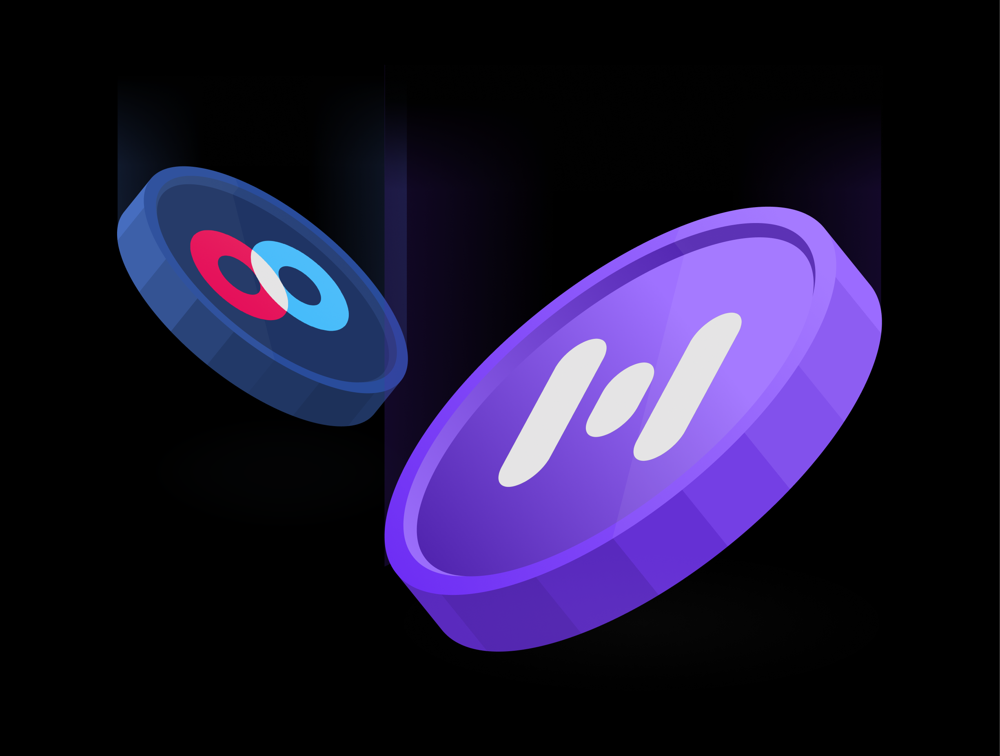

# Token Swap is Live

Token Swap is Live

### The Road to Token Swap has been a long and exciting journey that is finally coming to an end, but with that, a new beginning for the Hifi Ecosystem emerges in the form of Hifi DAO.

## Official Contracts

### HIFI Token:

[0x4b9278b94a1112cAD404048903b8d343a810B07e](https://etherscan.io/address/0x4b9278b94a1112cAD404048903b8d343a810B07e)

### Gov. Bravo Delegate:

[0xdA161D0CFB4F836070e31fBf46Bd771FAE2F8E87](https://etherscan.io/address/0xda161d0cfb4f836070e31fbf46bd771fae2f8e87)

### Timelock:

[0xAC46Db50B44BBeF8DC25f778359e1834248147F7](https://etherscan.io/address/0xAC46Db50B44BBeF8DC25f778359e1834248147F7)

## Proper Initialization

There is one final step to complete for proper initialization. This last step is subject to the 48 Hour waiting period enforced by our Timelock Smart Contract. It will finish the process of transferring full control from a wallet controlled by Hifi Labs to the Smart Contracts controlled by HIFI Token holders. Expect Hifi Labs to complete this final step 48 hours from the timestamp of [this preceding transaction](https://etherscan.io/tx/0x54ca5190426424d808b72c02c1295cb39342f609ee9f879b55b2e268e380e251).

## Exchange Support

Many community members are eager to swap their tokens. Please do not send HIFI tokens to exchanges until they have officially announced their support for HIFI.

Hifi Labs is working directly with all major exchanges to support the token swap. We will share updates about support once permission is granted to us. Some exchanges may choose to wait for the proper initialization (48-hour Timelock) to finalize before proceeding. This is completely acceptable. There is no penalty for community members who choose to be patient if they’d like to wait to swap until your favorite exchange officially announces support.

## HIFI Token Swap

Hifi Labs is proud to introduce the [HIFI Delegation & Token Swap App](https://swap.hifi.finance/#/), a quick and easy process for delegating your HIFI governance power and securely swapping your MFT for HIFI. As mentioned previously, there is no deadline for the HIFI Token Swap.

We prepared an easy-to-follow step-by-step guide you can find [here! ](https://blog.hifi.finance/hifi-token-swap-tutorial-210fe5fcdc8d)We recommend performing the swap on a desktop computer rather than a mobile device.

If you have any questions or issues regarding the token swap, please let anyone on our team know in [Discord](https://discord.com/invite/mhtSRz6) and we will be happy to help.

Join the conversation on [Discord](https://discord.com/invite/mhtSRz6) and [Twitter](https://twitter.com/hififinance) and help make Hifi DAO one of the leading decentralized autonomous organizations.

Source: https://blog.hifi.finance/token-swap-is-live-78df04ea2bd3
