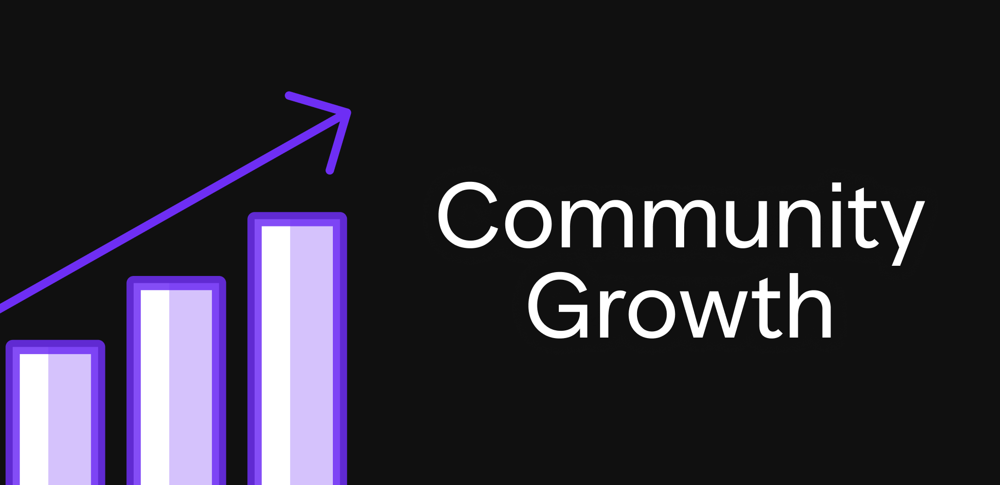

# A New NFT Collection: Laying Groundwork

A New NFT Collection: Laying Groundwork

In a [previous blog post](https://blog.hifi.finance/pawn-bots-end-of-life-next-steps-d2be9766cb09), we announced that support for Pawn Bots, our flagship NFT project, would soon end and that a new collection would replace it. Additionally, we’ve shared some of our [lessons learned](https://blog.hifi.finance/pawn-bots-lessons-learned-4bde49ab3200) from building Pawn Bots over the last year. Today’s blog post defines success for the next collection, sets initial expectations, and highlights the key principles we are using to guide our decision-making.

### **Success is growth**

Success is growth beyond our existing audience. Initially, with Pawn Bots, our objective was to educate and be a test-bed for Pooled NFTs; those will still be benefits we achieve with this next collection, but if that’s all we accomplish, we will have failed. Our success is measured by our ability to grow. Every community member needs to understand this from the start to unite us in what we are working towards. Growth is our singular priority. We only succeed if we grow our audience.

### Target Audience

Ethereum users are our target audience. Given the reality of being an NFT on the Ethereum Blockchain, our efforts should focus on the largest possible audience with the skills and knowledge required to interact with our collection. That audience is Ethereum users.

### Growth Fundamentals

**Comprehension. **As a general rule, people participate in things they understand. Conversely, people participate much less in something they do not understand. This is especially true for goods or services that cost money or time to participate. The more people who can comprehend our offering quickly, the larger our potential audience is. Therefore, our collection must be simple and easy to understand. The more complexity we introduce at any layer, the more limited our growth.

**Resonance. **As important as making who we are and what we do clear, it must also be compelling to our target audience. There is a social and reputation costs to sharing and inviting. We need to be something that represents our target audience well because when they share our project with their network, they are, by extension, sharing a part of themselves. If we don’t resonate with and embody the values held by our target audience, they will be much less likely to share and invite their network to join us. The more we resonate, the greater conviction our target audience will have in us.

**Clear Visual Identity. **Our offering should be distinct to be recognized, associated, and stand out. Optimize for the context in which growth happens; for us, this means optimizing around social media interactions and the profile picture as our canvas.

### Implementation Thoughts

Applying these growth fundamentals suggest the following. First, our target audience must find our purpose to be both ***clear*** and ***compelling***. Most people do not want to be sold something. However, they do want to be a part of anything that represents them well and ***helps them make progress on existing goals*** or desires they have.

When I think back on Pawn Bots, our implementation lost clarity as time passed, and our focus became more on the novelty of one day being able to borrow against them. This message was only ever understood by our existing Hifi community and only ever resonated with them because we were helping them progress on existing goals and desires that only we had.

Looking ahead, we must go beyond being a “Hifi growth tool” or an NFT collection you can use as collateral. We need a much broader vision. We can still be a growth tool and collateral, but these things will not contribute towards growth beyond what we already are today. To be clear, we still want those things and expect them to happen, but we must be more than that if we hope to grow.

### Expansion

As we chart the course for our next collection, we leverage previous experience and extensive research to strategically plan this launch. A new collection in which success will be measured by — Growth. Success can only be achieved if we can grow our community beyond our current audience.

By emphasizing the core fundamentals of comprehension, resonance, and a clear visual identity, we are positioning ourselves for success. Our collection will be simple to understand, and we will work hard to ensure our purpose resonates with our target audience. Every stride we take will be with the singular goal of expansion.

This is only possible with you, join in and participate with us directly on Discord and [Twitter](https://twitter.com/hififinance)!

Source: https://blog.hifi.finance/a-new-nft-collection-laying-groundwork-f0e8dbad1208
