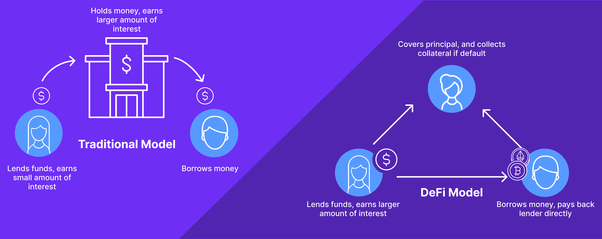

# What Is DeFi?

What Is DeFi?

### **Exploring DeFi Protocols, Crypto Lending, and More**

Fourteen years ago, the world was introduced to Bitcoin with the creation of its first block. This occasion was celebrated with the [message](https://www.coindesk.com/podcasts/the-breakdown-with-nlw/13-years-on-the-meaning-of-chancellor-on-the-brink-of-second-bailout-for-banks/):
> The Times 03/Jan/2009 Chancellor on brink of the second bailout for banks.

Satoshi Nakamoto, the anonymous inventor of Bitcoin, envisioned a decentralized financial system that would be free from centralized control, from taxpayer-funded bailouts to censorship. Bitcoin, however, does not have a Turing-complete language, making it difficult to implement a full range of financial products.

Six years after Bitcoin’s creation, the emergence of Ethereum and its Solidity language enabled developers to deploy code on the blockchain, enabling a range of decentralized financial products, now known as DeFi.

DeFi products include loans, savings, investments, insurance, and a whole host of other financial products. Instead of relying on a third party to validate (or invalidate) the transactions, DeFi protocols rely on smart contracts, or code on the blockchain, to regulate interactions between participants.

## Overview of DeFi Protocols

Many components make up the traditional financial ecosystem, from infrastructure like exchanges and custodians to gears like loans and derivatives, to lubricants like liquidity and insurance. DeFi protocols have emerged to emulate these components without the need for a centralized third party.

For thousands of years, borrowing and lending have been two core components of the financial system. However, fairly priced loans are often inaccessible to those without access to traditional banking, and there are still limited opportunities to use alternative collateral. Crypto lending and borrowing protocols like MakerDAO, Compound, and Dharma enable users to lend and borrow cryptocurrency and other digital assets with the help of smart contracts.

To lend, users can deposit cryptocurrency into a lending protocol and earn interest on the loan. To borrow, users can put up collateral, such as cryptocurrency, and take out a loan. The collateral is then held by the protocol until the loan is repaid. We here at Hifi are building a protocol that enables collateralized loans that are secured by crypto and soon NFTs, streams, liquidity tokens, and more.

Lending and borrowing, and virtually every other financial product, is subject to volatility. To combat this, stablecoins have emerged. Stablecoins are digital currencies pegged to more stable assets, such as the U.S. dollar. This helps protect users from the volatility of crypto markets. Popular stablecoins include Tether, USD Coin, and Dai. There are multiple ways to create and maintain the value of stablecoins, from algorithmic mechanisms to collateralized pools of assets.

Algorithmic stablecoins are falling under greater scrutiny following 2022’s collapse of TerraUSD. Large sales of UST by “whale” investors like Binance led to panic selling, which was followed by the minting of additional Luna tokens in an attempt to restore the peg. Naturally, this instead caused further losses in confidence and the peg was not restored. Several other algorithmic stablecoins have failed, so instead many investors look to audited collateralized stablecoins like USDC.

In order to facilitate all these transactions, DeFi protocols rely on decentralized exchanges (DEXs). DEXs are online exchanges that are powered by smart contracts. This eliminates the need for a third-party custodian and allows for peer-to-peer trades of cryptocurrency assets. Popular DEXs include Uniswap, 0x, and Kyber Network.

Assets traded on these DEXs include cryptocurrencies, tokens for metaverse and play-to-earn games and other dApps, stablecoins, synthetic assets, and more. Synthetic assets are digital assets that are designed to track the performance of real-world assets, such as stocks and commodities. Popular synthetic protocols include Synthetix and Mirror Protocol. They use protocols similar to the “pegging” of stablecoins to assets outside of the blockchain.

The lack of a centralized third party also introduces the need for insurance protocols. Insurance protocols enable users to purchase insurance against losses due to market volatility. Popular protocols include Nexus Mutual and Cover Protocol.

Finally, DeFi protocols enable users to earn rewards for providing liquidity to a particular protocol, commonly decentralized exchanges. This is known as yield farming. Staking protocols allow users to earn rewards for providing security to a blockchain network. Popular yield farming and staking protocols include Curve and Cosmos.

## Benefits of DeFi

The DeFi ecosystem is filled with countless wallets, exchanges, tokens, and protocols. So what are all these protocols and products trying to achieve?

DeFi offers numerous benefits. First and foremost, DeFi protocols are accessible to anyone with an internet connection, making it more inclusive than traditional financial services. Although it’s easy for, say, most city-dwellers in the U.S. to open a bank account, [1.7 billion](https://www.brinknews.com/bridging-the-digital-divide-to-widen-financial-services-in-central-asia/) people around the world are unbanked and lack access to traditional financial services. Even in the US, a hefty [63 million](https://www.npr.org/2021/04/05/984475870/unbanked-what-it-means-to-be-outside-of-the-banking-system#:~:text=Approximately%2063%20million%20Americans%20are%20either%20unbanked%20or,discouraged%20from%20opening%20accounts%20due%20to%20high%20fees.) Americans are underbanked, for several reasons: lack of access, difficulty in passing credit checks, or use of cash for financial transactions. DeFi provides an alternative to these people.

DeFi also offers transparency, since all transactions are recorded to the blockchain, making them transparent and immutable. This is a stark contrast to the opaque nature of traditional financial services. In fact, FTX’s failure stems from the fact that they were not actually a DeFi protocol and did not have the same transparency and trustless nature of DeFi protocols.

Finally, the ability to invest in novel asset classes is another benefit of DeFi protocols. DeFi protocols offer users the ability to invest in not only cryptocurrencies, but also race horses, watches, luxury cars, and more. This opens up a world of possibilities for investors.

## Challenges of DeFi

Every new technology, no matter how revolutionary, comes with its own set of challenges. DeFi is no different.

The most pressing challenge is regulatory uncertainty. DeFi protocols and products are still relatively new and there is a lack of clarity around the legal and regulatory status of these protocols. This could lead to further regulatory action against the industry.

Security is another challenge. Smart contracts are vulnerable to malicious actors, and DeFi protocols have been the target of many hacks. To combat this, protocols must be built with security in mind, and users must take extra precautions to protect their digital assets. Still, these roadblocks are being overcome with time, and are by no means insurmountable.

## Looking Ahead

2022 brought a lot of challenges, but also important lessons, for the DeFi industry. DeFi is suffering from the broader crypto winter, and yields have collapsed as a result. Further, a string of bankruptcies and hacks have shaken investor confidence in DeFi protocols.

However, DeFi protocols that build for the long term, with real-world value propositions, will be better positioned to survive the crypto winter and thrive in the future. As DeFi protocols continue to evolve, they will become more secure, more transparent, and more accessible to users around the world.

Join the conversation on [Discord](https://discord.com/invite/mhtSRz6) and [Twitter](https://twitter.com/hififinance) to stay up to date on the latest and be part of our growing community.

Source: https://blog.hifi.finance/what-is-defi-28d588019d37
