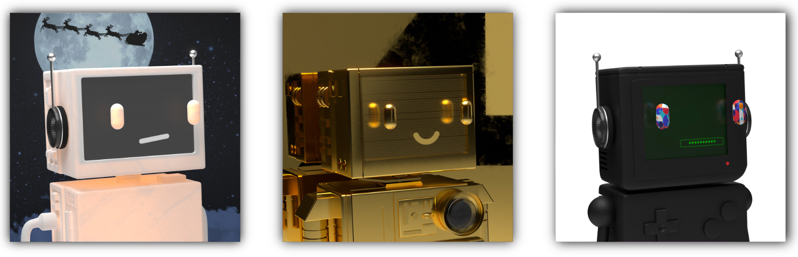
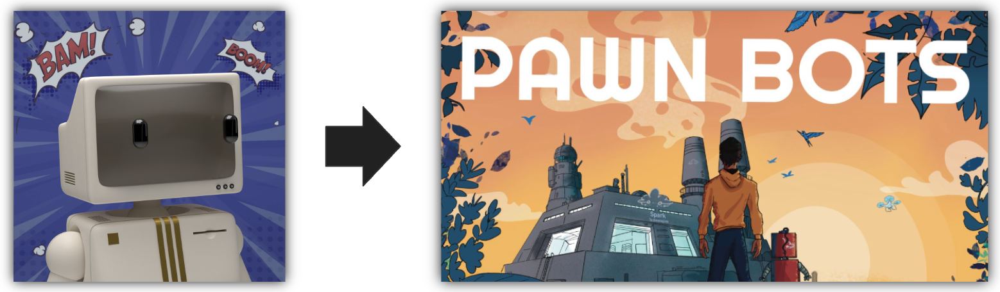
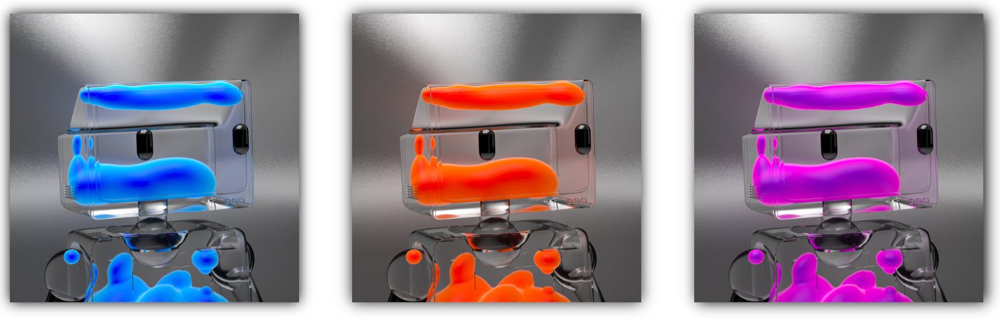

# Pawn Bots Phase VI

Pawn Bots Phase VI

As Phase V of Pawn Bots comes to an end, the Hifi Ecosystem has been progressing on all fronts. The Hifi Lending Protocol was audited and deployed to the Ethereum Mainnet. Crown Ribbon is on the brink of submitting its offering circular to the SEC for qualification. The HIFI Token Swap has been supported by all major platforms including Binance, Coin Market Cap, UPbit, and CoinGecko.

Pawn Bots exists to be our safe testing ground for upcoming innovations we’re creating at Hifi. This collection will be first through the door when we launch our Pooled NFT product that aims to bring liquidity and fractionalization to NFT collections. We also hope to enable borrowing against Pawn Bots as collateral on Hifi’s lending protocol. Our Pooled NFT prototype is almost ready to go live! We’ll have an official AMA once it’s released, so stay tuned!

## 🔥 Phase V Recap

Phase V introduced the final Flawless enablers of the collection, which gave holders on the quest of [Forging a Flawless](https://blog.hifi.finance/forging-a-flawless-e50ca6038935) the components required to create all types of Flawless Pawn Bots. During this phase, 14 new bots were forged and upgraded to Flawless status. We also launched the Santa Moon backgrounds on a 48-hour Christmas special, and over 100 Pawn Bots have been burned bringing our total number of burned bots to 1,634! This is an astounding number considering there are 1,980 Pawn Bots sitting in the liquidity reserve pools as well.

## 🗓️ Phase VI

Phase VI begins! Everything is different about this phase. Our pricing, the new attributes, the sudden cut-off of availability, our future… everything is different. It’s not clear yet why, but you wouldn’t be wrong to think that something is brewing. So let’s usher in Phase VI with the most appropriate clip to set the tone. Just know, that whatever you think is coming, even after watching this clip. You’re most definitely wrong. Enjoy.

<iframe width="560" height="315" src="https://www.youtube.com/embed/SSfGBskfthg" frameborder="0" allowfullscreen></iframe>

We’ve been hard at work to bring you the most beautiful and abundant phase yet. Phase VI introduces **19** **brand-new attributes** to the Pawn Bots store! None of these items exist in the current metadata of the collection, making them a must-have for all Pawn Bot collectors. There are no quantity limits on these new items; however, they will only be available during this phase. This is your only chance to have these attributes. Without any further ado, let’s showcase some attributes!

### Comic Background + Exclusive Pawn Bots Comic

This phase brings about something special. Our talented community member [@TaeKwonKrypto](https://twitter.com/TaeKwonKrypto) has created an epic Comic Background and wrote an exclusive Pawn Bots Comic for the community to enjoy. Each NFT that purchases the Comic Background upgrade will receive this beautiful piece of fan fiction comic in the form of “Unlockable Content” on OpenSea. You must be the owner of a Pawn Bot with this background to unlock access to the comic.

### Glow Bodies and Glow Eyes

Inspired by the success of the Orange Glow attributes, we decided to create more color combinations for our community to enjoy. There are now three new colors to choose from — blue, green, and purple. These range in price from ***0.025 BURN to 0.06 BURN***, so be sure to visit [The Store](https://store.pawnbots.com/) for exact pricing.

### Lava Lamp Bodies

Lava Lamp eyes are some of the rarest eyes to exist in the Pawn Bot collection. Now you can pair them up with Lava Lamp Bodies. These special body colors are completely transparent so holders are able to create truly unique Pawn Bots. Every existing Lava Lamp eye color is available for purchase as a body color and ranges in cost from 0.15 BURN to 0.2 BURN depending on the rarity of the correlating eye colors.

### Extracted Eyes

Get your hands on the legendary eyes of El Diablo, Short Circuit, Daemon and 16 oz.! These traits were extracted from our 1-of-1s and will take your Pawn Bot to the next level. These are some of our favorite eyes within the collection, so we can’t wait to see what incredible bots the community will create with them.

### Important things to note:

Please note, there will be no other Flawless types outside the currently existing types, this means there will NOT be any Flawless Glows or Flawless Lava Lamp Pawn Bots. To reiterate, Matte Black, Chrome, Gold, Diamond, Rainbow, and Ceramic White are the only colors that can achieve flawless status.

Remember you can Forge a bot first and then upgrade it after, but you cannot Forge a bot that has already been upgraded within the same phase.

## Conclusion

Phase VI is Pawn Bot’s biggest phase yet and we can’t wait to see what our holders come up with. The items pictured in this blog are only a fraction of the new items in this phase, so head on over to [The Store](https://store.pawnbots.com/) to view all available upgrades. Thank you all for taking this amazing journey with us as we continue to innovate. We are extremely grateful for each and everyone one of you, and as always, happy forging!

We are eager to hear your thoughts on the new store items and the Hifi ecosystem as a whole, so join the [Discord](https://discord.gg/uGxaCppKSH) to chat with the community or leave us a comment on [Twitter](https://twitter.com/Sheet_Heads).

Source: https://blog.hifi.finance/pawn-bots-phase-vi-91585fa58947
