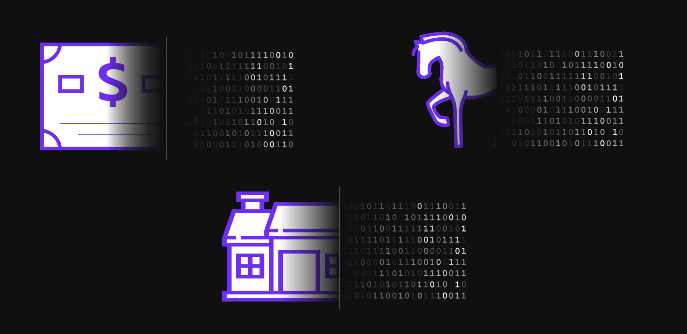

# NFT Real World Assets — Past, Present, and Future

NFT Real World Assets — Past, Present, and Future

On January 24th, 2018, Ethereum launched its first non-fungible token (NFT) standard, [ERC-721](https://eips.ethereum.org/EIPS/eip-721). This new standard revolutionized the way digital assets were bought and sold, enabling users to own and transfer digital assets in a secure manner. This early NFT standard provided a solid foundation for the tokenization of real-world assets, such as real estate, luxury goods, and collectibles on the Ethereum blockchain.

While ERC-721 brought NFTs to the mainstream in 2018, the concept of NFTs predates Ethereum by several years. [Colored coins](https://www.coindesk.com/markets/2013/06/14/colored-coins-paint-sophisticated-future-for-bitcoin/), a technology that enables the tokenization of real-world assets on the Bitcoin blockchain, first appeared in 2013. In 2014, the [Counterparty protocol](https://counterparty.io/) enabled the issuance of digital assets on Bitcoin. These early NFTs were primitive compared to those of today, but they laid the foundation for the NFT revolution.

Since the release of ERC-721 in 2018, the NFT space has seen tremendous growth. June 2018 saw the release of [ERC-1155](https://ethereum.org/en/developers/docs/standards/tokens/erc-1155/), a new NFT standard for the issuance and transfer of multiple tokens at once. This new standard enabled developers to create more complex NFTs and consequently expand the use cases for tokenized assets.

## The emergence of real-world asset NFTs

The first NFTs were mere digital collectibles, such as Cryptopunks, but they eventually evolved into real-world assets. LCX, the Liechtenstein Cryptoassets Exchange, released [Tiamonds](https://www.lcx.com/nfts-revolutionizing-the-real-world-assets/), a diamond-backed NFT. Diamonds are a perfect asset to tokenize, as they are immutable, rare, and highly valuable.

It comes as no surprise that gold, too, has been tokenized. Mattereum, a blockchain-based platform for tokenizing physical assets, released [gold NFTs](https://goldnft.io/) tethered to actual gold bullion stored in vaults.

Beyond precious metals and jewels, assets such as luxury cars, yachts, and real estate have also been tokenized. Propy sold the [world’s first real estate NFT](https://propy.com/browse/propy-nft/) last year. [CurioInvest](https://curioinvest.com/) has sold NFTs for luxury cars, Salient Yachts is [tokenizing physical yachts](https://coinpedia.org/press-release/nft-yacht-ownership/), and [Crown Ribbon is tokenizing real-world racehorses](https://www.crownribbon.com/).

So far, turning real-world assets into NFTs has often required lawyers and brokers to ensure that all the legal requirements are met. Even with new NFT standards, like [ERC-5505](https://eips.ethereum.org/EIPS/eip-5505), which seeks to make it easier to gain full control of the assets, there is still a lot of work to be done.

Today’s NFT market is seeing a mere fraction of the wild success that the crypto market experienced years ago. However, breaking down the barriers between the real world and the digital world is a giant leap forward.

## The future of real-world asset NFTs

In the future, NFTs will become an integral part of the DeFi economy. The Hifi Protocol, for instance, enables NFTs to be used as collateral for loans. The DeFi economy has long been dreaming of collateralized loans, and NFTs are a key piece of the puzzle. Whales, or those with a lot of capital, have long dominated the lending space, but NFTs and F-NFTs (fractionalized NFTs) will enable the average user to access a broader set of financial instruments.

In parallel to DeFi, the creator economy will be revolutionized by NFTs. Artists, musicians, and content creators will be able to monetize their work by tokenizing it as an NFT. Today, artists on Spotify and YouTube have to rely on third-party platforms and middlemen to monetize their work.

As a result, they end up making fractions of what they could make if they had full control over their content and its monetization. With NFTs, they will be able to tokenize their work, set their own prices, and keep more of the profits.

The NFT space has come a long way since the days of colored coins and Cryptopunks. It has evolved from a playground for digital collectors to a platform for tokenizing real-world assets and unleashing the potential of the DeFi and creator economies. The future is bright for NFTs, and the possibilities are endless.

Join the conversation on Discord and [Twitter](https://twitter.com/hififinance) to stay up to date on the latest and be part of our growing community.

Source: https://blog.hifi.finance/nft-real-world-assets-past-present-and-future-d292b878b5be
