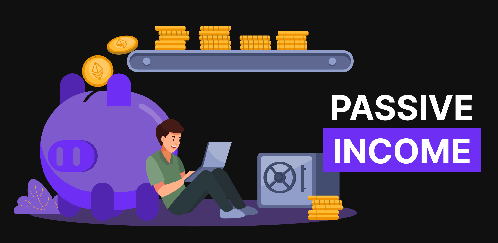

# Earning from DEXs with Liquidity Tokens and NFTs

Earning from DEXs with Liquidity Tokens and NFTs

Decentralized exchanges (DEXs) have a powerful value-add — the promise of truly open finance without a middleman. Simply existing as a platform, however, does not ensure success. In order for your buy or sell order to be fulfilled, there must be a counterparty.

Being able to easily and quickly convert between tokens is key to the success of decentralized exchanges. Without high liquidity, orders can take a long time to fill, have high slippage, or even not fill at all.

That’s why DEXs reward users for adding liquidity to their pools. By contributing to the liquidity pool, users can passively earn income from Uniswap trading fees. Adding liquidity to DEXs is one of the easiest ways to buy low and sell high, without having to actively trade.

## How liquidity provider (LP) rewards work

Providing liquidity to a DEX is a win-win-win situation. The liquidity provider earns on fees from trades, the DEX improves the trading experience, and the trader gets a better price for their trade. By adding liquidity to a DEX, users receive LP tokens that are associated with the platform. These LP tokens are typically ERC-20 tokens that are composable across the broader ecosystem.

The most popular DEXs include Uniswap, SushiSwap, Kyber Network, and Curve. Each of these DEXs have their own LP tokens that can be used to unlock new layers of access and yield farming opportunities. The value of an LP token is directly proportional to the amount of liquidity in the pool and can be calculated by dividing the total value of the liquidity in the pool by the amount of the LP token in circulation. LP tokens can be staked to earn additional passive income or traded for crypto or fiat.

On a technical level, a liquidity pool is just a smart contract between two tokens where the amount of either token must always remain equal to a fixed ratio, for example, 50/50. This allows traders to easily convert one token into another token quickly and efficiently. The stability of this ratio is what makes it attractive for liquidity providers, as they are able to earn revenue from the spread in price between these tokens over time.

Meanwhile, an automated market maker (AMM) is a blockchain program that acts as a facilitator to trade digital assets autonomously. AMMs use equations like the Constant Product Model to determine how tokens are exchanged and at what price. This approach provides much better liquidity than traditional exchanges while offering a fully automated, secure experience.

There’s been a boom in the number of AMMs available, as they help enable users to securely and efficiently trade assets across protocols. Furthermore, advancements like time-weighted average price (TWAP) trading with AMMs are giving traders the ability to execute orders more quickly and accurately than ever before. TWAP gives liquidity providers access to low-volatility prices, allowing them to profit from smaller pricing fluctuations.

## Get started providing liquidity

Different DEXs handle LP tokens in different ways. For instance, Uniswap’s LP token is a simple ERC-20 token. On SushiSwap, users get an SLP token specific to the asset they have deposited into the pool. Curve’s LP tokens represent an indirect form of staking and require users to hold cETH as collateral when staking.

To get started, simply sign up for an Ethereum wallet (like MetaMask) and deposit some ETH into your wallet. Then, connect your wallet to your preferred DEX and deposit tokens. Once you have done that, you can move to the relevant liquidity provider tab of the DEX.

From there, you will be able to select which assets you want to provide liquidity for. The rewards (in terms of LP tokens) received depend on how large the contribution is, the size of the pool, as well as market conditions.

## Earn passive income by pairing NFT pool tokens with ETH or USDC in Uniswap

Beyond simply depositing ETH, you can even use your NFTs to generate passive income. Similar to how a traditional liquidity pool or staking pool works, you can deposit an NFT into a [PooledNFT.com](https://poolednft.com/#/welcome) pool and receive a normal ERC-20 token, which you can use to generate additional passive income. You can easily pair your pool token with ETH or USDC in Uniswap, and start earning a return from the trading fees made within the pool.

This novel approach of using NFTs for DeFi applications brings huge implications to the NFT landscape by providing users an avenue to earn passive income from alternative digital assets. This works for any NFT collection and allows a much larger audience to gain exposure to collections that would otherwise be too costly.

The [Pawn Bots NFT collection](https://blog.hifi.finance/hifi-introduces-pawn-bots-98e357606a9) will be the first collection to tap into the potential of these NFT pools. Hifi also has plans to expand support for ERC-1155 tokens. Soon, users could be earning passive income from their digital trading cards, virtual sneakers, and other digital collectibles. Any NFT in a collection can be easily and fluidly swapped within the pool for more passive income opportunities.

In a nutshell, adding liquidity to Uniswap is a powerful way to bring a new income stream to the larger DeFi space. By leveraging LP tokens and pairing them with ETH or USDC, users have unprecedented ways to earn passive income through their NFT collections. As DEXs continue to develop, we expect to see steady innovations in the way liquidity is provided for digital assets.

Join the conversation on [Discord](https://discord.com/invite/uGxaCppKSH) and [Twitter](https://twitter.com/hififinance) to stay up to date on the latest and be part of our growing community.

Source: https://blog.hifi.finance/earning-from-dexs-with-liquidity-tokens-and-nfts-a7e78dc4b66b
