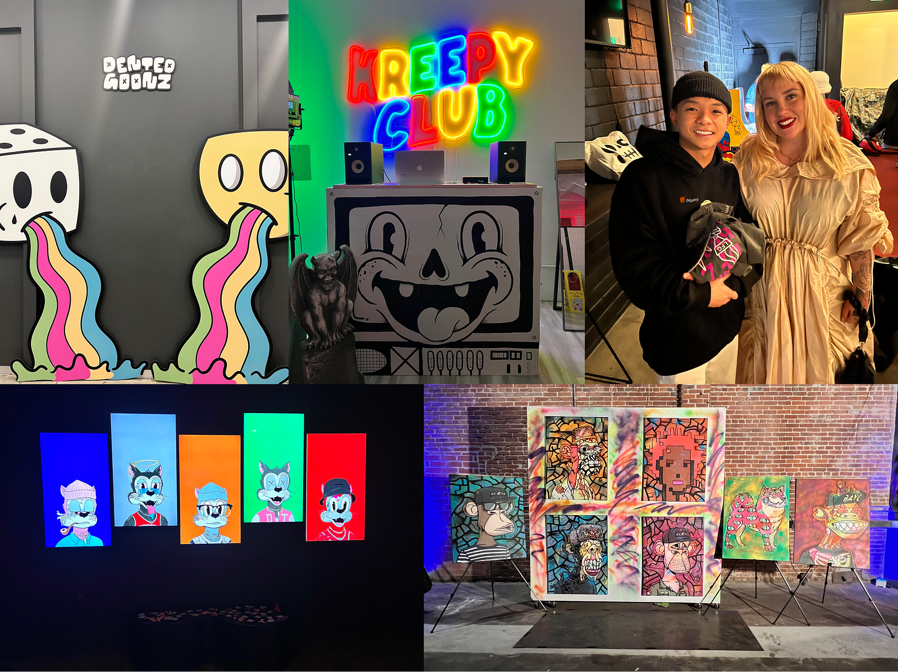

# Outer Edge LA: The Experience

Outer Edge LA: The Experience

At the end of March, our team attended Outer Edge LA 2023 (NFT LA), a gathering of innovative minds, creative projects, and enthusiasts in the NFT and DeFi space. Our objective in going was to promote our recently launched Pooled NFT product and connect directly with NFT teams in attendance.

This blog shares the experiences and takeaways from Outer Edge LA, highlighting the Hackathon, the conference, and the NFT community.

### Hackathon

We began our journey by sponsoring Outer Edge LA’s first Hackathon, a major competition where participants built projects and competed for prizes. Our sponsorship was a cash bounty that encouraged skilled teams to expand on Pooled NFTs’ smart contracts. Over ten teams dedicated their efforts to building upon our smart contracts and creating unique use cases.

_Outer Edge LA Hackathon_

### Liquid Pool & Pixel Port

Two standout projects, [Liquid Pool](https://github.com/punitarani/liquidpool-v2) and [Pixel Port](https://pixelportal-seven.vercel.app/), emerged as the winners of our bounty. Congrats to both teams!

[Liquid Pool](https://github.com/punitarani/liquidpool-v2) aimed to simplify the process of automatically depositing half of a user’s collection-linked ERC-20 tokens into a Uniswap pool and selling the remaining half for immediate liquidity. They created a single-click process for users seeking to add liquidity to an NFT pool and then add to liquidity to a Uniswap Market.

[Pixel Port](https://pixelportal-seven.vercel.app/) is a platform that streamlines the process of launching an NFT collection. Their [code](https://github.com/myweb3journey/pixelportal) utilized Pooled NFTs to allow options for investors to purchase fractionalized NFTs with credit cards.

_Liquid Pool, Pixel Port_

### Takeaway

The hackathon showcased creativity and talent within the NFT and DeFi community. The unique use cases and ideas proposed by the participating teams demonstrated not only the versatility of Pooled NFTs but also the potential it holds for builders and collectors alike. It was an excellent hands-on experience for our team to work on understanding which ideas resonated most with builders in the community.

### Community United

After the hackathon, the conference began. We attended panel discussions and keynote speeches to further enrich our understanding of the current trends and challenges faced by the NFT and DeFi community. Our CEO, Doug Leonard, spoke on a panel with notable industry leaders discussing the next catalyst for decentralized finance. We expect a transcript and video of the discussion will be released soon.

The conference was full of NFT enthusiasts, builders, and communities. Creating relationships and promoting Pooled NFT with individuals from the industry was a valuable component of Outer Edge LA.

_Arcade, Sologenic, Bankless, Hifi_

### Beyond the Conference

In addition to the main conference, prominent projects in the NFT space organized networking and satellite events. These events provided opportunities to connect with builders and forge relationships. As we interacted with creators, we pitched them on Hifi and Pooled NFT’s value propositions.

We attended 17 NFT project events and pushed ourselves to make as many connections with founders and collectors as possible! The whole experience was eye-opening and worth the effort to be there in person. Events like this help us get an accurate pulse on the space and see firsthand the people and the amount of effort it takes to run NFT projects.

Founders spoke a lot about recent royalty changes in traditional NFT marketplaces resulting in their projects looking for new revenue streams. We also learned how resource-strapped many projects are and that there is often no treasury for collections to use, even if they wanted to add liquidity to Pooled NFT and set up a Uniswap market. This was sobering to hear.

_Cryptoon Goonz, Kreepy Club, Deadfellaz, Degen Toonz, Yuga Labs_

### What We Learned

Outer Edge LA 2023 was an invaluable experience for our team as we promoted Pooled NFT and connected with the NFT and DeFi communities. By sponsoring the Hackathon, we witnessed the power of Pooled NFTs through the creativity and talent of participating teams. Attending panel discussions, keynote speeches, and networking events deepened our connections and understanding of the space. Our time at the conference not only allowed us to forge relationships with builders and creators but also gave us the opportunity to learn firsthand about the needs of the NFT community. The insights gained at Outer Edge LA will help us steer our future strategy.

Join us on our journey to shape the intersection of NFTs and DeFi. Follow us on Discord and [Twitter](https://twitter.com/poolednft) to stay up-to-date on the latest developments.

Source: https://blog.hifi.finance/outer-edge-la-the-experience-c38dcf18836f
