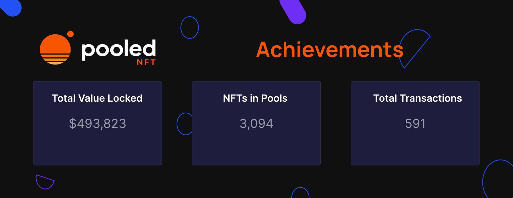

# Pooled NFT: Airdrop #2

Pooled NFT: Airdrop 2

Two months ago, we introduced Pooled NFT — a solution designed to address the major [challenges](https://blog.hifi.finance/our-customers-biggest-problem-6f838302e5a) NFT communities face: price, liquidity, and uncertainty. PooledNFT has already shown high engagement, and we’re thrilled to share that we’ve reached ~$490,000 in Total Value Locked (TVL)! Early users were airdropped a flawless [Pawn Bot](https://www.pawnbots.com/), and now it’s time for Airdrop #2!

### Quick Recap

[Pooled NFT](https://poolednft.com/#/welcome) enables NFT collectors to deposit their NFTs into collection-specific pools and receive ERC-20 tokens in return. By leveraging the familiar and versatile ERC-20 token standard, Pooled NFT bridges the gap between NFT collections and the world of decentralized finance.

*ERC-721 to ERC-20*

### Airdrop!

We’re airdropping several rewards and reimbursements to participants to celebrate those who have shown up and taken action. Airdrops like this highlight one of the unique capabilities of pool tokens! The snapshot for this airdrop was taken today, April 13th.

To everyone who deposited into an NFT pool, we’re airdropping $10K in $BOTSp tokens and reimbursing your ETH for those transactions! Thank you for your early support. To everyone who created a new pool or Uniswap market, which often comes with higher gas costs, we’re reimbursing you the gas costs for those transactions!

To [@TaekwonKrypto](https://twitter.com/TaeKwonKrypto) and [@MainBrain_](https://twitter.com/MainBrain_), we’re sending $1K in BOTSp for their early content contributions. See TaekwonKrypto’s video [here](https://www.youtube.com/watch?v=i9hiH6Azpqg&t=220s) and Mainbrain’s early Reddit post [here](https://www.reddit.com/r/Mainbrain_/comments/1192cov/how_to_use_hifis_pooled_nft_protocol_with_the/).

And finally, to our two earliest community builders, [@Bijoy.eth](https://twitter.com/bijoydoteth) and [@0xjustadev](https://twitter.com/0xjustadev/status/1630303405762662404?s=20), we’re sending each $1K in $DINOp tokens! @Bitjoy.eth built and open-sourced a [front end](https://www.poolmynft.xyz/) for pooled NFTs within the first week of its release. And @0xjustadev built the first [smart contract](https://twitter.com/0xjustadev/status/1630303405762662404?s=20) that enabled users to combine both deposit and withdraw actions into a single swap transaction.

### Early Traction: Breaking Down the Numbers

TVL is “Total Value Locked,” which refers to the total amount of assets currently locked or held in a particular DeFi protocol or platform. TVL is a crucial indicator of traction in a DeFi platform. In just two months, Pooled NFT has rapidly achieved a TVL of $490k, distributed among nine collections.

With over 500 transactions, the Pooled NFT platform has seen impressive growth in a short period. The platform has attracted a range of NFTs, with approximately 3,000 NFTs residing in the pools. As the platform evolves and garners more attention, the number of unique NFTs and collections participating will grow.

Pool tokens are being paired with other assets to create liquidity pools on Uniswap markets. $BOTSp/$USDC pair has a TVL of ~$140,000 and $BOTSp/$ETH pair has a TVL of ~$152,000. Providing liquidity on Uniswap opens up an alternative, liquid market for NFT traders. The number of users on Pooled NFT continues to grow, and more members are enjoying the benefits that come with it.

### What’s Driving the Volume?

The Hifi and Pawn Bots community is showing up and experimenting with this new tool.

NFT investors are no longer limited to owning an entire NFT to participate in a collection. Owners are fractionalizing their NFTs by selling a portion of their pool token. Investors purchase those fractionalized NFTs and gain exposure to a broader range of collections without committing significant capital. Fractionalization from Pooled NFT offers portfolios greater flexibility in the ever-evolving market.

Savvy members are seizing arbitrage opportunities by purchasing Pool tokens at low prices. They then exchange these tokens for NFTs, which they can sell on conventional marketplaces at higher prices, making a profit from the differences. This activity showcases one of the many ways traders can leverage Pooled NFT.

Collectors are taking the opportunity of generating passive income by providing liquidity on Uniswap markets using pool tokens. Liquidity providers receive a portion of the fees from every transaction in the pool. This helps stabilize the ecosystem and rewards collectors’ involvement in the platform.

### The Road Ahead

We are pleased with the early volume, traction, and usage of Pooled NFTs, as it shows the potential for the future. Our team has begun a ground-up rewrite of the front end and has already learned crucial lessons that are shaping a v2 of the smart contracts; more on that in a future blog post.

Join the conversation on [Discord](https://discord.com/invite/uGxaCppKSH) and [Twitter](https://twitter.com/hififinance) to stay up to date on the latest and be part of our growing community.

Source: https://blog.hifi.finance/pooled-nft-airdrop-2-43b2706eeefe
