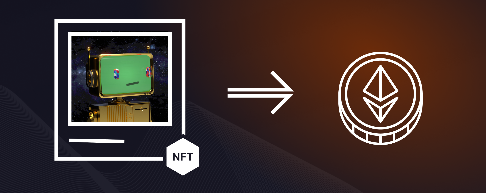

# NFT Collateral Status Update

NFT Collateral Status Update

In previous blog posts, we’ve introduced [Our Customer](https://blog.hifi.finance/our-customer-d1f956a87e90) and touched briefly on [Our Customers Biggest Problem](https://blog.hifi.finance/our-customers-biggest-problem-6f838302e5a). Enabling NFTs as collateral helps address NFT collection accessibility, liquidity, and mitigating collector uncertainty. By offering this functionality, we can support growth and retention for NFT communities.

Let’s check-in and take a look at where we are at in our journey to unlock NFTs as collateral. This post highlights our progress and outlines what remains between where we are currently and finally being able to borrow against NFTs.

### Where We Are Today

Our [latest blog post](https://blog.hifi.finance/pooled-nft-v2-82dcee8b7d15) introduces Pooled NFT v2 and discusses how it solves the stuck NFTs in the current version. V2 will add permissions and elegantly manages this edge case. Our team can remove the last NFT, sell it, and disperse the proceeds to the pool token holders pro-rata.

While it is technically possible to enable borrowing for NFTs today, we’ve opted to wait until the new version of Pooled NFT goes live before doing so. We want to avoid creating additional incentives to add collections to v1 of Pooled NFT. Additionally, managing a migration with active borrowing unnecessarily splits liquidity and overcomplicates the upgrade and migration process for pooled NFTs.

### Upgraded Front End

Alongside the next iteration of the smart contracts, we’re planning to ship a ground-up rewrite of the front end. Bringing with it the polish you’ve come to expect from our team. This will give us a more professional and usable product to present new users with.

### **Conclusion**

So that’s it! Once the smart contract and front end work are complete, we are ready to move forward with a proposal to add Pooled NFTs as collateral on Hifi’s Lending platform. With a polished and user-friendly front end, we hope users will be more willing to experiment with Pooled NFTs and begin to unlock their NFTs’ potential!

Join us on Discord and [Twitter](https://twitter.com/hififinance) to stay updated on our latest developments of NFTs as collateral.

Source: https://blog.hifi.finance/nft-collateral-status-update-c3774cd45eed
