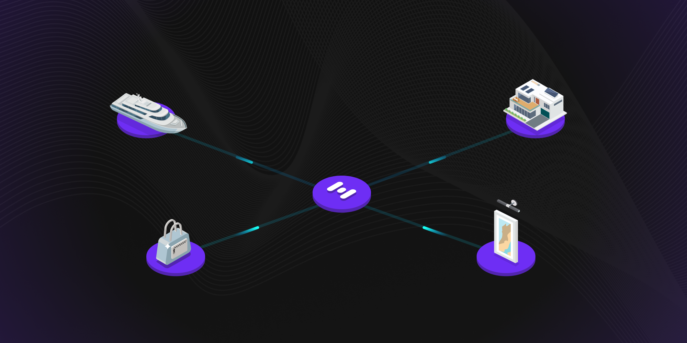

# We’re Ready! Onboarding Our First Real-World Asset (RWA)

We’re Ready! Onboarding Our First Real-World Asset (RWA)

### Our first real-world asset is ready to be tokenized and added as collateral!

Recall from our [Growth](https://blog.hifi.finance/growth-175a470d3d58) blog post that our growth strategy has two fronts, **NFTs** and Real World Assets (**RWAs**). Today’s blog post focuses on the progress we’ve made on the RWA front.

### Crown Ribbon’s Steady Progress

You already know about [Crown Ribbon](https://blog.hifi.finance/probably-nothing-3b5080008387) and our efforts to disrupt the performance horse industry. Progress at Crown Ribbon continues to move forward at a steady pace, navigating the legal processes required of us. In the meantime, our team has been working behind the scenes to curate other great collateral opportunities for Hifi Governance to consider.

### Our First RWA

We’re thrilled to announce that we are ready to tokenize our first RWA. In the coming weeks, we will submit a governance proposal to onboard a new tokenized asset representing ownership in a one-of-a-kind collectible car. Our goal with this first RWA is to demonstrate the various roles and legal frameworks we are using to bridge Real World Assets on-chain. All of our work here lays a foundation for Crown Ribbon and all of our future RWAs.

### Next Steps

We will publish blog posts that:

1. Introduce the Asset and our Borrower

1. Publish an overview of our trust and legal architecture

1. Submit a proposal to Hifi DAO for consideration

### In Conclusion

We’re incredibly excited to achieve this next major milestone as a community and bring our first RWA on-chain and into Hifi’s lending protocol. The hard work of the team and community is paying off. From months of researching and endless effort put into finding the right partners to help make this a reality for Hifi. Join us as we close in on hitting over $1M TVL in the HIFI protocol and begin participating in the largest onboarding of value blockchain will ever experience!

This is only possible with you, join in and participate with us directly on [Discord](https://discord.com/invite/uGxaCppKSH) and [Twitter](https://twitter.com/hififinance)!

Source: https://blog.hifi.finance/were-ready-onboarding-our-first-real-world-asset-rwa-79fd8dc694df
