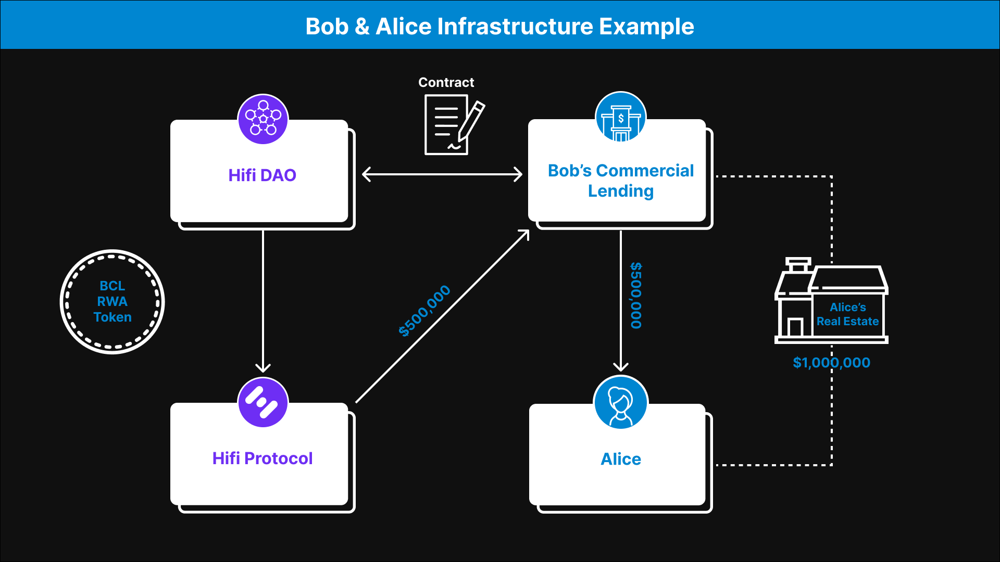

# Real-World Assets: The Framework

Real-World Assets: The Framework

[Previously](https://medium.com/mainframe-bits-bobs/were-ready-onboarding-our-first-real-world-asset-rwa-79fd8dc694df), we announced our first RWA as a one-of-a-kind collectible car, a massive milestone in our progression.

As we move forward, it’s crucial we develop a legal and structural foundation applicable to a wide variety of RWA classes. Today’s blog post will describe the legal framework and how it positions the Hifi Protocol for future growth.

### Defining Key Entities

The first step in creating a legal framework is understanding the entities involved and their relationships. For our purposes, we will define three key entities: the Hifi DAO, a Traditional Lender, and a Borrower.

The **Hifi DAO** is responsible for managing risk on the Hifi Protocol. This means that through governance votes, the Hifi DAO can add or remove collateral assets, set loan-to-value ratios, and change other variables associated with risk management on the protocol.

A **Traditional Lender** is an external entity with deep expertise in a collateral asset category and existing demand for borrowing.

**An example would be [Crown Ribbon](https://blog.hifi.finance/probably-nothing-3b5080008387). Crown Ribbon has deep expertise in the horse industry and existing demand for borrowing against that asset class.*

The **Borrower** is an individual or entity that owns a collateral asset and wishes to borrow against it.

### **Connecting the Pieces**

Our goal as a community is to onboard our [first billion dollars](https://blog.hifi.finance/the-road-to-token-swap-89b0c2c739f3) of value onto the Hifi Protocol, but it is not realistic for the Hifi DAO to become experts in every category of real-world assets.

A more scalable solution is for Hifi DAO to form partnerships with Traditional Lenders that already have deep expertise in a collateral asset class. The Traditional Lenders can then lend their Borrowers capital from the Hifi Protocol.

The partnership between Hifi DAO and the Traditional Lender will be formed through a legal contract, and the basic terms will include the following:

* Hifi DAO will add an RWA Collateral Token to the Hifi Protocol.

* The Traditional Lender will then be able to draw capital from the Hifi Protocol using that RWA Token as collateral.

* The Traditional Lender can use capital sourced from the Hifi Protocol to originate loans to Borrowers on certain specified terms.

* The Traditional Lender is responsible for repaying the capital to the Hifi Protocol and liquidating the Borrowers’ assets in the case of default.

### Understanding the Structure

Here’s an example to illustrate how everything fits together:

Let’s say there is a Traditional Lender called Bob’s Commercial Lending with a good track record of lending against commercial real estate. Let’s also say there is a Borrower named Alice, a commercial real estate investor with a large commercial real estate portfolio.

Alice wishes to borrow $500,000 from Bob’s Commercial Lending using $1,000,000 worth of her commercial real estate portfolio as collateral. Bob’s Commercial Lending would like to source capital from Hifi Protocol to originate the loan to Alice.

Hifi DAO and Bob’s Commercial Lending draft a legal contract that defines a partnership between the two entities. The Hifi DAO must vote to approve this contract. In this contract, Hifi DAO agrees to add an RWA Collateral Token to the Hifi Protocol for Bob’s Commercial Lending.

Using this RWA Collateral Token, Bob’s Commercial Lending can source $500,000 of capital from the Hifi Protocol to lend to Alice. Bob’s Commercial Lending agrees to only use this capital for lending against commercial real estate with approved loan-to-value ratios.

If Alice defaults on her loan, Bob’s Commercial Lending is responsible for liquidating her commercial real estate collateral to return the $500,000 to the Hifi Protocol.

Remember, this example is only a basic blueprint, and the details will vary based on the assets and lenders we work with.

### **What’s Next**

The legal framework lays a solid foundation for integrating real-world assets (RWAs) into the Hifi Protocol. We are working hard to finalize the governance proposal to approve the contract and partnership between Hifi DAO and the lender. Stay tuned for next week’s blog post as we reveal the details of the unique, rare vehicle.

We invite you to stay connected with us. Keep an eye on our announcements, participate in our discussions, and be a part of the growing community on [Discord ](https://discord.com/invite/uGxaCppKSH)and [Twitter](https://twitter.com/hififinance).

Source: https://blog.hifi.finance/real-world-assets-the-framework-f8180a749256
