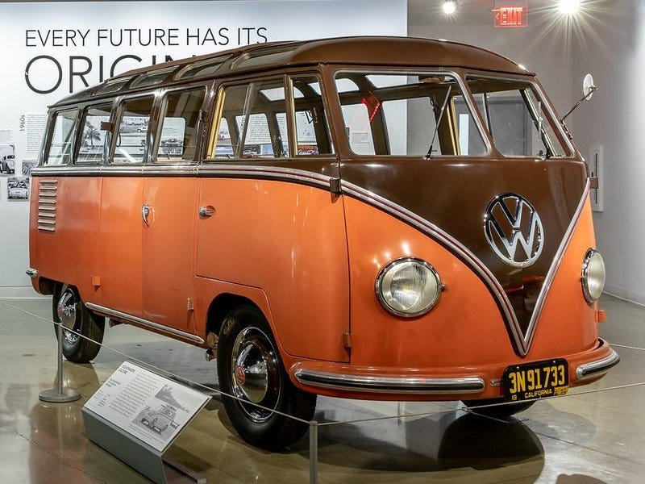
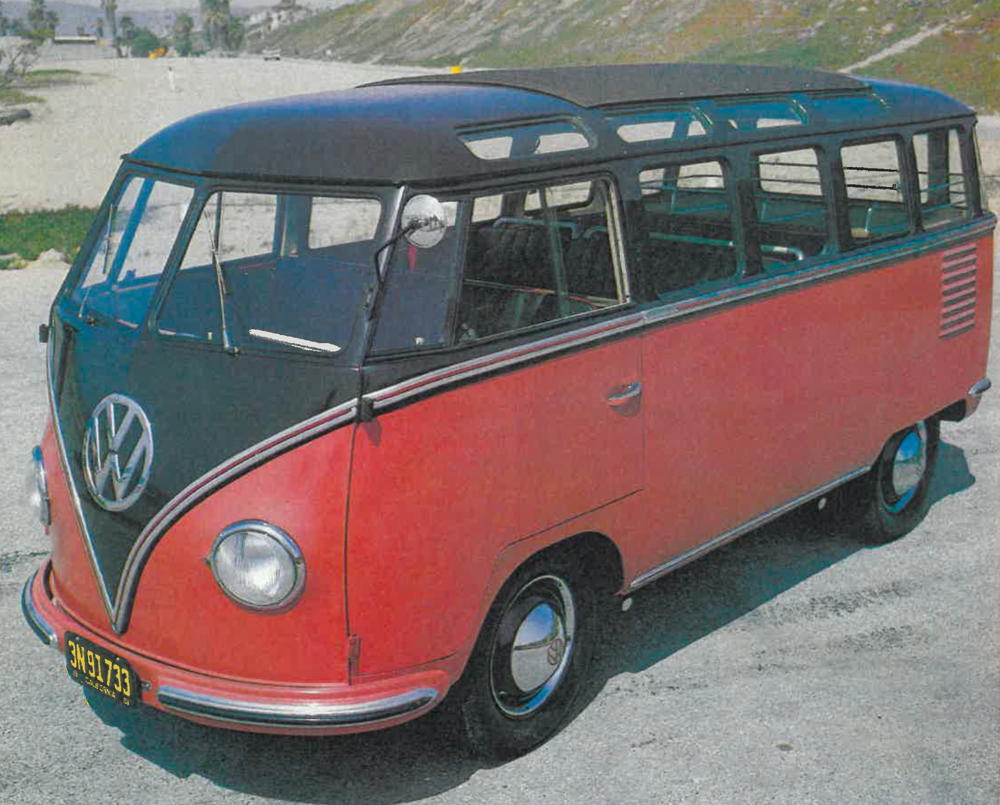
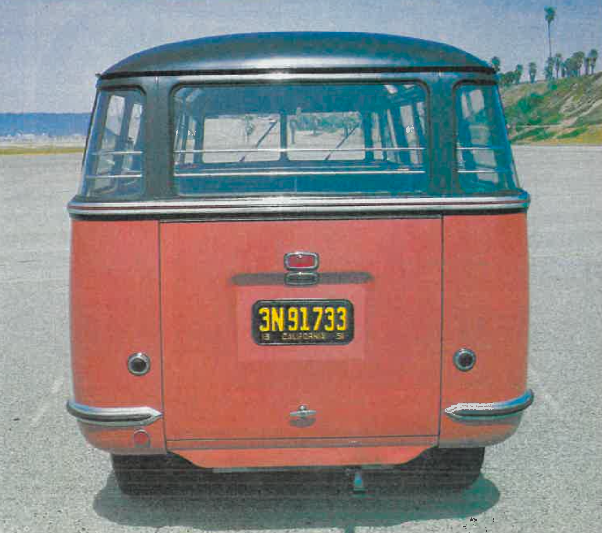
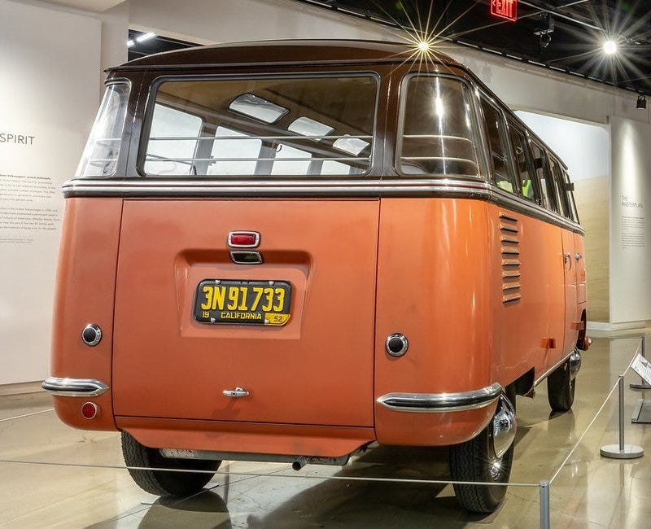
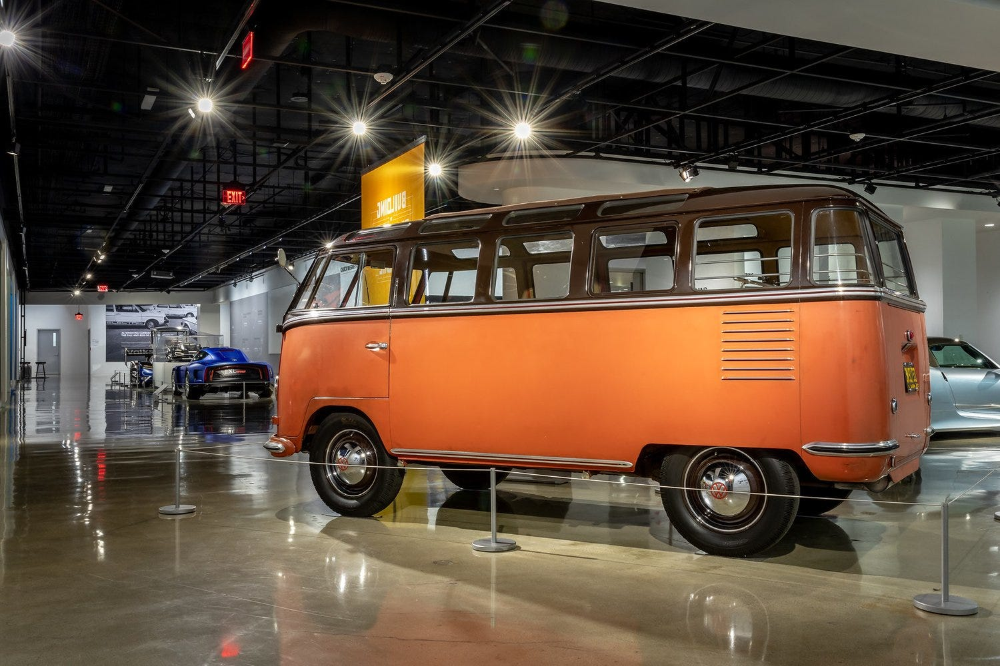

# Introducing Our First Real-World Asset

Introducing Our First Real-World Asset

## 1952 Volkswagen Type 2 DeLuxe Microbus

The following information is adapted from a recent Appraisal by Brendan Finn, Owner of [Holy Grail Garage](https://holygrailgarage.com/). With over 33 years of experience in vintage Volkswagens, Brendan Finn operates Holy Grail Garage, a global business providing comprehensive services around these classic cars. Beyond owning 50+ pre-1967 models, he assists in buying, selling, inspecting, and appraising individual vehicles and entire collections. Brendan has been instrumental in constructing and deconstructing significant Volkswagen collections in North America. He has helped clients sell over 500 vintage VWs, including record-breaking transactions. Adding to his credibility, he is a member of the NADA Classic Car Pricing Guide’s Advisory Committee for vintage Volkswagens.

*The Woods/Hornbecker*

This 1952 Volkswagen 23 Window Microbus with VIN Number 20–021754 is essentially the heavyweight champion of the world in the Vintage Volkswagen Bus community. It is completely original, unrestored, has under 19,000 original miles, is one of the oldest 23 Window Deluxe Buses on Earth, one of the oldest that Volkswagen built, one of the first that was originally delivered to the USA, and it has been in top-level collector ownership and custody dating back to the mid-1970s.

The 23 Window Deluxe Sunroof Microbus was the top-of-the-line model among Volkswagen Buses from late 1951 through 1963. The first generation examples, referred to as “Barndoors” for their huge engine lid, were made from late 1951 through early 1955. Barndoor 23 Window Deluxe Sunroof Microbuses are extremely desirable and rare, and the earliest examples from 1951 and 1952 are the crown jewels. The Bus is a true unicorn, a mind-blowing time capsule, original Sealing Wax Red and Chestnut Brown paint, original tan leatherette and wool cloth interior, original running gear including the matching numbers 25hp engine and full crash box transaxle, a superb survivor, and is the top of the top, on a global scale. It was selected for and participated in the “70 Years Of The Volkswagen Transporter” display at the Quail Motorsports Gathering in Carmel Valley, California back in 2019 and was recently on display at the [Petersen Museum](https://www.petersen.org/vw-23-window) as well.

This Bus has been a top legend of the global hobby for nearly the last 50 years. One of the most dreamt about, coveted, cherished, valuable, and it has been nicknamed two times, firstly, “The Woods” for the late legendary collector, Steve Woods, who purchased it in the mid-1970s from a Volkswagen dealership in Oklahoma. The dealership took delivery of the Bus back in early 1952, kept it in their inventory, and it was used as a loaner vehicle for customers who brought their cars in for servicing. By the mid-1970s the Bus had only accumulated approximately 14,000 miles, Woods bought it and proceeded to drive it back to his home in Seattle, Washington. By the early 1980’s he sold it to another legendary collector, Mike Hornbecker, of Manhattan Beach, California, who is the other nickname namesake for the Bus, “The Hornbecker”, as he owned it for approximately the next 20 years. In the years since these two owned it, collectors and enthusiasts have called it “The Woods” or “The Hornbecker”, depending on who they most credit for bringing it into the inner circle. The collector who originally got it into private collector hands, or the collector who owned it for the longest period of time!

I have personally been involved in the last three transactions on this Bus. The first time as a consultant to the buyer three sales ago, then again as a broker two sales ago, and again as a broker on the most recent sale. It has broken the world record highest price paid for a Volkswagen Bus four times, to my knowledge. It’s also possible that it could have been the highest price ever paid for any Vintage Volkswagen but I am not positive on that claim. The sales figures on this Bus have never been published nor shared publicly, just quietly amongst top-level enthusiasts in the innermost circle of the early Bus community.

There literally is no comp for this Bus. The closest Bus to it is a 1954 Barndoor 23 Window Deluxe Sunroof Microbus with 14,000 original miles that is affectionately referred to as “The Milan” as it was a hotel shuttle Bus for the Hilton Hotel in Milan, Italy, and survived in an equal fashion to The Woods/The Hornbecker. These two examples are absolutely incomparable to any other known surviving 1951–1955 Barndoor 23 Window Buses and they are vastly different Buses themselves, being an “early” example in the 1952 and a “late” example in the 1954. Literally dozens upon dozens of different production details between them. As a point of interest, I also brokered the last sale on The Milan back in 2011 so I have intimate knowledge of that Bus as well.

Based upon the most recent transactions of The Woods/The Hornbecker, lesser examples of 1952–1955 Barndoor 23 Windows, and unsolicited private offers sent through me on The Milan, as well as my nearly 35 years of involvement in the Vintage Volkswagen Bus scene and 15 years of full-time brokering, it is my professional opinion that the current market value on the1952 Volkswagen Barndoor 23 Window Deluxe Sunroof Microbus is: $650,000 US Dollars.

## Geek Out

If you’d like to dive into more about the history of this one-of-a-kind bus, check out these magazine publications that have written about it over the years.

* [Volkswagen Greats August 1975](https://medium.com/@HifiFinance/5ca4d737ee46)

* [Dune Buggies and Hot VW’s June 1984](https://medium.com/@HifiFinance/dune-buggies-and-hot-vws-june-1984-7dd30061c20b)

* [Dune Buggies and Hot VW’s July 1984](https://medium.com/p/a9d09e2ee4da/edit)

* [Classic VW’s Summer 1993](https://medium.com/@HifiFinance/38b44df5a9ca)

## The Road Ahead

The legal agreements for the DAO and each party involved in making this happen are being finalized. Once finalized, the team will submit a governance proposal for Hifi DAO to consider. The proposal is expected in the next week or two.

Now is a great time to ensure you have your HIFI tokens in a wallet you control, off of an exchange, so you can participate in the snapshot vote to add our first Real-world asset as collateral to the Hifi Lending Protocol! This is a big milestone for our community and we are grateful for everyone’s support that has gotten us here.

Source: https://blog.hifi.finance/introducing-our-first-real-world-asset-2395668f5aaf
