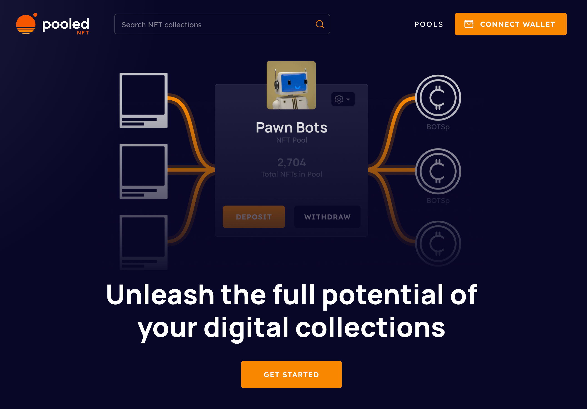

# Pooled NFT V2 is Live

Pooled NFT V2 is Live

### We are proud to deliver a complete revamp of Pooled NFT.

When we first launched Pooled NFT we were amazed by the positive response we saw from our community. As we stated when we first [launched Pooled NFT](https://medium.com/mainframe-bits-bobs/pooled-nfts-passive-income-for-any-nft-c35fe80f9386):
> Pooling NFTs is a way to turn any NFT collection into passive income.

By issuing ERC-20 tokens for any ERC-721 tokens (NFTs) deposited into our pools and adding liquidity to Uniswap, we have brought NFTs into the world of DeFi!

Many of you [swapped NFTs from our pools ](https://twitter.com/poolednft/status/1673372850642894848)and took advantage of [arbitrage opportunities](https://twitter.com/poolednft/status/1657113627164561408). This motivated us to improve Pooled NFT and make it more broadly accessible. Our first version served as a proof of concept to demonstrate the utility of NFT fractionalization and pools, but V2 is the complete embodiment of our initial vision. We want to thank everyone who took part in using our first version, but let’s introduce you to [Pooled NFT V2](https://poolednft.com/).

Here is a list of improvements you’ll find in V2:

* A completely reimagined user experience

That’s it, that’s the list, but let’s take a second to appreciate what that really means.

***V1 is on the left, and V2 is on the right.***

Pooled NFT V2 bears almost no resemblance to the first version, but rest assured all of the same functionality is still in place, plus much more.

### Users will be able to do the following:

* Search and Browse existing NFT pools

* Filter pools by traits and rarity

* Search pools for specific NFTs

* View all of their NFTs and tokens in a comprehensive wallet view

* Create new NFT pools directly from collections in their wallet

* Deposit NFTs into pools from the pool or wallet page

* Withdraw NFTs from pools directly from the platform UI

This is just the tip of the iceberg. The overall design and experience have been thoughtfully crafted and developed to be familiar to anyone who has used NFT marketplaces.

### New Resources

We have also added materials to help onboard new users to Pooled NFT and educate existing users. We have our intro page [What are Pooled NFTs?](https://poolednft.com/what-are-pooled-nfts/pool-basics) a dive into the DeFi opportunities [NFTs X DeFi](https://poolednft.com/nfts-x-defi), and an [FAQ](https://poolednft.com/faq) where we are documenting answers to common questions.

As we move into V2 we have also [upgraded our smart contracts](https://blog.hifi.finance/pooled-nft-v2-82dcee8b7d15). These improvements will ensure that the last NFT in a pool won’t get stuck and can be released if the final token belongs to multiple wallets. Any users that have tokens from our V1 pools/contracts will need to withdraw NFTs from their pool and then deposit them into our new V2 pools. We have an [improved V1 version](https://v1.poolednft.com/) of the site facilitating this process for many pools. Navigate to the pool page or your wallet and you’ll see options to migrate to V2.

### This is just the beginning

This is a new dawn for Pooled NFT, with our V2 launch we are ready to take this platform to the masses. We view Pooled NFT as a public service that we want to give back to the NFT community and creators to be a new revenue source as the landscape changes. Pooled NFT opens up a number of new opportunities to bring DeFi to NFTs.

We are grateful to be able to share all of our hard work with you and can’t wait for you to use Pooled NFT V2.

We invite you to stay connected with us. Keep an eye on our announcements, participate in our discussions, and be a part of the growing community on [Discord](https://discord.gg/B3T9zPJXMf) and [Twitter](https://twitter.com/poolednft).

Source: https://blog.hifi.finance/pooled-nft-v2-is-live-d96505a57c88
