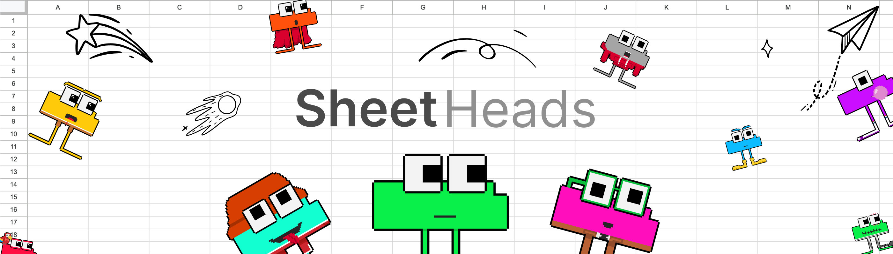
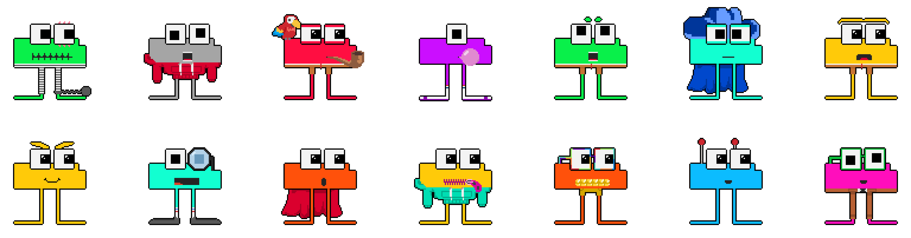
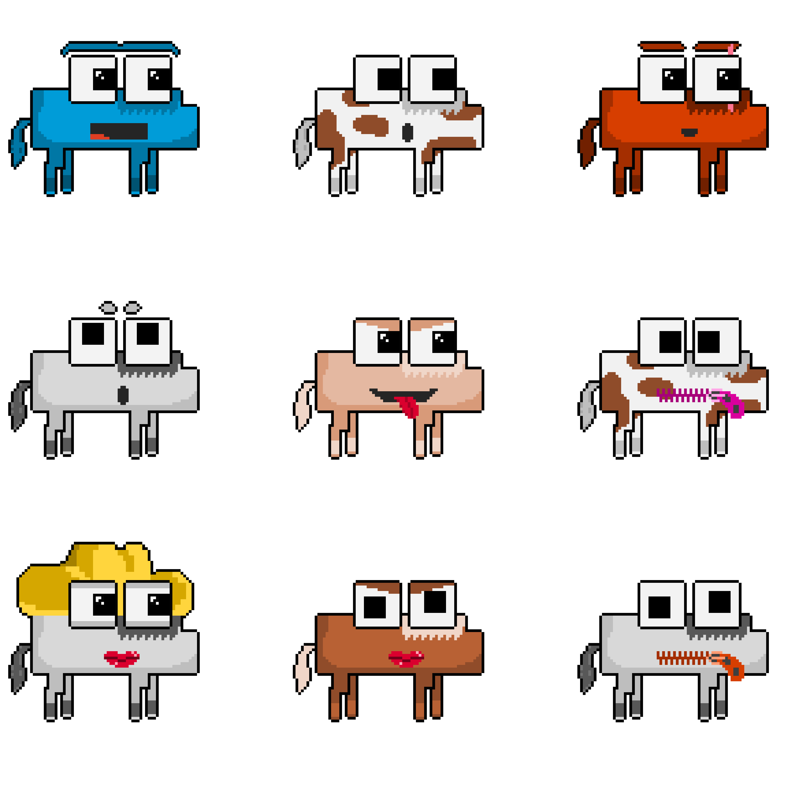

# Introducing: Sheet Heads

Introducing: Sheet Heads

### Get ready for a one-of-a-kind NFT experience, where humor, creativity, and spreadsheets collide!

Introducing [Sheet Heads](https://sheetheads.com/), an NFT project built entirely in Google Sheets. Each asset was painstakingly crafted pixel by pixel, setting the color within each humble cell.

## Getting Our Sheet Together

*Comprehension*

Sheet Heads was designed with simplicity in mind. Sheet Heads is easy to explain and easy to share. Simply put, it’s an NFT project built entirely in Google Sheets.

Despite this surface-level simplicity, if you look deeper Sheet Heads is an exploration of what is possible when you apply creative constraints to a unique canvas. In this case, pushing the boundaries of serious data analytics software to create art that doesn’t take itself too seriously.

## For Sheets and Giggles

*Resonance*

Sheet Heads captures the essence of humor and creativity, serving as a reminder that NFTs can embrace the lighter side of life. It is designed to make you laugh and forge meaningful connections as we continue to shape the expanding world of Web3.

As a collector, you’ll enjoy full access to the original sheet files, empowering you to create personalized memes and spin-offs. User-generated content, like community-made memes, plays a crucial role in driving organic engagement and building a strong online presence.

## Sheet Posting

*Visual Identity*

A good NFT collection needs a clear visual identity. Some of the constants you’ll find in the collection are the body and eye shapes. Sheet Heads is designed with enough variation to make each piece feel unique, but still recognizable as part of the collection.

The distinct geometric shapes and bold colors of Sheet Heads stand out and are easily recognizable even at the small size of a social media profile picture. This creates a strong brand identity that will help our community grow.

## Rare and Unusual Sheet

Within Sheet Heads, you’ll find three tiers of rarity. After the classic Sheet Heads there is a tier called **Horsey Men. **There are 327 of these and they resemble horses… somewhat. They come in a variety of colors unique to this tier. Holders of these NFTs will receive future [Crown Ribbon](https://www.crownribbon.com/) related perks, including early access to the platform. Giddy-up Cowboy! (Some legal and regulatory conditions may apply.)

The rarest tier is the 1:1s. There are only 16 of these in the collection, and each one is completely unique. Each 1:1 breaks the mold by taking on a different form factor than the rest of the Sheet Heads. The most exciting part about owning a 1:1 Sheet Head is that you get to create your own limited-run NFT collection with the help of the team! What you do with this new collection is completely up to you.

## Just the Beginning

Get ready for a memorable and meme-filled experience that not only pushes the boundaries of NFT collections but brings people together for a good laugh and maybe some pivot tables along the way. Whether you are a dedicated Pawn Bot holder or a newcomer eager to dive into the Sheety-verse, there’s a place here for everyone. As we move forward into this exciting chapter, let’s not just witness, but shape, the evolution of NFTs together. Embrace the art. Embrace innovation. Say hello to Sheet Heads!

For details on how to mint Sheet Heads check out our [**next blog](https://blog.hifi.finance/minting-sheet-heads-1eef2ff8d54)**. Be sure to follow the Sheet Heads on [Twitter](https://twitter.com/sheet_heads) and join our [Discord](https://discord.com/invite/uGxaCppKSH).

Source: https://blog.hifi.finance/introducing-sheet-heads-9d42267e46e
