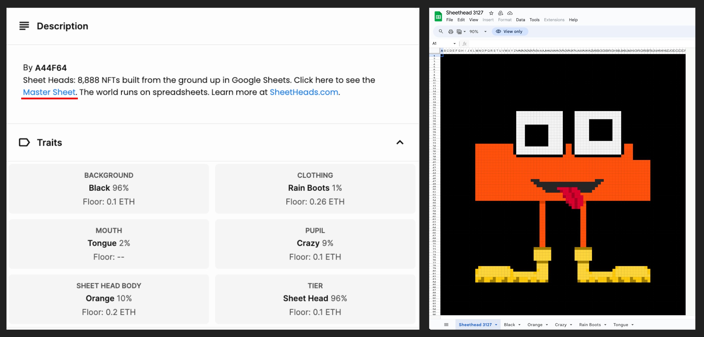
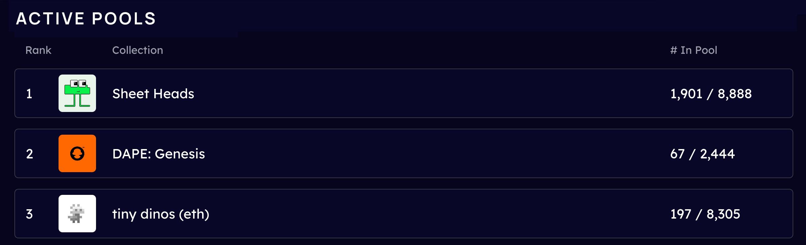

# Ecosystem Airdrop

## Sheet Heads

A little over 1 week ago, we released our new NFT collection, Sheet Heads. Within that week, over 40% of the collection has been claimed! On top of that, the team updated the metadata to include the Master Google Sheet of every single NFT. To access this, simply view any Sheet Head on OpenSea and view the Master Sheet located under the description section.

## Pooled NFT v2

In tandem with the Sheet Heads launch, we released Pooled NFT v2 with massive improvements from v1 including new search and filter features, a comprehensive wallet view, and a completely reimagined user interface. With hundreds of transactions processed in just the first week, Pooled NFT v2 is already home to over 2,000 NFTs distributed across various pools. Our community members have also been able to seize arbitrage opportunities by swapping low-rarity NFTs for NFTs with more desirable traits.

## Airdrop!

To show our gratitude for your active participation, we’re excited to announce an ETH airdrop reimbursing users for gas costs. The snapshot for this airdrop covers transactions made between May 2nd and August 24th, including:

* All Withdrawals on Pooled NFT v1

* Deposits on Pooled NFT v2

* Migrations from Pooled NFT v1 to Pooled NFT v2

* Sheet Heads mint transactions

## Moving Forward

We’d like to take a moment to thank our amazing community for their involvement in the launch of our latest offerings. Thank you! The team is pleased with both the number of Sheet Heads that have been minted as well as the number of early adopters for Pooled NFT. As we forge ahead, our focus will remain on Sheet Heads, Pooled NFT, and the Tokenization of Real World Assets. Stay tuned!

Source: https://blog.hifi.finance/ecosystem-airdrop-230eecf4bf7b
