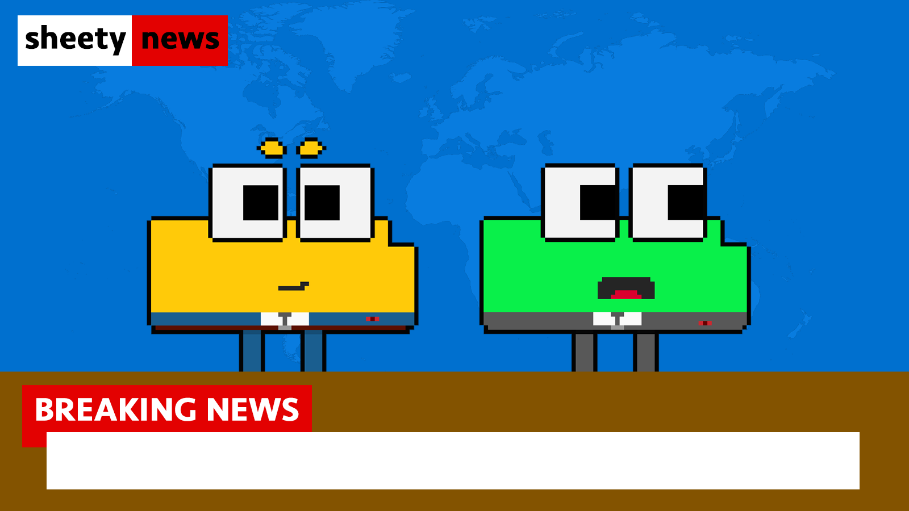
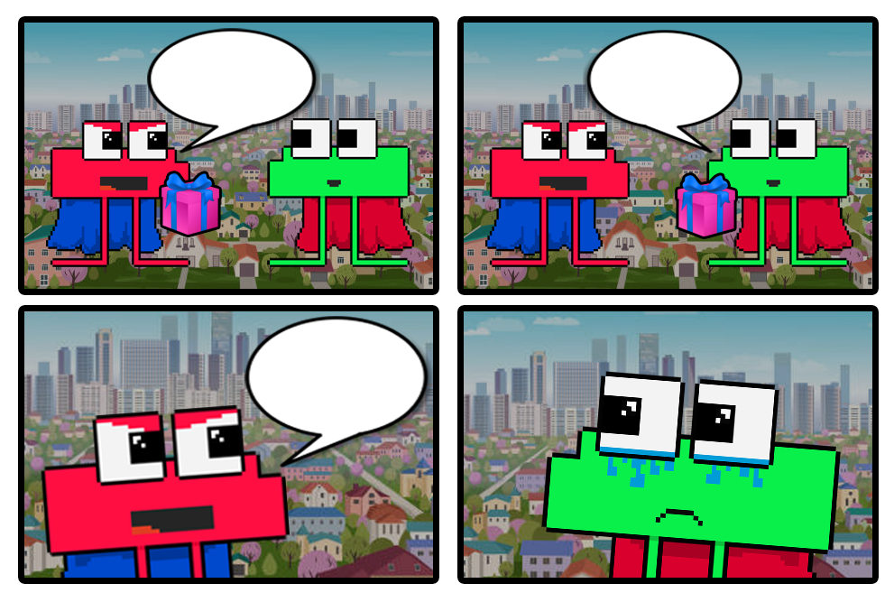

# Sheet Heads Mint Cutoff + Meme Contest

Sheet Heads Mint Cutoff + Meme Contest

We’re two weeks into the exciting Sheety-verse Adventure, and we’ve seen fantastic participation from our community members, both in the form of minting Sheet Heads and meme content generation. In today’s blog, we’ll provide the details regarding the cutoff for minting Sheet Heads and announce our first meme contest giveaway! Let’s dive in.

## Sheet Heads Mint Cutoff

As mentioned in the Google Sheets document announcing [Our Plan](https://docs.google.com/spreadsheets/d/1r9Jy9eyw-sICFhBUFjbf3TLPupvn7oQlymqYvp6WvYM/edit#gid=0), the team will announce a cutoff deadline for the transition. Afterward, any unclaimed Sheet Heads will be used for marketing and liquidity, similar to what our team has done with Pawn Bots.

The official cutoff date for transitioning your Pawn Bots to Sheet Heads is:** September 30, 2023 @ 11:59 PM UTC.**

This means you have approximately one month from now to decide whether or not you join the Sheety-verse. Still need to mint? Check out our blog on “[Minting Sheet Heads](https://blog.hifi.finance/minting-sheet-heads-1eef2ff8d54)” or visit [sheetheads.com](https://sheetheads.com/). As a reminder, participation in the Sheet Heads is optional. Some collectors may choose to keep their Pawn Bots or only transition a portion of what they’ve collected. Just know that all Pawn Bots related efforts are ending, and their respective services will be shut down. This includes the Websites, Discord, and Twitter. Choose wisely.

## Sheet Heads Meme Contest Giveaway

Now for the exciting part. To celebrate the successful launch of Sheet Heads, we’re holding a meme contest where three lucky winners will receive a Sheet Head! The contest is simple:

* Create a meme using a Sheet Head and share it on Twitter

* Tag @Sheet_Heads and use the hashtags #SheetheadsMeme #NFTGiveaway

The team will use these hashtags to find your memes, judging them on creativity and humor. You are allowed **unlimited entries**, meaning a single person can submit as many memes as they please. Contest ends **September 6, 2023 @ 11:59 PM MST. **Winners will be announced in [Discord](https://discord.com/invite/uGxaCppKSH) and on [Twitter](https://twitter.com/Sheet_Heads).

To assist with your meme creation journey, the team has created some templates contestants can use. Please note that these templates are completely optional, and we can’t wait to see the epic memes created over the next week! Good luck, have fun.

*Sheet Heads Meme Template #1*

*Sheet Heads Meme Template #2*

Want to stay updated on all things Sheet Heads? Follow us on [Twitter](https://twitter.com/Sheet_Heads) and join our [Discord](https://discord.com/invite/uGxaCppKSH)!

Source: https://blog.hifi.finance/sheet-heads-mint-cutoff-meme-contest-3d000581f5e8
