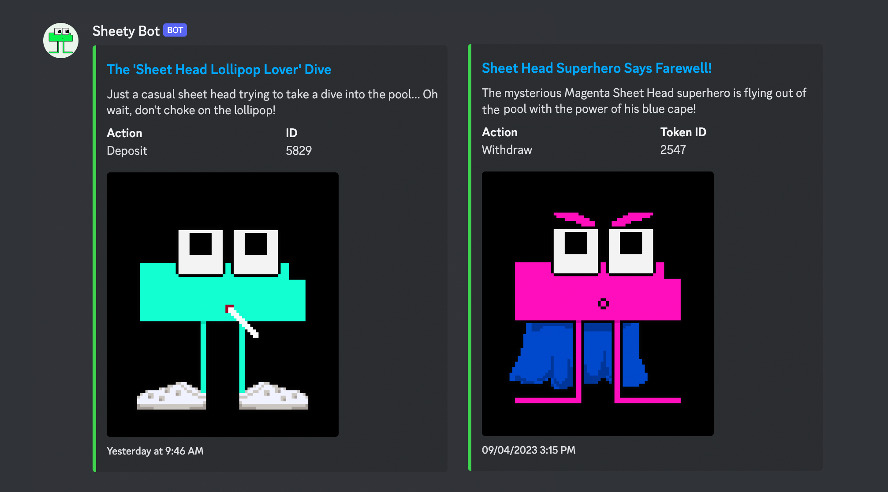

# Introducing Sheety Bot & Another NFT Giveaway!

Introducing Sheety Bot & Another NFT Giveaway!

It has been a busy few weeks for [Pooled NFT](https://poolednft.com/). Our team has been hard at work airdropping ETH reimbursements to our early adopters who aided in our transition from v1 to v2 and rolling out a comprehensive mobile experience, allowing users to browse NFT pools from the comfort of their phones. Today, we’re thrilled to introduce a new Discord bot that we believe will assist in driving engagement for NFT communities. Let’s dive in!

## Sheety Bot

Introducing Sheety Bot, a bot that is live in the Hifi Discord now. The main functionality of this bot is to track when new Sheet Heads are added or taken from the Sheet Head’s NFT Pool. This tool provides an easy way for users to keep track of what goes in and out of pools, which could lead to quick arbitrage opportunities for vigilant individuals watching for rare NFTs. Just yesterday we saw a Horsey Men go in for a dip and get snatched up from the pool within minutes!

Sheety Bot leverages AI to give it a fun and engaging personality. The AI consumes incoming NFT metadata and creates witty remarks depending on whether they’re being deposited or withdrawn. You can see it live in action in the [#sheet-heads](https://discord.com/invite/PRVfJQbJZ8) channel.

## Sheety Bot Upgrades

In the upcoming weeks, expect to see new abilities and features of Sheety Bot. We plan to open-source this code, enabling other NFT communities the ability to implement similar bots in their own Discord servers. We believe that our Discord bot’s combination of simplicity, utility, and entertainment will drive attention to Pooled NFT and draw new projects into our ecosystem.

## Pooled NFT Giveaway?!

Last week’s Meme Contest and NFT Giveaway was a huge success. This week we’re ready for more! To celebrate the initial release of the Pooled NFT Discord Bot, we will be giving away 1 $SHEETp token every day for the next week! The rules, once again, are simple. For every blockchain transaction Sheety Bot posts about, users gain 1 raffle entry to win a $SHEETp Pool Token. Note that Sheety Bot may post multiple times when multiple events happen within a single transaction. One transaction equals one raffle entry. We will give away a total of 7 $SHEETp tokens this week. Winners will be announced in [Discord](https://discord.com/invite/B3T9zPJXMf) and on [Twitter](https://twitter.com/poolednft). We are excited to see what random things our bot has to say about your deposits and withdrawals. Good luck!

## Airdrop Follow Up

Thanks to some of our amazing community members, we realized the dates for our previous airdrop did not include earlier withdrawals from Pooled NFT v1. We’ve created a new snapshot to include those withdrawals beginning on May 2nd, 2023. Additionally, we’ve also decided to reward those who have either set up liquidity pairs on Uniswap or added liquidity for existing pairs for pool tokens, so check your wallets! Thanks for being awesome!

We’d love to hear your thoughts and recommendations for the new Discord bot. Our team is active on both [Twitter](https://twitter.com/poolednft) and [Discord](https://discord.com/invite/B3T9zPJXMf). See you there!

Source: https://blog.hifi.finance/introducing-sheety-bot-another-nft-giveaway-a2ec4b72d54f
