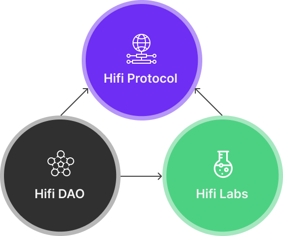

# Hifi DAO Legal Structure

Hifi DAO Legal Structure

### Hifi DAO is getting a legal structure! We’re sure you’re all excited to read this one, so buckle up.

After careful consideration and legal consultation, we are proposing the formalization of Hifi DAO’s legal structure by adopting a Trustless Unincorporated Nonprofit Association Agreement. We know that’s a mouthful, but we will explain it all below.

You can read the full agreement [here](https://github.com/hifi-finance/legal-docs/blob/main/Formation%20Docs/HIFI%20DAO%20TUNAA.pdf).

In this blog post, we’ll explain how a DAO benefits from a legal structure, provide an overview of the proposed legal framework, and share the reasons behind choosing an unincorporated nonprofit association (UNA) as a legal structure.

### **How does a DAO benefit from a Legal Structure?**

Decentralized autonomous organizations (DAO) are blockchain native systems that operate through decentralized governance. While most DAO operations can occur on the blockchain, having a formal legal structure gives a DAO the flexibility to interact with external entities and the ability to comply with relevant laws and regulations.

A legal structure allows a DAO to enter into contracts, open bank accounts, pay taxes, and interact with external entities in a more formal and organized manner. A legal structure can also provide protection for members by limiting their personal liability associated with the DAO’s activities, which is important for safeguarding the interests of the community.

### **What is an Unincorporated Nonprofit Association (UNA)?**

An unincorporated nonprofit association (UNA) is a type of legal entity that is organized and operated for nonprofit purposes without the need for formal incorporation. It is a flexible and relatively simple legal structure that provides limited liability protection for its members while allowing for minimal formalities and regulatory compliance burdens. UNAs are typically governed by a set of Articles of Association or an Agreement that outlines the organization’s purpose, membership requirements, decision-making processes, and other operational details.

### **Why an Unincorporated Nonprofit Association?**

We are proposing an unincorporated nonprofit association (UNA) as the legal structure for Hifi DAO.

Here are the reasons behind our choice:

**Flexibility and Minimal Formalities**: An UNA allows the DAO to operate with minimal formalities, which aligns with Hifi DAO’s ethos of simplicity and efficiency. This means the DAO can focus on building without getting bogged down by overly complex legal documentation.

**Limited Liability**: A UNA provides limited liability protection for our members, which helps to safeguard their personal assets from potential risks associated with Hifi DAO’s activities. This is an important consideration for us as we strive to protect the interests of our community members.

**Tax Classification**: While there are ongoing developments and discussions within many DAO communities about the tax treatment of DAOs, we are fully committed to being compliant with any tax obligations the Hifi DAO may incur. We believe the simplest way to stay compliant is to file our UNA as a C-Corporation for federal tax purposes. With this tax classification, individual DAO members will manage their tax liabilities as they always have with no impact from DAO activities or transactions. This allows us to manage taxes at the entity level while maintaining the privacy of DAO members.

### **Conclusion**

Adopting a Trustless Unincorporated Nonprofit Association Agreement for Hifi DAO is an important step towards ensuring compliance, protecting our members, and maintaining transparency in our operations. After careful evaluation, we chose an unincorporated nonprofit association (UNA) as our preferred legal structure due to its flexibility, limited liability, and alignment with our DAO’s ethos of decentralization. We are excited about the possibilities that our new legal structure brings and look forward to continuing our community-driven initiatives with the support of our members.

### **Resources**

Special thanks to the people at Lexdao and Wrappr for their open-source work on legal templates for DAOs.

[https://www.wrappr.wtf/](https://www.wrappr.wtf/)

[https://www.lexdao.coop/](https://www.lexdao.coop/)

Research by Paradigm and A16z on DAO legal structures.

[https://daos.paradigm.xyz/](https://daos.paradigm.xyz/)

[https://api.a16zcrypto.com/wp-content/uploads/2022/06/dao-legal-framework-part-1.pdf](https://api.a16zcrypto.com/wp-content/uploads/2022/06/dao-legal-framework-part-1.pdf)

[https://api.a16zcrypto.com/wp-content/uploads/2022/06/dao-legal-framework-part-2.pdf](https://api.a16zcrypto.com/wp-content/uploads/2022/06/dao-legal-framework-part-2.pdf)

Source: https://blog.hifi.finance/hifi-dao-legal-structure-7ac515fff25a
