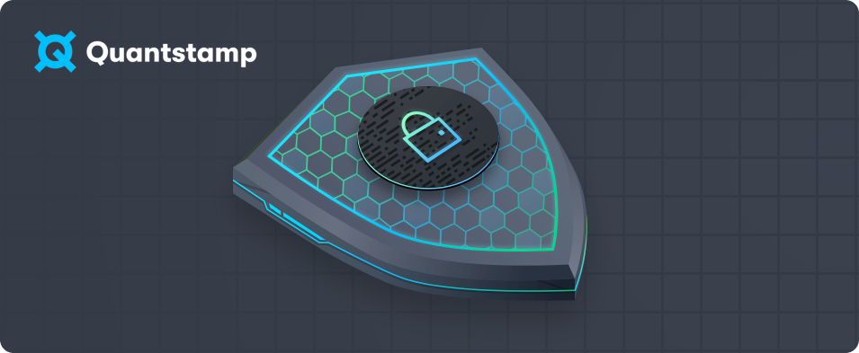
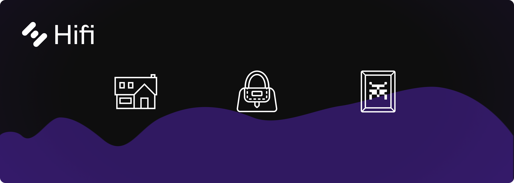
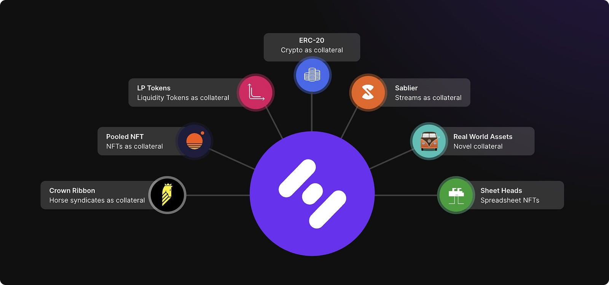
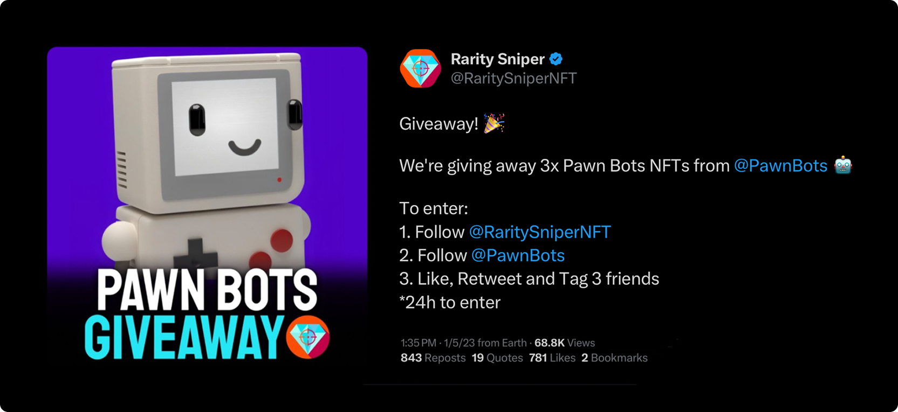
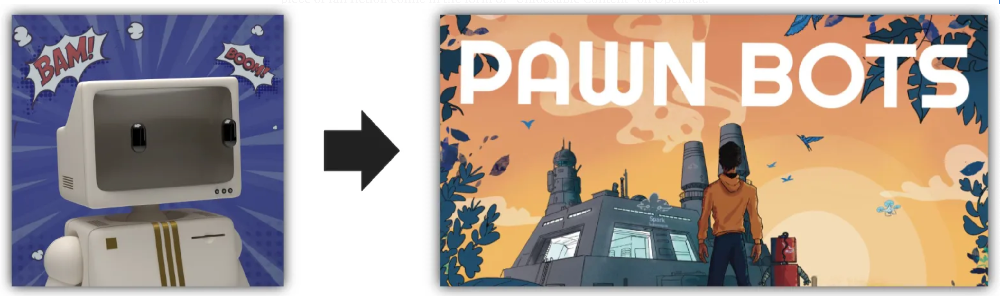
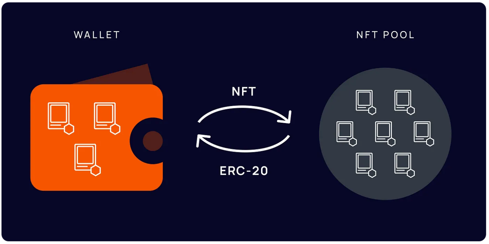
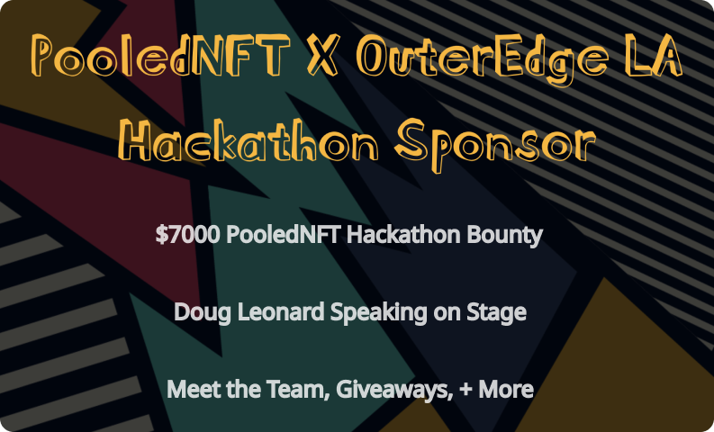
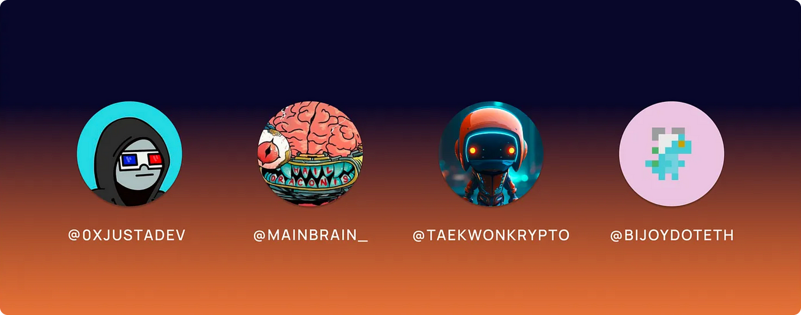
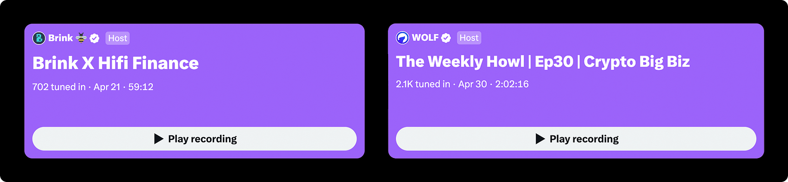

# Hifi 2023 — A Look Back

Hifi 2023 — A Look Back

It’s been almost a year since Hifi DAO was born! As we approach this major community milestone, let’s take a moment and look back on everything we’ve accomplished together. Our first anniversary marks the halfway point in Hifi DAO’s two-year contract with Hifi Labs for their contributed marketing, development, administrative, and legal services. Reviewing the past 12 months sets the stage for the upcoming reveal of Hifi’s 2024 roadmap! So, let’s get this party started and take a trip down memory lane.

## Laying the Foundation — Hifi Token Swap

Our journey began by laying the foundation for Hifi DAO. Underscoring our efforts in 2023 was the secure and successful migration from MFT to HIFI, our governance token. It’s hard to capture the amount of care and attention to detail that went into managing the token swap and making it successful. We worked with all major exchanges and successfully transitioned all our major markets, maintaining global access to HIFI.

## Bravo, Governor

The next foundational layer often overlooked is our Hifi governance smart contracts that were modernized, updated, and crafted to meet our specific DAO needs. Hifi Labs prepared and deployed the Hifi [Governor Bravo](https://etherscan.io/address/0xef0a0421ea43b602e5be35e9018dd3e34bcee007) smart contract after a [successful audit](https://github.com/hifi-finance/hifi/blob/c61317db1936bd38588e29462ec02cd5178ddaf6/audits/Quantstamp%20Audit%20Report.pdf) provided by [Quantstamp](https://quantstamp.com/).

## Live On Mainnet

Finally, our last foundational piece that would kick off the beginning of Hifi DAO was our deployment of the Hifi Lending Protocol on Ethereum Mainnet. Included in the deployment was assigning ownership and administrative control of the lending protocol to HIFI token holders.

## Clear Focus

Alongside Hifi Labs’ foundational development work that set the stage for launching Hifi DAO, the labs team published 5 of our most influential blog posts that would shape 2023. We identified [our customer](https://blog.hifi.finance/our-customer-d1f956a87e90), [their biggest problem](https://blog.hifi.finance/our-customers-biggest-problem-6f838302e5a), [our solution](https://blog.hifi.finance/our-solution-514fc759c4ad), laid out our [two-pronged strategy for growth](https://blog.hifi.finance/growth-175a470d3d58), and [announced Crown Ribbon](https://blog.hifi.finance/probably-nothing-3b5080008387).

If you’ve been following along, you know our growth strategy has had two fronts: Non-fungible tokens (NFTs) and real-world assets (RWAs). Knowing that NFTs will play a key role in tokenizing ownership of real-world assets, Hifi Labs developed and released all the necessary infrastructure layers that help bridge tokenized real-world assets into decentralized finance (DeFi). As a community, we’ve been determined to run the right experiments that allow us to create a thriving ecosystem.

## Rarity Sniper Giveaway

In January, our marketing efforts ushered in the new year as we partnered with [Rarity Sniper](https://twitter.com/RaritySniperNFT), the number 1 source for NFT rarity, to give away Pawn Bots. With over 60,000 views and 1,300 comments from people tagging each other to win, this successful [giveaway](https://twitter.com/RaritySniperNFT/status/1611098987255283712) brought over 800 followers to the Pawn Bots’ Twitter account, some still active in the community today.

## Crown Ribbon Offering Circular

Our partnership with [Crown Ribbon](https://www.crownribbon.com/) aligned perfectly with our ambitious growth strategy to venture into Real World Assets. To proceed, we tackled the legalities by submitting the initial draft of Crown Ribbon’s Offering Circular, a legal document that companies must prepare when planning to issue securities, to the SEC for qualification.

## Pawn Bots Phase V Reveal + Phase VI Announcement

The team revealed Phase V of Pawn Bots, which added new attributes to be purchased with $BURN. Upon reveal, 14 Pawn Bots were upgraded to Flawless Bots. These bots would later go on to become [Horsey Men](https://opensea.io/collection/sheet-heads?search[stringTraits][0][name]=Tier&search[stringTraits][0][values][0]=Horsey%20Men).

Phase VI was the most significant phase for Pawn Bots. It introduced **19** **brand-new attributes** to the Pawn Bots Store, including an epic [Comic Book Background](https://opensea.io/collection/pawnbots?search[collections][0]=pawnbots&search[stringTraits][0][name]=background&search[stringTraits][0][values][0]=Comic) created by [@TaeKwonKrypto](https://twitter.com/TaeKwonKrypto). This background also came with an exclusive Pawn Bots Comic Book linked within the metadata.

## Finnovators Podcast

To strengthen our marketing efforts, we actively pursued article publications, Podcasts, Twitter Spaces, and YouTube features. The [Finnovators’ Podcast](https://t.co/QtpgcwPXXo) was the first example showcasing these efforts. In this podcast, Doug talks about the role of NFTs in DeFi, abstracting blockchain away from the end user and barrel racing horses (Crown Ribbon). Check it out [here](https://open.spotify.com/episode/4NyMfsrsXEPsEU84OF0ifP?si=eccc1a4650104ee4).

## Pooled NFT v1 + Airdrop #1

The team introduced the very first version of [Pooled NFT](https://poolednft.com/) to the community. Pooled NFT is an easy way to turn any NFT into passive income. Users deposit NFTs into Pools and receive ERC-20 Pool tokens. Pairing these pool tokens with ETH or USDC on [Uniswap](https://twitter.com/Uniswap) is a powerful way to earn swap fees passively with any NFT collection.

## First Pure Pooled NFT Market Live on Uniswap

The first pure Pooled NFT market went live on Uniswap. To test the early versions of our smart contracts, we added $80K of [@PawnBots](http://twitter.com/PawnBots) ($BOTSp) and [@eth_porsche](https://twitter.com/eth_porsche) ($911p) to Uniswap. Early adopters took advantage of many arbitrage opportunities; for example, the $911p token was cheaper than the floor price of the Porsche NFT collection, enabling users to buy the NFTs cheaper on Pooled NFT and sell them for profits on OpenSea.

The team also discovered a unique edge case with the early versions of the smart contracts. Due to how rounding is handled within Uniswap, tiny fractions of tokens were left in the dust, making withdrawal of the last NFT within a pool impossible.

## Pooled NFTs AMA YouTube Live

The team hosted an [AMA (Ask Me Anything)](https://www.youtube.com/watch?v=c-aX7kP9k4A) regarding Pooled NFT live on YouTube. This allowed us to clarify our vision, share upcoming features, and answer community questions. It also served as an opportunity to identify areas where we can improve and innovate directly based on community feedback. Feedback from this AMA would later be utilized to develop Pooled NFT v2.

<iframe width="560" height="315" src="https://www.youtube.com/embed/c-aX7kP9k4A" frameborder="0" allowfullscreen></iframe>

## Outer Edge LA Experience + Hackathon Sponsorship

At the end of March, our team attended [Outer Edge LA 2023](https://www.outeredge.live/) (NFT LA) to promote Pooled NFT and connect directly with NFT teams in attendance.

We began our journey by sponsoring Outer Edge LA’s first hackathon, a major competition where participants built projects and competed for prizes. Our sponsorship was a $7,000 cash bounty that encouraged skilled teams to expand on Pooled NFTs’ smart contracts.

After the hackathon, we attended panel discussions and keynote speeches to enrich our understanding of the current trends and challenges faced by the NFT and DeFi community. Our CEO, Doug Leonard, spoke on a panel with notable industry leaders discussing the next catalyst for decentralized finance.

Our time at the conference allowed us to forge relationships with builders and creators and to learn firsthand about the needs of the NFT community. These insights gained at Outer Edge LA would help us steer our future strategy.

## Pooled NFT Airdrop #2

During the first two months into the release of Pooled NFT, we reached ~**$490,000** in Total Value Locked (TVL)! To celebrate, we decided to send out another airdrop to our initial users.

To everyone who deposited into an NFT pool, we airdropped $10K in $BOTSp tokens and reimbursed ETH for those transaction costs! Anyone who created a new pool or Uniswap market was also reimbursed gas costs for those transactions. We sent $1K in $BOTSp and $1K $DINOp to four community members for their early content and product contributions.

## Pooled NFT Smart Contract Upgrade

We launched new upgraded smart contracts for Pooled NFT with the primary objective of providing an elegant solution for managing the edge case mentioned above, where the last NFT may get stuck forever in the pools.

To achieve this, we implemented new permissions, which can only be invoked if a single NFT is left in the pool. The mechanism allows us to set a Multi-sig wallet as an Admin of pools to help arbitrate this rare scenario. If our team is ever called on to arbitrate this situation, you can expect that we will liquidate the NFT and disperse the proceeds to the pool token holders pro-rata to their pool token holdings.

## Brink Trade + Wolf Financial Twitter Spaces

Our team collaborated with [@BrinkTrade](https://twitter.com/BrinkTrade) to create a Twitter space for both communities to join. With over 700 people tuned in, this Twitter space focused on advanced trading for NFTs and DeFi, including some giveaways to random listeners.

Shortly after, we were featured on [@Wolf_Financial’s](https://twitter.com/WOLF_Financial) Twitter space along with a few other industry leaders. This session attracted over 2,100 listeners, and it was great to see so many from our community actively participating.

## Sheet Heads Development Begins

In May of 2023, OpenSea disabled purchasing and selling Pawn Bots on their marketplace. While our team respectfully disagreed with their judgment, there was little value in trying to push back and fight this; however, the team needed a flagship NFT collection with access to all major NFT marketplaces to highlight the benefits of Pooled NFT.

To foreshadow the Sheety-verse, the team released a plan in the form of a [Google Sheet](https://docs.google.com/spreadsheets/d/1r9Jy9eyw-sICFhBUFjbf3TLPupvn7oQlymqYvp6WvYM/edit#gid=0). This plan included essential information about a new collection and how we intend to distribute it.

After the announcement of a new NFT collection, the team released a series of blogs outlining the [lessons we learned](https://blog.hifi.finance/pawn-bots-lessons-learned-4bde49ab3200) from our previous collection and details on how the latest collection [improves](https://blog.hifi.finance/a-new-nft-collection-laying-groundwork-f0e8dbad1208) upon those; for instance, we planned for a collection with a clear visual identity, meaning it should be distinct to be easily recognized and stand out.

## Binance Academy Partnership

Our team worked closely with [Binance](https://www.binance.us/?utm_source=binanceglobal&utm_medium=popup&utm_campaign=com_redirect) to develop a selection of educational resources designed to teach members the ins and outs of Hifi while providing the opportunity to earn $HIFI tokens.

This partnership served an important role in onboarding new members into our community. Participants in the ‘Learn and Earn’ program became acquainted with our ecosystem and received $HIFI tokens as a reward for their educational engagement. Hifi Labs sponsored the campaign with over **$150,000** worth of $HIFI to help educate new users and expand our community reach.

## Hifi Website Restructure

With the launch of our educational campaign with Binance, our team restructured our website, aiming for a more user-friendly experience, particularly for those new to Hifi. This website design provides swift navigation and efficiently portrays Hifi, our ecosystem, and our vision. From a glance, it is now easy to see what’s coming next and how to get involved. Check out the refreshed website [here!](https://hifi.finance/)

## New Exchange Listings

The HIFI Token received new listings on multiple exchanges: [BitMart](https://www.bitmart.com/en-US), [HTX](https://www.htx.com/en-us/), [Poloniex Exchange](https://poloniex.com/), and [Coinstore](https://www.coinstore.com/#/home). These exchange listings increase the global accessibility and exposure of the HIFI Token.

## Our First Real-World Asset (RWA)!

The team tokenized our first Real-World Asset, a Volkswagen Microbus owned by [Kevin Bradburn](https://blog.hifi.finance/one-more-thing-d1a94dce53fd). This is no ordinary Volkswagen Bus. It’s a 1952 Gen 1 Type 2 Volkswagen 23 Window Microbus Deluxe Bus, one of Earth’s rarest and most sought-after VW busses. With the official appraisal value of this vehicle sitting at $650,000, it has been featured in numerous publications and celebrated in museums. This was a massive moment for us due to the months of research and endless effort to find the right partners to help make this a reality for Hifi.

## Hifi DAO Legal Structure

Along with the tokenization of the VW Microbus, Hifi Labs published Hifi DAO’s [legal framework](https://blog.hifi.finance/real-world-assets-the-framework-f8180a749256), which will apply to a wide variety of RWA classes by providing a scalable solution for Hifi DAO to form partnerships with traditional lenders with deep expertise in specific collateral asset classes. A legal structure allows a DAO to enter into contracts, open bank accounts, pay taxes, and interact with external entities in a more formal and organized manner. A legal structure can also protect members by limiting their personal liability associated with the DAO’s activities.

With these two things, the team had everything required to prepare the following governance proposals for Hifi DAO to consider onboarding our first RWA to the Hifi Lending Protocol!

## Blockworks Article Publication

CEO of Hifi Labs, Doug Leonard, wrote and published an article on Blockworks, one of the largest news hubs for all things crypto. This article, titled “[Decentralization is a zero-sum game](https://blockworks.co/news/decentralization-zero-sum-game),” explained the complexities and misconceptions around decentralization in the world of Web3.

## Hifi Improvement Proposals (HIP) 3 & 4

The Labs team pushed two new forum discussions live, allowing our community to discuss the upcoming changes with other DAO members before the official proposals went live. The proposals went live and passed with majority approval, further improving the Hifi Ecosystem.

**HIP 3 — [Volkswagen Microbus Collateral Onboarding](https://forum.hifi.finance/t/hip-3-volkswagen-microbus-collateral-onboarding/273):** This proposal aimed to form a strategic partnership with Finance Ventures, allowing the [“VWMBp” token](https://etherscan.io/address/0x858f0bdb905fdbb3e04d0430d9b4f9f48381f103) to be integrated into the Hifi Protocol as collateral.

**HIP 4 — [Administrative Updates: Voting Period, Proposal Threshold](https://forum.hifi.finance/t/hip-4-administrative-updates-voting-period-proposal-threshold/274):** Voting Period, Proposal Threshold: This proposal aimed to adjust the voting period from 2 to 5 days and raise the proposal threshold from 2.83K to 50K HIFI.

## Sheet Heads NFT Launch

[Sheet Heads](https://sheetheads.com/) was designed with simplicity in mind and is easy to explain and share. Simply put, it’s a fun NFT project built entirely in Google Sheets. To mint, users traded out their existing Pawn Bots, burning them for Sheet Heads at a 1:1 ratio. The community minted a staggering 80% of Sheet Heads, and it’s been amazing seeing everyone’s Sheet Heads and excitement with our new collection.

## Sheet Heads Meme Contest

To celebrate the successful launch of Sheet Heads, we held a weeklong meme contest where three lucky winners received Sheet Heads! The team released some meme templates for anyone to use to assist with meme creation. This giveaway generated hundreds of images and circulated all around Twitter. With so many great memes from our current community and new users who found our giveaway on Twitter, it was extremely difficult for our team to pick winners.

## Pooled NFT v2 Launch

To complement the release of our flagship NFT project, the Labs Team released [Pooled NFT v2](https://poolednft.com/) alongside Sheet Heads. These projects were months in the making and marked monumental new beginnings for our ecosystem products. Pooled NFT v2 bears almost no resemblance to the first version, as we completely reimagined the user experience. The overall design and experience have been thoughtfully crafted and developed to be familiar to anyone who has used NFT marketplaces.

## Sheet Heads Update & Ecosystem Airdrop

About a week into the Sheet Heads launch, the team updated the metadata to include the Master Google Sheet of every single NFT. This spreadsheet also contained separate sheets of each asset used to make up the NFT.

In appreciation of the community’s support through the minting of Sheet Heads and the transition from Pooled NFT v1 to v2, the team initiated an ETH airdrop to compensate for gas fees incurred during various transactions. This gesture was aimed at showing gratitude for the active involvement of the community.

## Pooled NFT Full Mobile Support

Since the release of Pooled NFT v2, the team continued development on the website’s front end. In less than two weeks, the team was able to design and develop mobile versions of the website, ensuring complete responsiveness across all devices.

## BeInCrypto Article

Doug was interviewed by [BeInCrypto](https://twitter.com/beincrypto), a large crypto news firm, who pubished “[Tokenization of Horse Syndicate Is Not a Fantasy](https://beincrypto.com/tokenization-of-horse-syndicate-not-fantasy/).” In this article, Doug shared his thoughts on the potential of real-world assets and uncovered more information on what users can expect from Crown Ribbon.

## Sheety Bot Introduction + Giveaway

The team introduced Sheety Bot, a bot whose primary purpose is to track when new Sheet Heads are added or taken from the Sheet Head’s NFT Pool and post them in Discord. This tool provides an easy way for users to keep track of what goes in and out of pools, which leads to quick arbitrage opportunities for vigilant individuals watching for rare NFTs. To celebrate the initial release of the Pooled NFT Discord Bot, we gave away 1 $SHEETp token every day for an entire week!

## Sheety Bot Upgrades + Giveaway #2

Hifi Labs rolled out an update to Sheety Bot, further increasing its functionality by introducing real-time $SHEETp Uniswap Monitoring. This upgrade allowed the bot to monitor Buy and Sell transactions of Pool Tokens on Uniswap, sending Discord notifications for each action. These notifications include valuable data, such as a price feed, providing users with real-time insights into potential arbitrage scenarios.

With the newly upgraded Sheety Bot, the team held another daily $SHEETp giveaway! Not only were these giveaways entertaining, but they also served educational purposes; for example, the meme contest familiarized our community with meme generation, while the initial Sheety Bot giveaway gave users hands-on experience in trading NFTs for Pool Tokens. This giveaway focused on educating users on how to trade Pool Tokens on Uniswap while serving as an additional testing ground for our ecosystem.

## Sheet Heads’ Multiple Twitter Campaigns

As an experiment, we collaborated with separate 5 Twitter accounts with prominent influences within the NFT space. Working closely with these accounts, we launched simultaneous Sheet Heads giveaways on each Twitter. This campaign gained over 2,000 new followers on the Sheet Heads’ Twitter. The giveaway Tweets received over 4,000 retweets, reaching **~71K** accounts on Twitter! These Sheet Heads were sent out as $SHEETp, introducing new users into our ecosystem via Pooled NFT.

## Pink Buckle 2023 Event

The Labs team met with our Crown Ribbon partners to attend [Pink Buckle’s Barrel Racing Event](https://pinkbuckle.com/), a 5-day event with over 4 Million Dollars in payouts. The team built connections here, watched our horses race, and even sold a few! Waiting on the SEC’s approval has not stopped us from building; we’ve been making great progress on Crown Ribbon, and we can’t wait to share more.

## Hifi Discord Bot

The Labs team implemented a new Discord bot in the Hifi-Lobby channel. This bot behaves similarly to Sheety Bot, except it tracks when recent borrow and liquidation transactions happen within the protocol and posts them into Discord. Along with a link to the transaction, Hifi Bot displays the amount borrowed in USDC and the specific borrowing market used for the loan.

## Hifi Improvement Proposal 5 + Giveaway

HIP 5 proposed the addition of “[$SHEETp](https://etherscan.io/token/0xc2bc2320D22D47D1e197E99D4a5dD3261ccf4A68)” as collateral, unlocking the ability to borrow against Sheet Head NFTs using the Hifi Protocol’s DeFi infrastructure, utilizing a Time-Weighted Average Price Feed (TWAP).

To gather additional data for the TWAP before the vote went live on Tally, we hosted a giveaway for buy and sell orders of $SHEETp on Uniswap. The vote went live and passed unanimously. From here, the Hifi DAO began taking the technical steps to integrate SHEETp Token into the Hifi Protocol.

## Tally Airdrop

To celebrate the passing of HIP 5, Hifi Labs sent out a massive airdrop reimbursing participants of Hifi DAO governance. This airdrop reimbursed all Tally transactions that have ever been made since the Hifi DAO moved to On Chain voting. Additionally, our dedicated guardian, [@Hollywood41x](https://twitter.com/Hollywood41x), was airdropped $1K in $HIFI tokens for his remarkable contributions towards the HIP 5!

## $SHEETp Added as Collateral

Hifi Labs pushed updates to the Hifi Lending Protocol to support the newly added $SHEETp collateral type, making a significant milestone for Hifi Finance as it tied the entire ecosystem together. Users can now swap their Sheet Head NFTs into ERC-20 tokens via Pooled NFT. Once converted, these tokens can be used as collateral for borrowing on the Hifi Lending Protocol. Along with ETH and real-world assets already accepted as collateral, the protocol now supports borrowing against NFTs, aligning with our vision to tokenize every major asset class.

## That’s a Wrap

What a year 2023 has been! Hifi Labs has worked tirelessly on all fronts: marketing, development, administration, and legal! 2023 saw the development and delivery of multiple products, *numerous* community airdrops, and a steady push forward in our Crown Ribbon compliance efforts with the SEC.

Access to the HIFI token is greater than ever, with listings across most major exchanges. In 2023, we observed material growth in HIFI’s Market Cap. The Labs team has been busy and could not have made so much progress without the support of our fantastic community, active on [Discord](https://discord.gg/uGxaCppKSH), [X](https://twitter.com/HifiFinance), and [Governance](https://www.tally.xyz/gov/hifi-dao). We can’t wait to share with you what we have in store for 2024!

Source: https://blog.hifi.finance/hifi-2023-a-look-back-844d2afa837f
