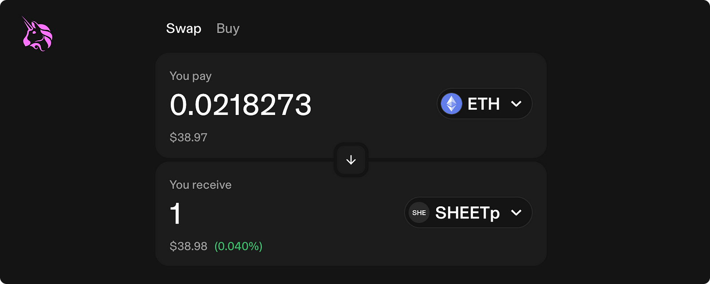
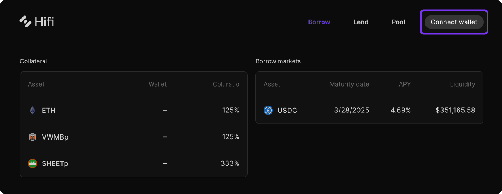
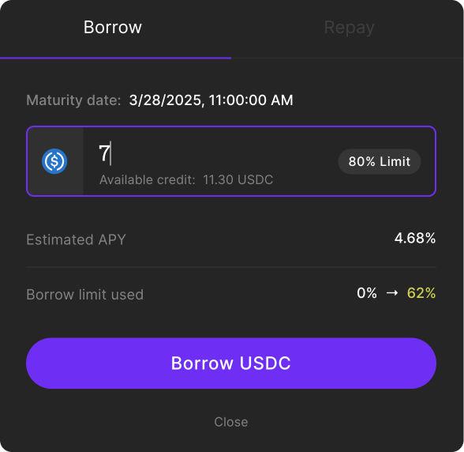

# Sheet Heads Borrowing Live

Sheet Heads Borrowing Live

Congratulations to the Hifi DAO! [Hifi Improvement Proposal 5](https://www.tally.xyz/gov/hifi-dao/proposal/3?chart=0) was successfully passed, queued, and executed by the Hifi DAO. After updating the lending protocol’s front-end code and the liquidation bot to support $SHEETp as collateral, Sheet Head holders can officially borrow against their NFTs! Today’s blog post covers how to borrow against your Sheet Head NFTs.

## How to Borrow

Borrowing USDC against your Sheet Heads is quick and easy. Remember, the SHEETp collateral ratio is configured to 333%, meaning SHEETp holders must post ~$3 for every $1 they borrow. Take this into account when deciding how much SHEETp to borrow against.

### **Step 1: Obtain $SHEETp**

The first way to obtain SHEETp is by depositing your Sheet Heads NFT into the pool on [PooledNFT.com](https://poolednft.com/pool/0xc2bc2320D22D47D1e197E99D4a5dD3261ccf4A68). If you don’t have a Sheet Head, you can pick one up on [Opensea](https://opensea.io/collection/sheet-heads).

The second way to receive SHEETp is by purchasing it directly on [Uniswap](https://info.uniswap.org/#/tokens/0xc2bc2320D22D47D1e197E99D4a5dD3261ccf4A68). As mentioned in the [Hifi Forum Post](https://forum.hifi.finance/t/hip-5-sheet-heads-collateral-revote/298), Hifi Labs is committed to keeping its liquidity on chain, primarily concentrated in a full range SHEETp/USDC market. Not only does this liquidity power the SHEETp TWAP feed, but it also provides instant liquidity for our collection.

### **Step 2: Connect Wallet & Deposit Collateral**

Visit the [Hifi Lending Protocol](https://app.hifi.finance/borrow) with a wallet containing both $SHEETp and a small amount of ETH, which will be used for transaction fees. Click “Connect wallet” In the top right corner. Once connected, the page will reload with your balances, signifying a successful connection to the dApp.

To deposit your collateral, click $SHEETp under the “Collateral” table on the left-hand side. A popover will appear prompting you to input the amount to deposit. Notice your borrowing limit increases with the quantity of your deposit.

If this is your first time using the lending protocol, you’ll be prompted to create a vault, making managing your position seamless. After that, you must sign a transaction allowing the protocol access to your $SHEETp.

### **Step 3: Borrowing Against Collateral**

With the collateral deposited in your vault, you can now borrow against it! Under the “Borrow Markets” table, select a maturity date that fits your needs and enter the amount of USDC you’d like to borrow.

## That’s It!

With just a few clicks, you’ve successfully borrowed against your NFTs! Adding Sheet Heads as collateral is an important milestone our community has been eagerly working towards. NFTs will play a key role in tokenizing ownership of real-world assets, so we’re beyond excited to see everyone borrowing with their Sheet Heads!

Have any questions on how to borrow against your NFTs? Our team is on standby for your questions and concerns on [Discord](https://discord.com/invite/uGxaCppKSH) and [Twitter](https://twitter.com/hififinance).

Source: https://blog.hifi.finance/sheet-heads-borrowing-live-c89d59fc91b0
