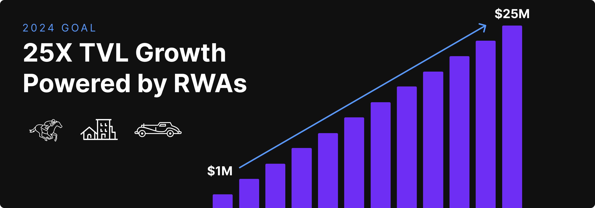

# Hifi 2024 Roadmap

Hifi 2024 Roadmap

*Doug Leonard, CEO of Hifi Labs will be hosting an [AMA this Friday at 9:00 MST](https://youtube.com/live/M4Juk1U6jv8?feature=share) to take questions from the community about Hifi’s 2024 Roadmap.*

Last week, we published one of our [longest blog posts to date](https://blog.hifi.finance/hifi-2023-a-look-back-844d2afa837f), recounting the extensive marketing and product accomplishments from 2023. Product development and our marketing efforts characterized our focus in 2023. Now, as we look ahead to 2024, we’re shifting gears and going all in on business development. Our singular focus for 2024 is growing Hifi’s TVL. TVL stands for Total Value Locked and is a metric used to measure the combined value of all assets within a protocol. It helps measure adoption and utilization within the Defi Space. This is our North Star, so let’s dive into what the 2024 updated roadmap looks like!

## TVL TVL TVL!

Today, the [protocol](https://app.hifi.finance/borrow) has ~$1M in TVL; in the next 12 months, our goal is to grow our TVL by **25x** to capture a total of **$25M** TVL. Several things need to happen for us to be able to make this a reality. First, we’ll be doubling down on Real World Assets (RWAs); as we’ve shared, this is where we expect to see the most significant growth across decentralized Finance (DeFi). Next, we’ll propose and implement a plan to address Hifi’s supply-side liquidity shortage; with additional liquidity, we can scale our TVL; without it, our growth is limited. And lastly, we will upgrade the lending protocol for greater usability and scalability.

## **RWAs**

Our partnership with [Crown Ribbon](https://www.crownribbon.com/) remains our largest and most ambitious collateral undertaking. We’re still in the process of working with the SEC to qualify for a Reg A+ exemption, which will allow retail investors to purchase shares of professionally managed horse syndicates. We remain committed to our partnership here, knowing it will contribute substantially towards Hifi’s TVL. As liquidity permits, we expect to onboard additional vintage cars as we did with the [VW Micro Bus](https://blog.hifi.finance/introducing-our-first-real-world-asset-2395668f5aaf) in July. Finally, We plan to open the door into Real Estate as collateral. With these three areas of focus, we have more than enough borrower demand to get Hifi to **$25M** in TVL.

## **Good Problems**

We’ve got a problem, a good problem, that is. Demand for borrowing on Hifi’s Lending Protocol is greater than the liquidity in the protocol so far. Hifi Labs, our core team, has access to more than **$100M** in borrowing potential across several industries if we can source the liquidity for these opportunities. Our biggest hiccup in onboarding new collateral and TVL is the shortage of supply-side liquidity (LP providers and Lenders). So far, most liquidity comes from the core team, allocating all available resources into the protocol to help bootstrap the overall protocol liquidity.

Given that Hifi Labs is contributing all it can, the core team has been researching additional solutions to add to their existing efforts. In the coming weeks, we’ll share our recommendation and submit a proposal for consideration by HIFI DAO members. Our ability to onboard TVL is a direct function of our ability to source liquidity efficiently. This effort is the single effort that will have the most significant impact on the rate at which Hifi’s TVL grows. It is our primary bottleneck.

## **Protocol & Token Economic Updates**

As we scale in our onboarding of uncorrelated collateral types, Hifi needs to satisfy a more diverse set of borrower needs. Already, some of the borrowing that’s happened on Hifi had to be coordinated and facilitated through over-the-counter (OTC) transactions. Transactions put together in this ad hoc way helped bypass the limited liquidity in the protocol; Hifi Labs has been happy to facilitate these transactions for our larger borrowers since it’s meant more TVL, greater utilization, and demonstration of the Hifi’s capabilities. Ideally, these ad hoc transactions wouldn’t be necessary, and borrowers of discrete asset types have terms that meet their needs directly.

Hifi’s current protocol architecture has the following limitations: Liquidity fragmentation across markets of differing maturity dates. The AMM limits loan duration to a maximum of ~4 years. Finally, our consolidated interest rate market across all collateral types makes Hifi’s offering less competitive against industry-specific lending products.

Our core team is hard at work addressing all of these issues which will unify our liquidity, increase our ability to extend longer-duration loans, and isolate our interest rate markets to be competitive with industry-specific lending products. These changes will enable Hifi to remain competitive, scale our TVL, and improve our usability for borrowers. Alongside these improvements will be upgrades to Hifi’s token economic model, which go beyond the current origination fee switch in the protocol. Look forward to learning more as development progresses on this front.

## 2024 Here We Come!

So there you have it, Hifi’s most ambitious and significant [roadmap update](https://hifi.finance/roadmap) ever! Every aspect of our roadmap points to our singular objective of growing Hifi’s TVL. If we properly address our liquidity bottleneck and upgrade the protocol to meet the needs of our borrowers, we believe we can grow our TVL to more than **$25M**! 2024 is the year we scale Hifi!

We look forward to hearing your thoughts and opinions for the year ahead! Leave your comments in our community [Discord](https://discord.com/invite/uGxaCppKSH) or on [Twitter](https://twitter.com/hififinance).

Source: https://blog.hifi.finance/hifi-2024-roadmap-e489383df572
