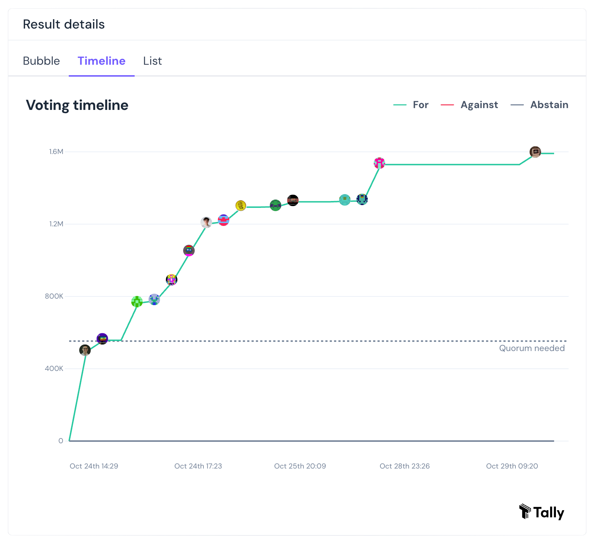

# HIP 5 Update: Failed to Meet Quorum

HIP 5 Update: Failed to Meet Quorum

This likely comes as a surprise. HIP 5 failed to meet quorum. What’s Quorum? A quorum is the minimum amount of participation from group members necessary to conduct business for that group. It ensures that decisions are made by a representative subset of the group rather than a small minority.

### The Shortfall

Quorum within HIFI DAO is set to 2% of the Total HIFI Token Supply. At the time of writing, the HIFI Token total supply is 120,169,924, which means to meet quorum, we need the participation of at least 2,403,398 HIFI. For HIP 5, we had 1,591,192 HIFI voting power participate. Unfortunately, we missed quorum by 812,206 HIFI.

### Interface Bug

Given that all votes cast were in favor of the HIP 5 proposal, the reason behind failing to meet quorum was likely that we all erroneously put our trust in the Tally interface, which falsely claimed we had already met quorum of 553,020 HIFI. This is an issue with Tally’s front end. Our team will open a ticket with Tally to address the UI issue.

This experience is an excellent reminder of the importance of double-checking essential parameters directly from their primary source. In this case, we should have checked directly with the Hifi Governor Bravo smart contract.

### Next Steps

Given unanimous support for the proposal, it seems appropriate to put HIP 5 up for a second vote. But before doing so, we should allow the community time to regroup and ensure they have their HIFI token balances in a self-custody wallet so their voting power can count towards this next attempt. If we cannot meet quorum in this second vote, it may not be prudent to proceed with this proposal. Hifi Labs supports this second proposal and urges the community to take the necessary steps to participate in Hifi Governance.

A [new forum discussion](https://forum.hifi.finance/t/hip-5-sheet-heads-collateral-revote/298) is now live to give the community a place to discuss these events and prepare for the upcoming HIP 5 revote. A new instance of HIP 5 will go live on **November 1st (in 2 days)**. Now is the time to get your tokens in a wallet you control and double check that your wallet is setup to delegate to yourself or another member of the community.

Source: https://blog.hifi.finance/hip-5-update-failed-to-meet-quorum-604987640b35
