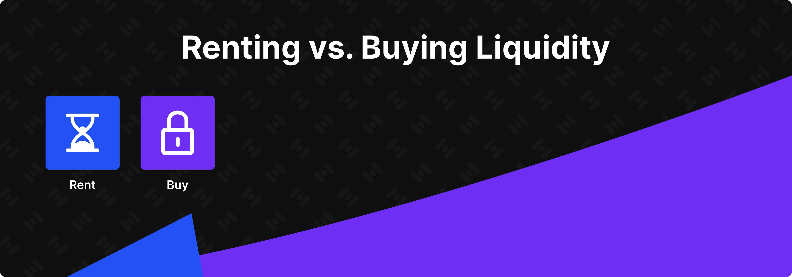
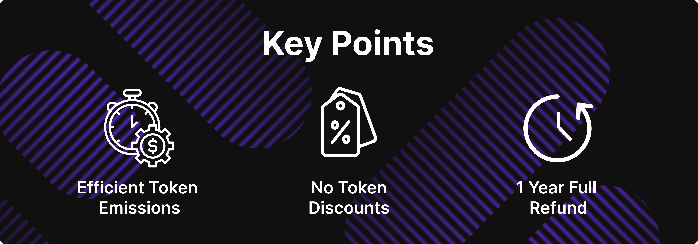

# HIP 6 — Liquidity Bootstrapping Program

HIP 6 — Liquidity Bootstrapping Program

Two weeks ago, we announced our [roadmap](https://blog.hifi.finance/hifi-2024-roadmap-e489383df572), which includes our ambitious goal to grow Hifi TVL by more than **25x**! We are all very excited about the opportunity in front of us, and now it’s time to talk about how we can grow at this level. It may be obvious to some, but our growth is directly linked to the liquidity available to lend out within our protocol. Even with our core team contributing every dollar they can, our current TVL growth is happening at a very slow pace. To accelerate our growth, we must add more LP and Lender capital to the protocol.

## Renting vs. Buying

Bootstrapping liquidity is not a new problem for decentralized finance (DeFi) protocols; in fact, we’ve been able to study many different approaches taken by well-respected protocols in the space. From a high level, there are two schools of thought regarding bootstrapping liquidity: DAOs will either rent liquidity for a limited amount of time or purchase and own their liquidity for as long as they’d like.

Renting liquidity tends to have a higher impact on TVL in the short term, whereas owning liquidity tends to have a higher long-term impact on TVL. Both can be useful depending on the circumstance. Having extensively researched each approach across a broad set of programs within the space, we recommend that Hifi DAO purchase and own its liquidity. It is expected that the net impact over time will be larger with this approach of owning the liquidity versus renting it.

## Ownership

To build up DAO-owned liquidity, token holders will need to vote to approve new token emissions for the explicit purpose of purchasing liquidity and adding it to the protocol. This liquidity is wholly owned by HIFI token holders and will add valuable backing to the HIFI token. **Note**: None of these resources go to Hifi Labs, they belong to HIFI token holders and will only be used to lend and add liquidity to Hifi’s protocol.

## Research Observations

With any new token emission, careful consideration should always be made for potential trade-offs. As we looked at other DeFi protocols with similar objectives, there are three key observations our core team came across during their research:

1. In almost every case, timing the market and broader market momentum had the most significant impact on outcomes.

1. Economic incentives will be taken advantage of at scale, so be prudent in what is offered.

1. Systems that leverage time as a key component of their design have had greater overall success because they were less dependent on a singular set of circumstances at a specific point in time.

## Our Criteria

Based on these observations, Hifi Labs defined a specific set of criteria focusing on variables within our control that protect HIFI token holders from certain undesirable outcomes. Specifically, we want to protect against unnecessary token emissions during weaker economic periods. If we are going to emit tokens to fund growth, it’s important that we *only* do so during strong economic periods. Additionally, we want to avoid giving out discounts, as we know these discounts can be taken advantage of at scale. Next, we want to allocate resources over time rather than during one large singular event. And finally, if things don’t go well, we want to be in a position to reverse course and, as much as possible, reset ourselves back to where we are today.

To be fair, this was a challenging set of requirements to meet. Nothing in all of our research showed us a system that even came close to being able to meet these requirements. But our core team at Hifi Labs has come up with what we believe you will find a rather compelling proposal. Let’s take a look.

## Hifi’s Liquidity Program

* Purchase USDC each month for ten months.

* Budget: 2M HIFI per month.

* Give participants an option for a full refund one year from the time of their transaction.

That’s it! That’s the program. The design is deceptively simple and elegant. Let’s highlight why it works so well for Hifi DAO. First, we love that new token emissions finalize only during a stronger economic period. In the event that we experience a weaker economic period, Hifi DAO will effectively get a one-year **interest-free** loan from participants, and Hifi DAO will get all their HIFI tokens back! Lastly, we love that this proposal elegantly manages scale. Spreading these transactions out over ten months helps us avoid shocks to the ecosystem yet still provides the scale necessary to accelerate our growth in a material way.

## Putting it All together

Our growth is directly linked to our ability to bootstrap liquidity within the protocol. Bootstrapping liquidity is not a new challenge for DeFi protocols like Hifi. Having researched many respected liquidity bootstrapping programs, Hifi Labs recommends that Hifi DAO purchase its liquidity rather than rent it. This proposal seeks to mint 20M HIFI to grow TVL. All resources are wholly owned by HIFI token holders, adding valuable backing to the HIFI token. The full proceeds from this proposal are used to lend and provide liquidity in the Hifi Lending Protocol.

## Next Steps

In the coming days, we will publish a follow-up that outlines the administrative details for execution of this proposal and an outline of governance parameter updates that will be included in this proposal. At that point we will create the post on Hifi’s governance forum to host community discussion. Then, next week, we will go live with the official governance proposal.

If you haven’t done so already, please take time to move your HIFI tokens into a wallet you control and [delegate your voting power](https://medium.com/@HifiFinance/hifi-dao-tutorial-assigning-delegates-c70f9d3372a0) to yourself or a member of the community to represent you in governance votes.

Have any questions about HIP-6? Our team is on standby for your questions and concerns on [Discord](https://discord.com/invite/uGxaCppKSH) and [Twitter](https://twitter.com/hififinance).

Source: https://blog.hifi.finance/hip-6-liquidity-bootstrapping-program-46cf5ee9244e
