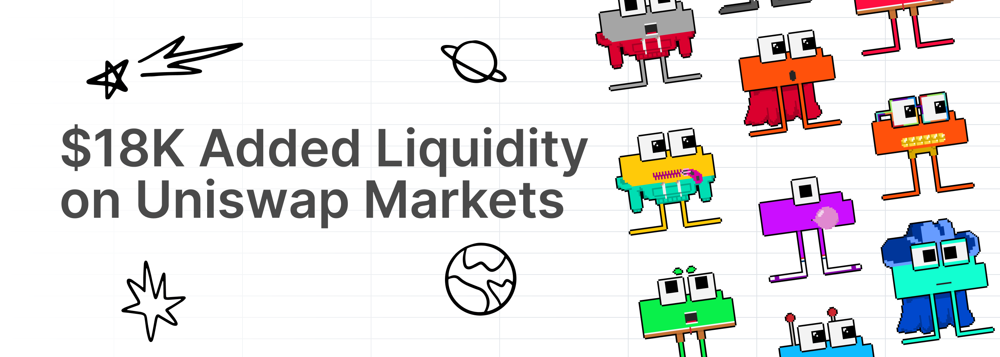

# Starting Off 2024 Right!

Starting Off 2024 Right!

Our team is back from the holidays refreshed, rejuvenated, and ready to take 2024 on. Today’s blog post highlights what we’ve started to work on in the new year and provides updates for work that is already in progress.

### Hifi Protocol

With the coming boost in liquidity, thanks to [HIP-6](https://blog.hifi.finance/hip-6-liquidity-bootstrapping-program-46cf5ee9244e), we’ve been working on updating the [tutorial videos](https://www.youtube.com/@HifiFinance/videos) that help onboard new users to the protocol. Big shout out to Josue and Alex for their excellent work on this front!

<iframe width="560" height="315" src="https://www.youtube.com/embed/2uZ6uiqi01w" frameborder="0" allowfullscreen></iframe>

### HIP 6 — Bootstrapping Liquidity

Our first batch of bootstrapped liquidity is in progress. So far we’ve grown Hifi TVL to $1,930,667. This includes the values of deposited collateral and hUSDC liquidity in Hifi’s AMM. Each month, we anticipate liquidity to grow within the protocol. So keep your eye out, especially if you’re looking to borrow from the protocol!

### Crown Ribbon

Our team received its latest response from the SEC in December and is finalizing our response to their latest inquiry. This is a part of the normal approval process, and we’re optimistic that we’ll be getting a final decision from the SEC in the first half of this year.

### Sheet Heads

As announced in our [Discord](https://discord.com/channels/724701556087455815/1141452399186288903/1192527668680343572), our team added an additional $18K in liquidity to the [Uniswap markets](https://info.uniswap.org/#/tokens/0xc2bc2320D22D47D1e197E99D4a5dD3261ccf4A68) last week. You might also notice that on [OpenSea](https://opensea.io/collection/sheet-heads), we have started adding liquidity to markets there as well. So now, Sheet Head owners have the option to sell directly on OpenSea or utilize [Pooled NFT](https://poolednft.com/pool/0xc2bc2320D22D47D1e197E99D4a5dD3261ccf4A68) via the Uniswap markets.

As discussed in our [Sheet Heads Progress Report](https://blog.hifi.finance/sheet-heads-progress-report-1b5959398618) published in December, we are preparing to run our first Sheet Heads focused ad campaign. This is all a part of our goal to enable discovery beyond our existing ecosystem. Let’s welcome any new members of the community with open arms and enthusiasm.

### Community Member Spotlight

We’d love to give a special thanks to [kellypr](https://twitter.com/gemelitopr5) for being an incredible community member. His active involvement, positive messages, and memorable memes on both Twitter and Discord consistently bring amazing vibes to the Hifi Ecosystem. To show our gratitude, we’re sending Kelly 250 USDC; if you see him around, make sure to congratulate him on his efforts. Thank you, Kelly, for making our community a better place!

We’re off to a great start in 2024; let’s all work together to make this the best year in Hifi’s history! And as always, if you forget what we’re all looking forward to, you can find it in our [2024 roadmap](https://hifi.finance/roadmap) at [hifi.finance](https://hifi.finance/roadmap).

Have any questions about our 2024 goals? Feel free to reach out on [Discord](https://discord.com/invite/PRVfJQbJZ8) and [Twitter](https://twitter.com/hififinance). Our team members and community are always ready to lend a helping hand.

Source: https://blog.hifi.finance/starting-off-2024-right-9a0e7fd6d91d
