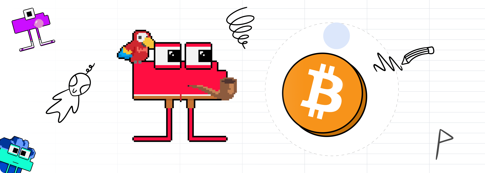

# Ecosystem Quests and Giveaways

Ecosystem Quests and Giveaways

As mentioned in our [Sheet Heads Progress Report](https://blog.hifi.finance/sheet-heads-progress-report-1b5959398618) blog, the team would introduce exciting giveaways and quests to enable the discovery of Sheet Heads beyond our ecosystem. In today’s update, we dive into the world of quests, unveil our first giveaway, and even send you off on your very first questing adventure. We have a lot to cover, so let’s get started!

## Introducing Zealy

To track and manage Hifi Ecosystem Quests and Experience (XP), our community will utilize [Zealy.io](https://zealy.io/c/hififinance/questboard), a platform that allows web3 communities to drive growth and engagement through various quests and sprints.

Getting started is easy; simply visit the [Hifi Finance Community](https://zealy.io/c/hififinance/questboard) on Zealy and create an account. For the best experience, we highly recommend linking your Discord and Twitter to your Zealy account; and just like that, you’re ready to begin your questing journey.

## Ecosystem Quests

Complete quests and earn XP. Experience earned will act as raffle tickets for our exciting giveaways. 100 XP = 1 Raffle Ticket, so the more quests you claim, the higher your chance to win! These community quests will vary in occurrence, difficulty, XP gained, and much more while providing a fun and engaging way to support all aspects of our ecosystem. Feel free to work with other community members on the more difficult quests, though it may be in your best interest not to.

To start, we’ve added around 20 quests for our community members to complete, and we’ll add additional quests periodically. When new quests are added, they will be posted in the newly created “[#quests](https://discord.com/channels/724701556087455815/1197202058877603890)” channel within our Discord; additionally, the team may randomly remove quests and add new quests with extremely limited timeframes or small numbers of max claims, so pay attention to not miss out on that precious XP.

## Giveaway #1

To familiarize our community and team with quests and to celebrate the long-awaited Bitcoin ETF, our first giveaway will consist of $300 worth of $BTC to 2 lucky winners! This will be the first of many giveaways, and as time goes on and our community grows, these giveaways will become more exciting, ridiculous, or just downright insane.

To increase fairness and attract newcomers, our giveaways will be typically done in 2-week sprints, meaning only the experience gained during those 2 weeks will count towards raffle tickets for the current giveaway. View the official sweepstake rules [here](https://firebasestorage.googleapis.com/v0/b/sheetheads-2.appspot.com/o/Hifi%20Labs%20Quest%20Sweepstakes%20Official%20Rules.pdf?alt=media&token=795bdb28-0c33-49d4-8b7e-eabbe5014e80).

## Discord Holders Verification

Some of you may have already noticed we have new holder roles in our Discord server: Sheety Shrimp, Sheety Dolphins, and Sheety Whales. These roles are important as some quests will be unlocked depending on your roles within Discord, thus granting more available XP for Sheet Head holders! For holder verification, the team integrated [Vulcan](https://www.vulcan.xyz/) into our [Discord](https://discord.gg/uGxaCppKSH), allowing Sheet Head holders to verify NFTs in their wallets and claim their roles. Don’t have your role yet? Be sure to visit our “[#nft-verify](https://discord.com/channels/724701556087455815/1197203195424940112)” channel in the Discord to acquire your new holder roles.

## Your First Quest

Now we’re ready to send you off on your first quest, [Ad-Venture on Etherscan](https://zealy.io/c/hififinance/questboard/80d8e8f7-93b7-45e0-8a43-5686eff9bbc6). Hifi Labs has been working closely with Etherscan over the last month to get a Sheet Heads ad placement up and running on the [Etherscan Website](https://etherscan.io/). To claim this quest, you’ll need to find one of the ads and upload a screenshot to Zealy. This Quest is worth a whopping 1200 XP, but don’t procrastinate, as this quest will only be up for one week. With that, the giveaway contest has officially begun. Happy questing everyone!

We hope you’re as excited about quests as we are! Let us know on [Discord](https://discord.com/invite/PRVfJQbJZ8) or [Twitter](https://twitter.com/hififinance) what crazy giveaways you’d like to see in 2024.

Source: https://blog.hifi.finance/ecosystem-quests-and-giveaways-71a392bada44
