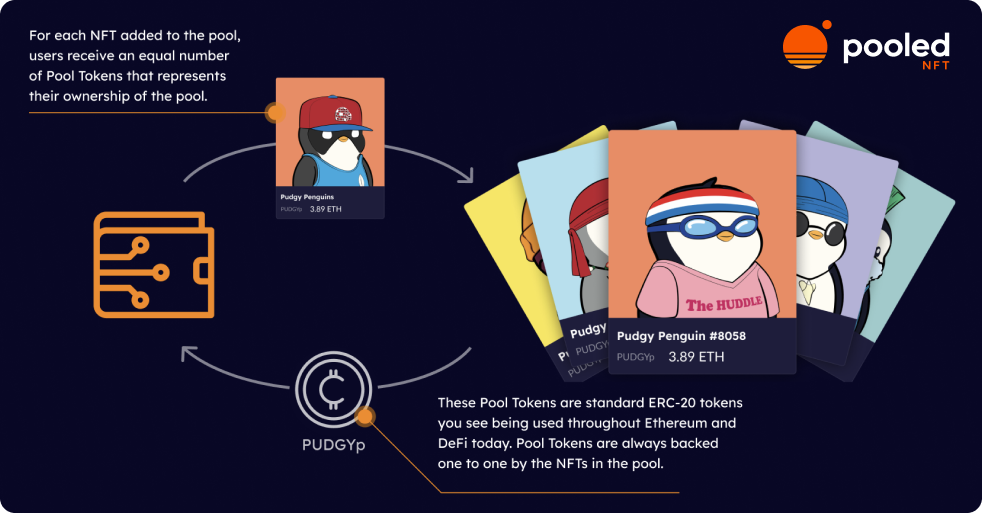

# “ERC-404” NFT & Fungible Token Interoperability

“ERC-404” NFT & Fungible Token Interoperability

[Unisocks](https://socks.uniswap.org/) is the granddaddy of interoperability between the two most popular token standards, ERC-20 and ERC-721. Buy the fungible token on Uniswap and then later redeem it for an NFT and a physical pair of socks.

<iframe src="https://medium.com/media/6929ee941fd55e88b34ca15123ca40ae" frameborder=0></iframe>

### What’s ERC-404?

As explained by [@BinanceResearch](https://twitter.com/BinanceResearch/status/1755677020120367155). Self-proclaimed ERC-404 is an unofficial, experimental, and unaudited token “standard” that aims to combine properties of fungible and non-fungible (NFT) tokens into a unified interface.

Several tradeoffs were made to try and get these two distinct paradigms to cooperate inside a single interface. NFT liquidity and fractionalization are the desired benefits 404 tries to capture.

[@0xQuit](https://twitter.com/0xQuit/status/1754853866120835239?ref_src=twsrc%5Etfw%7Ctwcamp%5Etweetembed%7Ctwterm%5E1754859038385262805%7Ctwgr%5Ec890308d7adee21b979ec1cc33dfd807d75a4c88%7Ctwcon%5Es2_&ref_url=https%3A%2F%2Fcdn.embedly.com%2Fwidgets%2Fmedia.html%3Ftype%3Dtext2Fhtmlkey%3Da19fcc184b9711e1b4764040d3dc5c07schema%3Dtwitterurl%3Dhttps3A%2F%2Ftwitter.com%2FlofiQtip%2Fstatus%2F17548590383852628053Fref_src3Dtwsrc255Etfw257Ctwcamp255Etweetembed257Ctwterm255E1754859241481891842257Ctwgr255E05177a2abd8bbc927a132d9a2a7f72031bd2fcc3257Ctwcon255Es2_26ref_url3Dhttps253A252F252Fwww.notion.so252FERC-404-NFT-Fungible-Token-Interoperability-a14827e1d4364d67bb1d169e1bcc2beeimage%3D) took a deep dive into the code here. Give it a read and you can get a sense of the tradeoffs necessary to bring this idea to life. Below are some of the reactions.

<iframe src="https://medium.com/media/714f56e01678d18f8640477bb3eafe28" frameborder=0></iframe>

Good news for those looking for the tools to fractionalize and liquify NFT collections. Pooled NFT is an out-of-the-box solution that provides just this! As the name implies, Pooled NFT allows anyone to deploy an NFT Pool and corresponding ERC-20 token. Pool Tokens are always backed one-to-one by the NFTs in the pool.

Rather than trying to push all the functionality into a single token standard, our team created a set of smart contracts that keep the standards separate, yet allow for interoperability. This approach reduces complexity and makes for a much safer implementation. Check out our app at [PooledNFT.com](http://PooledNFT.com) or dive into our [docs](https://hifi-finance.gitbook.io/pooled-nft/) to learn more.

If you want to see all of what’s possible check out [Sheet Heads](https://sheetheads.com/), an NFT collection that utilizes Pooled NFT and already has liquidity in Uniswap Markets. Buy a Sheet Head on [OpenSea](https://opensea.io/collection/sheet-heads) or buy a fraction of a Sheet Head on [Uniswap](https://info.uniswap.org/#/tokens/0xc2bc2320D22D47D1e197E99D4a5dD3261ccf4A68), the choice is yours!

Keep the conversation going on our [Discord](https://discord.com/invite/PRVfJQbJZ8) and follow us on [Twitter](https://twitter.com/poolednft).

Source: https://blog.hifi.finance/erc-404-nft-fungible-token-interoperability-ad5eaf4039de
