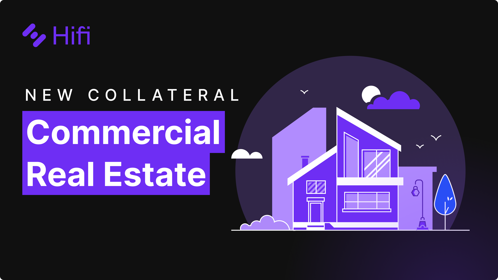

# Real Estate as Collateral

Real Estate as Collateral

In June of last year, the core team set out to tokenize our first real-world asset, a one-of-a-kind 1952 Volkswagen Type 2 DeLuxe Microbus. Today, the core team is excited to reveal the next chapter of our real-world asset journey, commercial real estate.

### Commercial Real Estate

Commercial real estate refers to properties used primarily for business purposes, including office buildings, health care facilities, retail spaces, warehouses, industrial sites, and multifamily residential buildings with five or more units. Unlike residential real estate, which focuses on personal use, commercial real estate centers around investment and income generation.

Commercial real estate (CRE) stands out as excellent collateral due to its unique blend of attributes. The tangible nature of CRE provides a solid asset base that can be appraised, sold, or leased, offering lenders tangible security against loans. Furthermore, CRE’s ability to generate steady income through leases demonstrates the property’s potential to support loan repayment from its own revenue streams. The long-term appreciation potential of commercial properties, and their inherent marketability, especially in prime locations, enhances their value as collateral. These characteristics — tangible value, income generation, appreciation potential, and marketability underscore its strength as collateral.

The same [framework](https://blog.hifi.finance/real-world-assets-the-framework-f8180a749256) we introduced in June of last year, for integrating the VW Microbus into the Hifi Protocol, works for adding Commercial Real-Estate to the protocol! Be sure to check out that blog post if you haven’t yet.

### **About the Collateral**

Working alongside real estate professionals, our team has identified a property that meets our criteria of excellent collateral. The property is a 93-unit residential building, built in 2001. The professionally managed facility is located in Utah, USA. A recent valuation of the property valued it at $7.85M.

This proposal will seek to add a $1.25M fractional share of the asset, including personal guarantees from borrowers, to Hifi’s Protocol. The proposal will assign the asset a 125% collateralization ratio (80% loan-to-value), which is in line with industry standards. Our team is working to finalize the legal agreements for the DAO and our operating partners and hopes to submit the proposal this week for consideration by HIFI token holders.

Now is a great time to ensure you have your HIFI tokens in a wallet you control so you can participate in this governance proposal. Don’t forget to delegate your votes to your wallet or to someone in the community for your vote to count.

Have questions about real estate as collateral? Feel free to reach out on [Discord](https://discord.com/invite/PRVfJQbJZ8) and [Twitter](https://twitter.com/hififinance). Our team members and community are always ready to lend a helping hand.

Source: https://blog.hifi.finance/real-estate-as-collateral-77e60814aaa1
