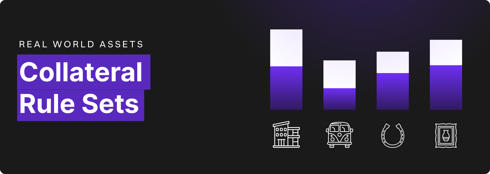

# RWA Framework Improvements

RWA Framework Improvements

Today, we are introducing changes to the RWA Framework used to onboard Real World Asset Collateral into Hifi’s Lending Protocol. Previously, a new governance proposal was necessary for each loan our lending partners originated. Going forward, Governance will approve a set of rules for each collateral type and enable Hifi to better scale the onboarding of RWAs as collateral. Under the improved framework, a governance proposal can onboard many loans and additional proposals will only be necessary to update credit limits or improve collateral rule sets.

To introduce this new framework for RWA’s let’s start with an example community members should be familiar with. In June of last year, we onboarded a 1952 VW Microbus to the protocol; how would that look today under this new approach? To start, rather than describing the specific car used as collateral, Governance would approve a set of rules that would apply to the broader category of similar vintage vehicles. Here is an example of what that ruleset might look like.

## Example Ruleset: Vintage Vehicle Collateral

* **Vintage** — The vehicle must have been manufactured more than 25 years ago.

* **Condition** — The vehicle must be in excellent or good condition, as determined by a qualified independent third-party appraiser. Vehicles in fair or poor condition will not be accepted as collateral.

* **Loan To Value (LTV)** — Vehicles in excellent condition qualify for up to 80% LTV, and vehicles in good condition qualify for up to 60% LTV.

* **Personal Guarantee** — Borrowers with good credit who wish to pledge their personal assets as an additional layer of collateral backing the loan may do so to increase the LTV from 60% to 80% for vehicles in good condition.

* **Valuation** — The appraised value will determine the maximum loan amount based on the LTV ratio. A recent purchase of the asset may also be used to determine the value of an asset when the transaction constitutes at least a 25% ownership stake of the asset.

* **Loan Term** — The maximum loan term is five years.

* **Insurance Requirement** — Borrowers must maintain comprehensive insurance coverage on the collateral vehicle for the duration of the loan. The Lending Partner must be named as an additional insured party on the policy.

* **Documentation** — Lending partners must obtain and verify all necessary documentation, including the vehicle title, appraisal report, insurance policy, and borrower information.

* **Loan Servicing** — Lending partners are responsible for servicing the loans, including collecting payments, managing delinquencies, and reporting to the appointed Hifi DAO designee.

By adhering to these requirements, our lending partners can ensure that credit is extended prudently and that Hifi DAO’s interests are protected. We enable much more collateral to onboard with minimal friction and can scale Hifi’s TVL to greater heights.

## On-Chain Implementation

With this new framework, we can also iterate on and improve our on-chain implementation that represents the collateral. Again, let’s describe what we have done in the past and then explore what the implementation will look like going forward.

### Old Framework

Previously, we created a unique NFT collection highlighting the specific collateral being used, in this case, a 1952 VW Microbus with VIN 20–021754. Then, we’d deposit that NFT into our Pooled NFT product, which would give us a fungible ERC-20 token to deposit into the protocol. This on-chain implementation has worked well for our needs but can be improved.

### New Framework

Going forward, we can create a more generic representation of each collateral type with a standard ERC-20 token. In this case, we’d deploy a token called Vintage Vehicle Collateral, give it a token symbol of VVC, and assign a value of $10,000 for each token. Given that the Microbus appraised for $650,000, we’d mint 65 VVC tokens and use that in the protocol.

As a part of the governance process and enforceable through our legal agreements, each Collateral Token will have a system-wide credit limit. Our Designee will be responsible for minting new collateral tokens to represent the value of Lending Partner customer deposits. Lending Partners, still, can only lend up to the collateral-specific credit limit set by Governance. Similar to how we have managed accountability in our existing system, we will continue to have a governance-appointed designee representing the DAO’s interests throughout the entire process.

### Summary

Under the new framework, Hifi is positioned to take advantage of new collateral onboarding opportunities in real-time as our Lending Partners source demand for liquidity within Hifi’s Lending Protocol. This new approach was developed based on community feedback and looking for more efficient ways to work towards our goal of growing Hifi’s TVL to $25M. Big shout out to @Hollywood41 for his constructive dialogue that catalyzed our new and improved approach. We can’t wait to try our new framework in the coming weeks. So keep an eye out for our next improvement proposal to onboard two new collateral types onto Hifi’s Lending Protocol.

Stay connected with us. Keep an eye on our announcements, participate in our discussions, and be a part of the community on [Discord](https://discord.com/invite/uGxaCppKSH) and [Twitter](https://twitter.com/hififinance).

Source: https://blog.hifi.finance/rwa-framework-improvements-c7b71b44b4ba
