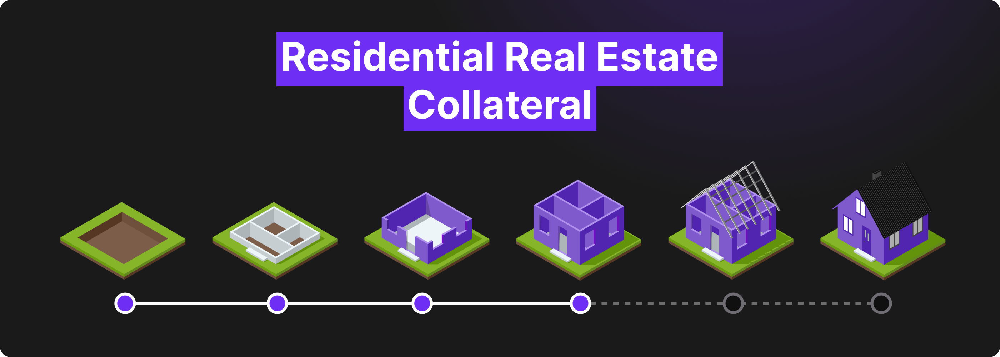
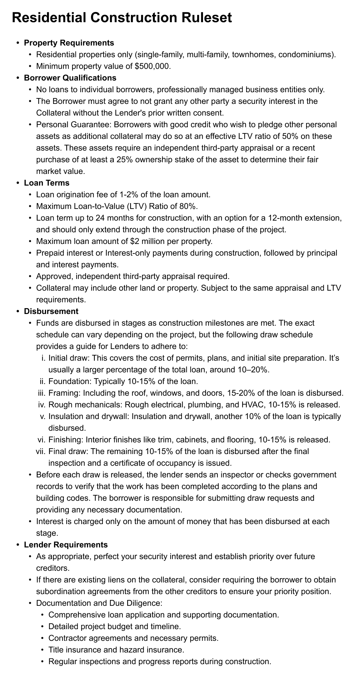

# Collateral Ruleset: Residential Construction

Collateral Ruleset: Residential Construction

In our last blog, we introduced [RWA Framework Improvements](https://blog.hifi.finance/rwa-framework-improvements-c7b71b44b4ba). In today’s blog post, we utilize our improved approach and outline a ruleset for our next category of Real-World Assets: Residential Construction. Onboarding this new collateral type will help us progress toward our goal of growing Hifi’s TVL to $25M!

For those who may be unfamiliar with how construction loans typically work in the US, here’s a brief overview. The borrower often secures the land separately through a land purchase or using existing owned land. In cases where the land acquisition cost is included in the construction loan, a larger down payment is typically required. The construction loan is then used to finance the building project, with funds disbursed in stages based on construction milestones. The borrower usually makes interest-only payments on the disbursed amount during construction. Once the project is completed, the loan is paid off or converted into a permanent mortgage.

## Special Considerations

Under the supervision of the DAO-appointed designee, Lending Partners will be permitted to borrow the full amount of the loan upfront. This is needed to facilitate the regular draw schedule and lock in a single rate for all disbursements. Consistent with our prior agreements with Lending Partners, they are not permitted to use these resources for anything other than facilitating lending to their customers.

## Next Steps

Stay tuned, we’ve got one more collateral ruleset to present, before we bring these items to governance for token holders to vote. Our new framework enables us to more efficiently work towards our goal of growing Hifi’s TVL to $25M!

For all things Hifi keep an eye on our announcements, participate in our discussions, and be a part of the community on [Discord](https://discord.com/invite/uGxaCppKSH) and [Twitter](https://twitter.com/hififinance).

Source: https://blog.hifi.finance/collateral-ruleset-residential-construction-3126c35ce4e9
