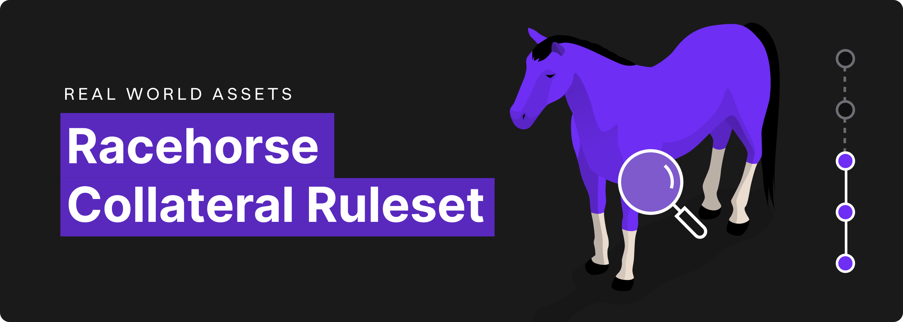
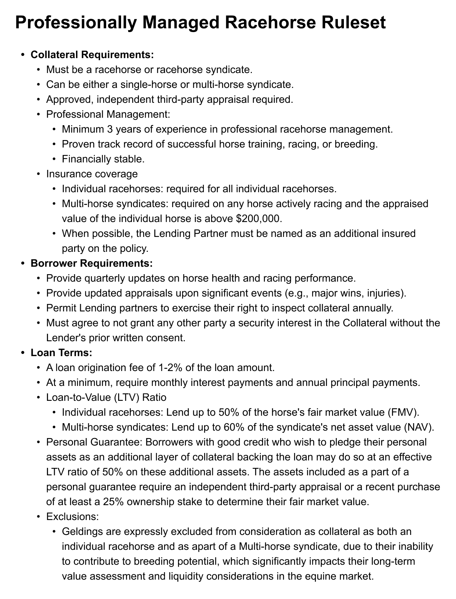

# Collateral Ruleset: Professionally Managed Racehorses

Collateral Ruleset: Professionally Managed Racehorses

Just over a year ago, we announced [our partnership with Crown Ribbon](https://blog.hifi.finance/probably-nothing-3b5080008387) — intending to disrupt the $300 billion performance horse industry. Behind the scenes, we’ve been working on education, business development, and legal compliance as we all await the much-anticipated launch of Crown Ribbon. Today, we are introducing our collateral ruleset for professionally managed racehorses.

This ruleset will allow Hifi to onboard existing owners of professionally managed racehorses and prepare us for onboarding Crown Ribbon retail customers once regulators approve their Offering Circular. Governance approval of this collateral ruleset helps us push forward in our goal of growing Hifi’s TVL to $25M!

## Designee Role

Consistent with other collateral requirements the DAO-appointed designee will oversee and represent Hifi DAO’s interests in the transaction. This includes reviewing reports and updates provided by Lending Partners and ensuring compliance with DAO-approved collateral rulesets.

## Next Steps

Now that we have our first two collateral rulesets defined, our next blog post will introduce and summarize the processes, roles, and legal agreements needed to support our improved approach to collateral onboarding. After that, the core team will put forward a proposal for consideration by Hifi Governance.

For all things Hifi keep an eye on our announcements, participate in our discussions, and be a part of the community on [Discord](https://discord.com/invite/uGxaCppKSH) and [Twitter](https://twitter.com/hififinance).

Source: https://blog.hifi.finance/collateral-ruleset-professionally-managed-racehorses-45871b4771bc
