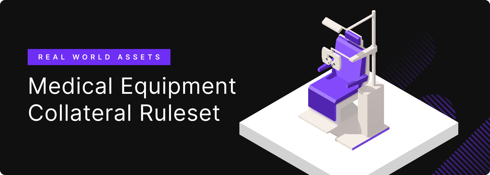
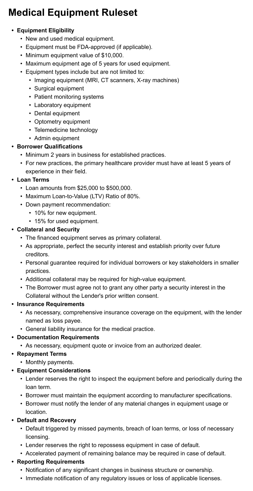

# Collateral Ruleset: Medical Equipment

Collateral Ruleset: Medical Equipment

We are proud to announce a new collateral ruleset for our latest Real-World Asset (RWA) category: Medical Equipment. This new collateral type will continue to fuel our progress toward our goal of growing Hifi’s TVL to $25M!

### **Overview of Medical Equipment Loans**

Medical equipment loans allow healthcare providers to secure financing using their medical equipment assets as collateral. Medical equipment loans are commonplace and used when starting, expanding, or simply updating a medical practice. These loans are used to purchase equipment like diagnostic devices, therapeutic machines, and other high-value medical tools. Once equipment is purchased, the practice makes payments from revenue earned through its normal business operations.

### **Next Steps**

This collateral ruleset will be subject to our governance process and will be put forward for a community vote alongside [HIP 10](https://blog.hifi.finance/hip-10-administrative-appointment-c2e33dbca748) which is seeking approval to appoint a DAO Manager. Both proposals are expected to go live on the [forum](https://forum.hifi.finance/) in the coming days. We hope you will join us in support of our goal of growing Hifi’s TVL to $25M and beyond!

Stay updated with Hifi by following our announcements and joining our community discussions on [Discord](https://discord.com/invite/uGxaCppKSH) and [Twitter](https://twitter.com/hififinance).

Source: https://blog.hifi.finance/collateral-ruleset-medical-equipment-1cf3d1c404e7
