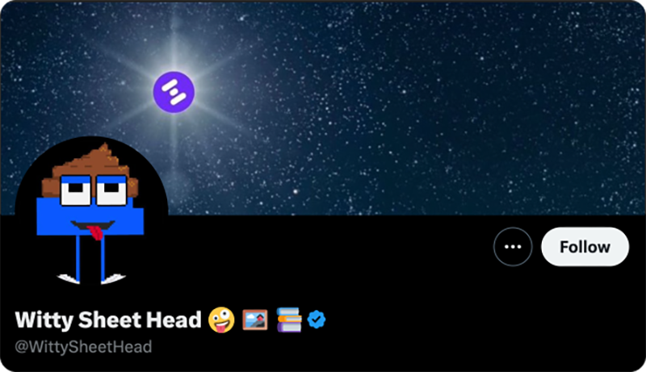

# Community-Led Marketing

Community-Led Marketing

Today we recognize and reward some of our community members for taking initiative to extend our reach and boost our online presence. Our community is our most valuable asset. Take a look at what we can accomplish, as we work together.

## Nawaf’s Marketing Campaign

Nawaf took it upon himself and dedicated substantial time to reaching out to over 70 influencers, ultimately narrowing them down to the top 32. He worked closely with each influencer to draft and schedule tweets for a simultaneous release, even contributing his own funds to support the campaign. With an additional $20k in financial backing from the Hifi Labs, we successfully launched this campaign on June 12th, 2024.

<iframe src="https://medium.com/media/9deee1314d792656e81ddd6a344e9082" frameborder=0></iframe>

### **Results**

On June 12th, 2024, all tweets were posted resulting in the following metrics:

* 2100+ new followers

* 500,000+ views

* 7800+ retweets

* 6,000+ likes

* 7200+ comments

## KingCliff1982's Youtube Outreach

KingCliff’s marketing initiative targets a completely different social media platform: YouTube Live. He has made it his mission to feature Hifi Finance on some of the top YouTube Live crypto channels, working tirelessly each day to achieve this goal.

His dedication to outreach has captured the attention of leading YouTubers in the industry. Although this campaign is still in its early stages, we are excited to see the results unfold!

## MuchFungible’s Hifi Tracker

Another relatively new community effort is MuchFungible’s [Hifi Tracker account on X](https://x.com/Hifi_Community). This Twitter account was made to track various aspects of the ecosystem to put them in one place for the community to easily consume. These updates are anything from Github activity, ecosystem tweets, announcements, blogs, Tally, the Hifi metrics dashboard, etc.

As of now, everything is being tracked and posted manually, but he’s been researching plans for automation. If you haven’t followed that account yet, send it a follow!

## CuriousSheetHead’s Witty Sheet Head Account

You must be living under a rock if you’re not following [@WittySheetHead](https://x.com/WittySheetHead)! This account was created in March of 2023 by one of our amazing guardians, CuriousSheetHead. Since then, he’s posted hundreds of hilarious tweets and memes. This uplifting account always brings a smile to our day while promoting the Hifi Ecosystem.

## Thank You!

As a special thanks to our community members who have gone the extra mile and taken initiative, we’re giving $500 in $HIFI to each person mentioned! Your efforts and initiatives significantly increase our online presence. We appreciate your hard work and dedication, and we’re excited to see what other innovative ideas and contributions our community members will bring in the future. Thank you for being an essential part of Hifi DAO!

Have a suggestion for future initiatives? Our team actively reads every message on [Discord](https://discord.com/invite/uGxaCppKSH) and [Twitter](https://twitter.com/hififinance).

Source: https://blog.hifi.finance/community-led-marketing-80375a53dd53
