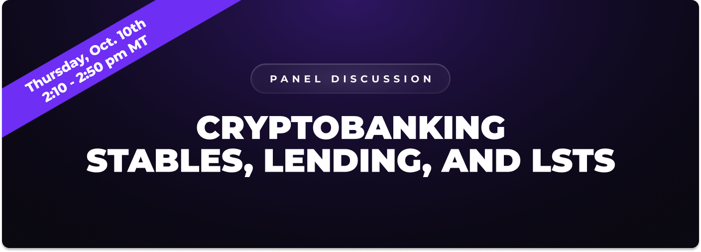

# Permissionless III

Permissionless III

Hifi Finance is proud to announce that we will be Gold Sponsors at the upcoming [Permissionless III](https://blockworks.co/event/permissionless-iii) event in Salt Lake City, Utah, from October 9th to the 11th. Hosted by Blockworks, this event for founders, application developers, investors, policymakers, and users brings together some of the biggest names in crypto, including Coinbase, Celestia, Polygon, and many more.

### Speaking Event Panel

Our CEO, Doug Leonard, will be speaking on the Institutional Track on Thursday, October 10th at 2:10 PM (MST). We invite you to join us as Doug speaks with notable industry leaders discussing Cryptobanking: Stables, Lending, and LSTs. If you can’t stop by to hear the panel in person, we will upload videos of the discussion after the event.

### Come Say Hi!

Join us at Booth #1427 in the Salt Palace Convention Center (90 S W Temple St, Salt Lake City, UT 84101) where our team will be available throughout the 3-day event to chat, answer your questions, connect with community members, and hand out unique swag for those who stop by. Additionally, we’ll be raffling out some awesome prizes, so stay tuned for more details!

### **See You There**

We’re pumped to be part of Permissionless III, and we can’t wait to connect with community members and crypto enthusiasts. If you’re attending, be sure to listen in on Doug Leonard’s insights, swing by Booth #1427 for some interesting swag, and participate in the giveaways.

For more updates on the event or any questions, join the community on [Discord](https://discord.com/invite/uGxaCppKSH) and [Twitter](https://twitter.com/hififinance).

Source: https://blog.hifi.finance/permissionless-iii-48f45e77823b
