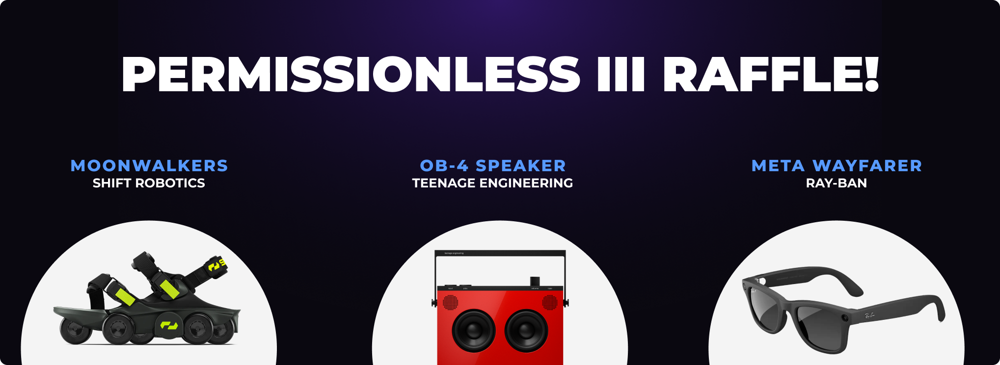

# Permissionless III Summary

Permissionless III Summary

From October 9th to October 11th, the Hifi team attended the [Permissionless III](https://blockworks.co/event/permissionless-iii) event as Gold Sponsors. For this event, Blockworks and Bankless gathered the most influential minds in crypto for three days of networking, engaging content, and live conversations. Here is our recap of our experiences and takeaways from Permissionless III, highlighting our booth, speaking panel, and giveaway raffle.

## Booth #1427

We made our mark at the Salt Palace Convention Center with an unexpected and memorable giveaway: branded coconuts. Each attendee who visited booth #1427 received a drinkable coconut with the Hifi logo seared into it, easily making us the most popular booth at the event. Our team received numerous comments during and after the event complementing our creativity; this initiative alone captured around 350 new followers on [X](https://x.com/HifiFinance) (formerly Twitter), but more importantly, it sparked countless conversations and connections.

## Institutional Track Speaking Panel

Our CEO, [Doug Leonard](https://x.com/dleonard00), took the stage at the Institutional Track in front of hundreds of people, taking a deep dive into “Cryptobanking: Lending, Stables, and LSTs.” with notable industry founders from companies such as [Steakhouse Financial](https://www.steakhouse.financial/), [Block Analitica](https://blockanalitica.com/), [Phoenix Labs](https://www.phoenixlabs.dev/), and [Anchorage Digital](https://www.anchorage.com/). Afterward, Doug was invited to an exclusive networking event with key decision-makers from [Lido](https://lido.fi/), [Blockworks](https://blockworks.co/), and many others.

You can view the full panel here: [https://x.com/Permissionless/status/1849131227149738098](https://x.com/Permissionless/status/1849131227149738098)

## Giveaways!

On top of coconuts, the Hifi team brought various high-tech gifts to raffle off to our online community members and event attendees. Qualifying for the raffle was simple, users joined the Discord and reacted to a specific message to obtain a “Permissionless III” role. Additional raffle tickets were awarded to those who uploaded a picture of their coconuts on X! The winners were [@charliedbrooks](https://x.com/charliedbrooks), [@GregTomaselli](https://x.com/GregTomaselli), and [@muchfungible](https://x.com/muchfungible), so if you see them in the community, congratulate them!

## Conclusion

Overall, the Permissionless III event was a success. Our presence at Permissionless III strengthened Hifi’s position within the DeFi space while opening doors for future partnerships and collaborations. The Hifi team would like to thank everyone who visited our booth, attended the speaking panel, or participated in the giveaways. Thank you!

Side note: for those who participated in governance voting for [HIP 9](https://www.tally.xyz/gov/hifi-dao/proposal/8) and [HIP 10](https://www.tally.xyz/gov/hifi-dao/proposal/9), we have sent out gas reimbursements for all those Tally transactions.

If you have any questions about the event, our team is always on standby on [Discord](https://discord.com/invite/uGxaCppKSH) and [Twitter](https://twitter.com/hififinance).

Source: https://blog.hifi.finance/permissionless-iii-summary-da0edd8cb593
