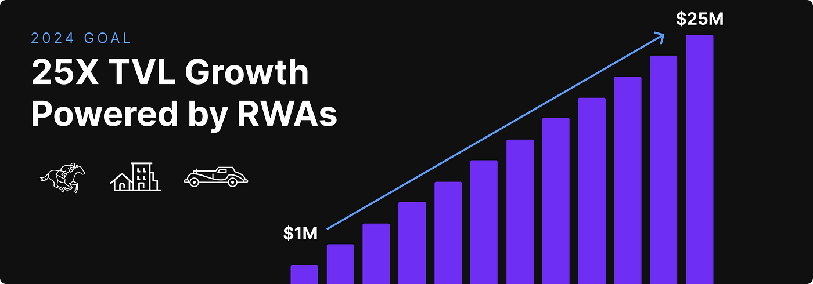
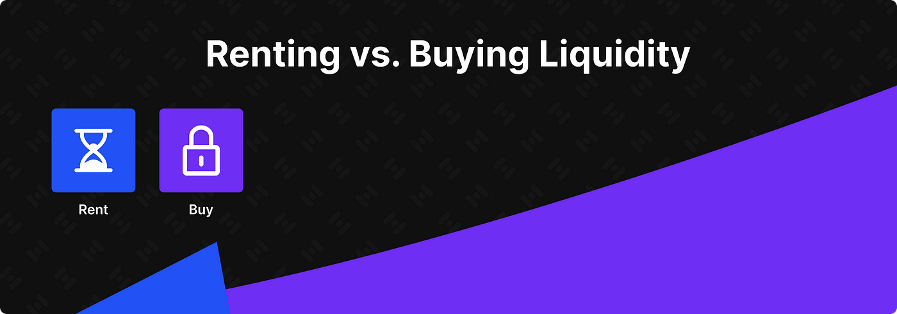
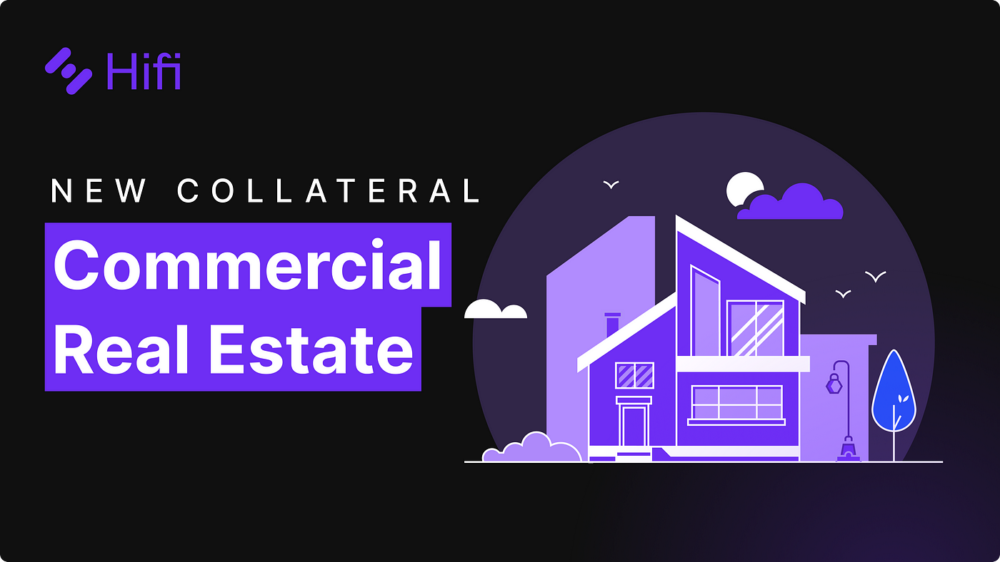
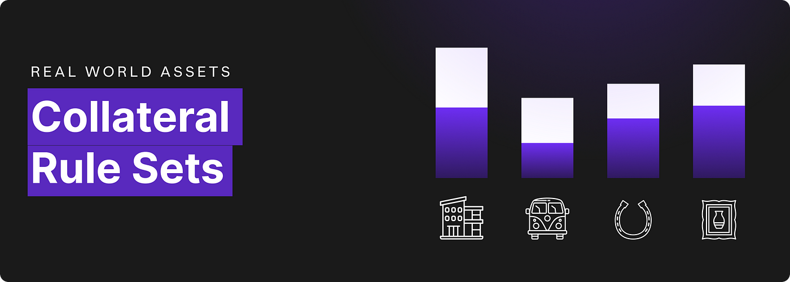
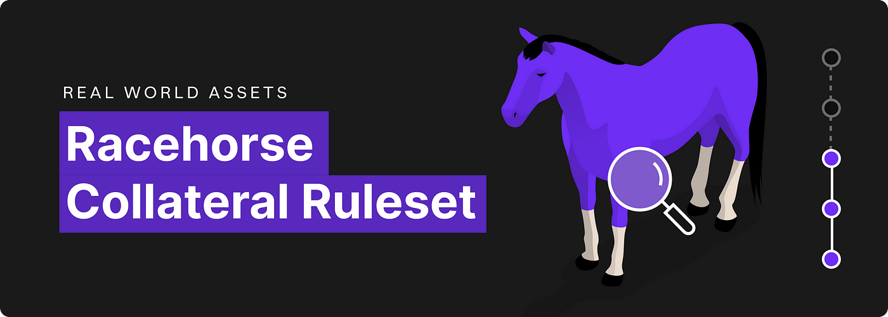
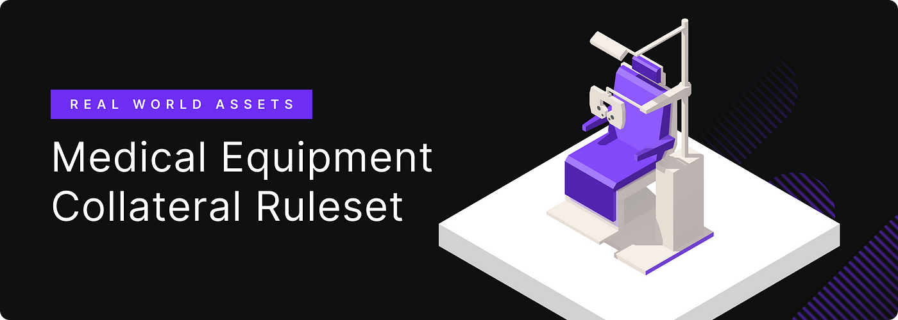
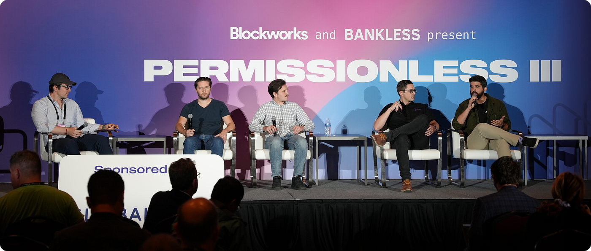
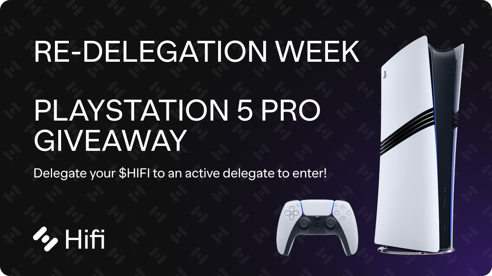
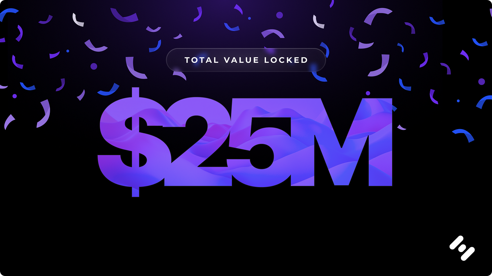

# Hifi 2024 — In Review

Hifi 2024 — In Review

As we wrap up the second year of the Hifi DAO, we’re excited to reflect on the progress made in 2024. This year brought a renewed focus on Real-World Assets (RWAs) and growing Hifi’s Total Value Locked (TVL). Let’s take a moment to celebrate the achievements and milestones that have shaped Hifi’s journey this year.

## The 2024 Roadmap

At the beginning of 2024, we unveiled an ambitious [roadmap](https://blog.hifi.finance/hifi-2024-roadmap-e489383df572) to solidify Hifi’s position as a leader in RWA decentralized lending. Our main objectives were enhancing the user experience, expanding the variety of supported assets, and innovating on our core protocol. We also set a goal to grow our TVL to $25 million — a target that would require strategic partnerships, new collateral integrations, and a strong focus on liquidity.
> # …in the next 12 months, our goal is to grow our TVL by 25x to capture a total of $25M TVL.

## Liquidity Bootstrapping Program

One of the first initiatives we implemented was [HIP 6](https://www.tally.xyz/gov/hifi-dao/proposal/5), our Liquidity Bootstrapping Program. This program aimed to enhance liquidity within our fixed-rate lending markets by incentivizing liquidity providers through a targeted rewards system. By ensuring transparency and fairness through reward tiers, HIP 6 played a pivotal role in aligning incentives and driving engagement — ultimately making significant strides toward our $25 million TVL goal.

## Sheet Heads Progress Report

We set out to try fun and new things to reward our [Sheet Heads](https://sheetheads.com/) NFT holders, which has become a vibrant part of the Hifi community. Sheet Heads were designed to merge art, culture, and DeFi, and we’ve seen incredible engagement from our community as they’ve embraced our new Zealy quests initiative. Sheet Heads have provided a unique way for our users to engage with the Hifi beyond lending and borrowing. This has been made evident by the over 8,000 individuals who have participated, completing over 100k quests!

## Real Estate as Collateral

In Q1, we introduced real estate as collateral within the Hifi protocol — a major milestone in bridging traditional finance and decentralized finance. By allowing users to leverage real estate assets, we’ve broadened the range of collateral options and opened up new opportunities for borrowers to access liquidity without selling their property. This integration has brought tangible value, making our protocol more accessible to a wider audience.

Building on this, in Q2 we launched [HIP 7](https://www.tally.xyz/gov/hifi-dao/proposal/6) to integrate commercial real estate as collateral. By partnering with Finance Ventures, we were able to extend credit backed by operational commercial real estate properties. This move further diversified our collateral options and strengthened our RWA collateral framework.

## Metrics Dashboard

Transparency is a cornerstone of our mission. Throughout the year, we developed the [Metrics Dashboard](https://metrics.hifi.finance/) to provide real-time insights into key performance indicators like TVL growth, protocol-owned liquidity, and loan volume. This initiative is a testament to our commitment to building a data-driven, transparent DeFi ecosystem.

## **Improving the RWA Framework**

In April, we refined our Real-World Asset framework to streamline the onboarding process, enhance risk assessments, and align with industry standards. These improvements made it easier to integrate new RWAs while ensuring security and scalability. This work has laid a strong foundation for Hifi to continue expanding its collateral options and increasing TVL.

## **Collateral Rule Set Expansions**

Through [HIP 8](https://www.tally.xyz/gov/hifi-dao/proposal/7), we introduced new collateral rule sets for residential construction projects and professionally managed racehorses. These additions have diversified the types of real-world assets used as collateral and attracted new participants to our ecosystem. By collaborating with industry experts, we created comprehensive frameworks that ensure risk management while expanding opportunities for borrowers.

## Hifi Governance Page

May saw the launch of the new [Hifi Governance Page](https://swap.hifi.finance/#/delegate) — a central hub for all governance activities. With enhanced features like $HIFI delegation, easy access to the Governance Forum, and voting tools, the page empowers our community to take an active role in shaping Hifi’s future. The new hub ensures governance remains accessible and fosters more inclusive decision-making.

## Sheet Heads Website Update

In June, we refreshed the [Sheet Heads website](https://sheetheads.com/) to better reflect our focus on community, liquidity, and creativity. The new Media Page, packed with memes, GIFs, and stickers, has been instrumental in boosting community engagement. Additionally, our successful quest initiative has attracted over 8,000 participants, reinforcing Sheet Heads as a core part of Hifi’s culture.

## Hifi Ecosystem Tutorials

<iframe width="560" height="315" src="https://www.youtube.com/embed/xWDkY2W5WaQ" frameborder="0" allowfullscreen></iframe>

June also brought the launch of our revamped tutorial video series on YouTube. These easy-to-follow videos cover topics like token swapping, governance participation, borrowing, lending, and adding liquidity. The tutorials make our ecosystem more accessible by guiding both new and experienced users through key features of the Hifi protocol.

## Community-Led Marketing Initiatives

<iframe src="https://medium.com/media/a9567837eec06e195ec5440d190b5f16" frameborder=0></iframe>

This summer our community shone brightly with grassroots marketing initiatives that propelled Hifi’s presence. Nawaf led a campaign featuring over 30 influencers, resulting in over 500,000 views and thousands of new followers. KingCliff1982 promoted Hifi on major YouTube crypto channels, while MuchFungible launched the Hifi Tracker account to consolidate updates. We’re grateful for our community’s continued dedication.

## **Web3 Global Media**

<iframe src="https://medium.com/media/500c8f6e05644b8183b1d3483e9df45b" frameborder=0></iframe>

In August our CEO, [Doug Leonard](https://x.com/dleonard00), joined a Twitter Space hosted by Web3 Global Media to discuss the future of decentralized finance and Hifi’s role in advancing the industry. The conversation highlighted Hifi’s ongoing initiatives, the integration of Real-World Assets, and our vision for growing TVL to $25 million. Doug’s insights provided valuable context for our community and broader audiences on how Hifi is contributing to the evolving DeFi landscape. You can listen to the recording [here](https://x.com/web3globalmedia/status/1829440846460338253).

## **Medical Collateral and A DAO Manager**

In September, we expanded our collateral offerings to include [medical equipment](https://www.tally.xyz/gov/hifi-dao/proposal/8) — enabling healthcare providers to secure loans using high-value assets. This was a major step in our mission to bring real-world assets into DeFi. At the same time, [HIP 10](https://www.tally.xyz/gov/hifi-dao/proposal/9) appointed Doug Leonard as the official DAO Manager, ensuring compliance with US tax regulations and allowing Hifi to take legal and administrative actions.

## Sheety Deals

This year, Sheet Heads holders enjoyed Sheety Deals — a weekly offering of unique giveaways and discounts tied to NFT metadata. From amusement park tickets in Iraq to hair restoration in Turkey, the deals provided fun and valuable perks to our community, further driving engagement and adding to the value of holding Sheet Heads NFTs.

## Permissionless III Event

In October, we attended [Permissionless III](https://blockworks.co/event/permissionless-iii) in Salt Lake City as Gold Sponsors. Our CEO, Doug Leonard, joined a panel on “Cryptobanking: Lending, Stables, and LSTs” and our booth #1427 drew significant attention thanks to our Hifi-branded coconuts — the talk of the show floor. This event strengthened our relationships within the DeFi industry and opened doors for potential partnerships.

## Re-delegation Week

To strengthen governance and engagement, we introduced Re-delegation Week, a seven-day initiative allowing members to reassign their tokens to active delegates while reimbursing gas costs. This effort aimed to boost voting power and ensure every community voice is counted, addressing the challenge of inactive delegates. To encourage participation, members who re-delegated were entered into a raffle for various prizes, including a PS5 Pro. We are committed to effective, inclusive governance and maintaining an active community that helps steer the DAO toward its goals.

## **Residential Construction Ruleset Amendment**

[HIP 11](https://www.tally.xyz/gov/hifi-dao/proposal/10) added amendments to our Residential Construction Ruleset to make the protocol more accessible while maintaining strong risk controls. Key updates included reducing the minimum property value requirement from $500,000 to $150,000, broadening access to smaller residential projects, and allowing borrowers to pledge up to 50% of the loan value as additional collateral. These changes reflect market feedback and our commitment to growing Hifi’s TVL to $25 million while balancing inclusivity with maintaining the robustness of our risk controls.

## **Collateral Ruleset: Vintage Vehicles**

HIP 12 expanded our Real-World Asset offerings with a new collateral ruleset for vintage vehicles. Following the successful addition of a vintage vehicle to the protocol, [HIP 12](https://www.tally.xyz/gov/hifi-dao/proposal/11) established a generalized framework to enable more of these unique assets to be used as collateral. Vintage vehicles, defined as those over 25 years old, represent an intriguing mix of collectibles and investments, often appreciating in value when properly maintained. Key safeguards, including climate-controlled storage, comprehensive insurance, and regular appraisals, ensure the security and value preservation of these assets.

## **Commercial Real Estate Collateral Ruleset**

[HIP 13](https://www.tally.xyz/gov/hifi-dao/proposal/12) brought a new collateral ruleset for Commercial Real Estate (CRE), marking another significant step in expanding our Real-World Asset offerings. Building on our earlier success with individual commercial real estate additions, HIP 13 establishes a generalized framework that enables a broader inclusion of CRE assets as collateral. Commercial real estate loans offer substantial collateral values, secured by properties such as office buildings, retail spaces, and industrial facilities. The ruleset also emphasizes risk management, requiring professional property management and maintaining robust insurance and collateralization standards.

## **Administrative Update for Liquidity Bootstrapping**

Building on the success of HIP 6, which helped Hifi DAO secure over $13.5M in protocol liquidity, [HIP 14](https://www.tally.xyz/gov/hifi-dao/proposal/13) proposed an administrative update to redeploy any HIFI tokens returned to the DAO. This allows the Liquidity Bootstrapping Program to continue seamlessly without minting new tokens, maintaining the original mission of HIP 6. By recycling returned tokens, HIP 14 ensures flexibility in liquidity management, sustains protocol-owned liquidity, and supports Hifi’s long-term growth strategy. This proposal underscores the effectiveness of our approach to liquidity and invites community participation in shaping the future of this program.

## **$25M TVL Achieved**

Hifi achieved an incredible milestone this year by surpassing our ambitious [$25M Total Value Locked (TVL) goal](https://metrics.hifi.finance/)! This achievement reflects the strength of our strategy, the support of our community, and the success of initiatives like the Liquidity Bootstrapping Program (HIP 6) and the expansion of Real-World Asset offerings through HIPs 7–13. Together, we’ve built a strong foundation for continued growth, showcasing what’s possible when innovation meets collaboration. We look forward to seeing what TVL growth we’ll see in 2025!

## **Exchange Listings and Platform Additions**

<iframe src="https://medium.com/media/a862a5599b5d2978afe06244ef9d9f62" frameborder=0></iframe>

This year $HIFI was added to several new exchanges and platforms, further expanding its accessibility and presence in the DeFi ecosystem. Notably, $HIFI was listed on Indodax, DeGate Dex, and Bitunix, among others, providing new avenues for users to trade and interact with Hifi. Additionally, $HIFI was integrated into [Daobase](https://daobase.ai/dao/HifiDAO), a data and analytics platform, enhancing the visibility of Hifi’s metrics and supporting data-driven decision-making. For more $HIFI listings check out our [comprehensive list](https://medium.com/@HifiFinance/6fa78f5cc552).

## Crown Ribbon Update

Throughout 2024, we have been actively working on our partnership with Crown Ribbon, and this journey has involved several rounds of submissions to the SEC for review. We’ve submitted documents on multiple occasions, demonstrating our dedication to ensuring full compliance with regulatory standards. We have been working with legal counsel to guide us through this complex process, helping to address any concerns and move forward toward approval. We are also continuing to explore additional legal counsel options that will continue to assist us as we push forward toward approval.

We remain optimistic about receiving the necessary approvals, and we are committed to continuing our efforts with Crown Ribbon. We believe this partnership holds significant potential for enhancing Hifi’s offerings and advancing our mission in the decentralized finance space.

## Looking to 2025

Reflecting on 2024, it’s clear that Hifi has made tremendous strides in growing our TVL, ultimately reaching our goal of $25M, expanding collateral options, and building a stronger community. We’re proud of what we’ve achieved this year and are looking forward to an even more impactful 2025.

Thank you to everyone who contributed to making this year a success. Here’s to more innovation, growth, and collaboration in the year to come.

Source: https://blog.hifi.finance/hifi-2024-in-review-54d8d24643ea
