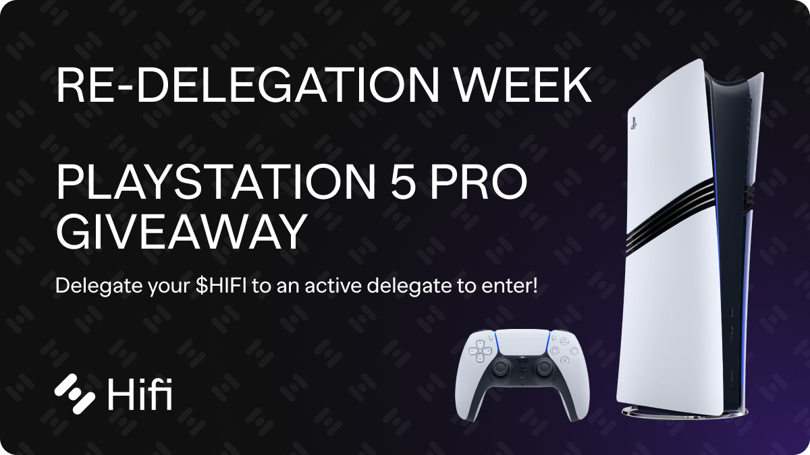

# Re-delegation Week Giveaways

Re-delegation Week Giveaways

The Hifi DAO has utilized [Tally](https://www.tally.xyz/gov/hifi-dao) for on-chain governance voting for over a year. Since then, our delegates have passed numerous Hifi Improvement Proposals (HIPs) to steer us toward our goals. Over this period, our list of [**active delegates](https://firebasestorage.googleapis.com/v0/b/hifi-3bac8.firebasestorage.app/o/Hifi%20DAO%20Active%20Delegates.pdf?alt=media&token=975a12a1-a5e0-44b9-80b9-b76783bc3a8b)** (involved individuals entrusted with voting power on behalf of other members) has changed. Some new people have joined, while others have explored new paths.

When a delegate becomes inactive, their votes and those of anyone else delegated to them go uncounted, reducing the overall voting power, safety, and engagement within the Hifi DAO.

## Introducing Re-delegation Week

To boost engagement and ensure every voice is counted, the team is excited to introduce Re-delegation Week! Over the next 7 days, all Hifi DAO members can reassign their tokens to active delegates and have the gas costs on these transactions reimbursed by the team. As a thank-you, everyone who participates by [re-delegating](https://swap.hifi.finance/#/choose-a-delegate) to an active delegate will be automatically entered into an exclusive raffle to win a variety of prizes, including the **newly released PS5 Pro**! (More prizes announced soon).

Our list of active delegates consists of those who have participated in governance voting for [HIP 8](https://www.tally.xyz/gov/hifi-dao/proposal/7), [HIP 9](https://www.tally.xyz/gov/hifi-dao/proposal/8), or [HIP 10](https://www.tally.xyz/gov/hifi-dao/proposal/9). View the list of active delegates [**here](https://firebasestorage.googleapis.com/v0/b/hifi-3bac8.firebasestorage.app/o/Hifi%20DAO%20Active%20Delegates.pdf?alt=media&token=975a12a1-a5e0-44b9-80b9-b76783bc3a8b)**.

**Already delegated to someone on our active list?** You’ll still be included in the raffle — no action required. Self-delegators on the [active list](https://firebasestorage.googleapis.com/v0/b/hifi-3bac8.firebasestorage.app/o/Hifi%20DAO%20Active%20Delegates.pdf?alt=media&token=975a12a1-a5e0-44b9-80b9-b76783bc3a8b) are also eligible for the raffle.

## How It Works

Starting now, you have one week to [re-delegate](https://swap.hifi.finance/#/choose-a-delegate) your $HIFI tokens to one of the [**active delegates](https://firebasestorage.googleapis.com/v0/b/hifi-3bac8.firebasestorage.app/o/Hifi%20DAO%20Active%20Delegates.pdf?alt=media&token=975a12a1-a5e0-44b9-80b9-b76783bc3a8b)** listed. For each $HIFI token you delegate to an active member, you’ll receive one raffle ticket, up to a maximum of 1,000 tickets per person.

After the first week, we will announce the winners in our [Discord](https://discord.com/invite/uGxaCppKSH) within the **#re-delegation-raffle** channel. Every 24 hours that the prizes go unclaimed, two new winners will be chosen and added to the list of winners; all previously drawn winners will remain eligible. This process will repeat until all prizes have been claimed from the growing list of winners!

For instructions on delegating your Hifi, you can read our blog post on [Assigning Delegates](https://medium.com/@HifiFinance/hifi-dao-tutorial-assigning-delegates-c70f9d3372a0); additionally, we’ve created a governance video tutorial video on [YouTube](https://www.youtube.com/watch?v=oJ_ZFyh9gtQ).

Good luck, everyone! As always, our team is always on standby on [Discord](https://discord.com/invite/uGxaCppKSH) and [Twitter](https://twitter.com/hififinance) to answer any questions, comments, or concerns.

Source: https://medium.com/mainframe-bits-bobs/re-delegation-week-giveaways-00176925872a
