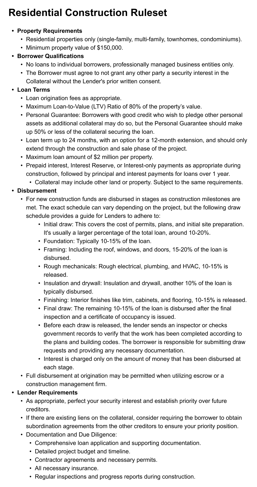
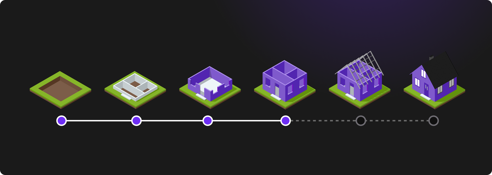

# HIP 11 — Residential Construction Ruleset Amendment

HIP 11 — Residential Construction Ruleset Amendment

We’re excited to propose amendments to our Residential Construction Ruleset that will make the protocol more accessible while maintaining strong risk controls. These changes reflect market feedback and our commitment to growing Hifi’s TVL to $25M!

## Key Changes

The proposed amendments maintain the core strengths of our original ruleset while making several strategic adjustments:

**Broader Market Access: **We’re reducing the minimum property value requirement from $500,000 to $150,000, allowing the protocol to serve a wider range of residential construction projects while maintaining our focus on quality developments.

**Flexible Guarantees: **The revised personal guarantee structure allows borrowers to pledge up to 50% of the loan value in additional collateral, streamlining the process while ensuring adequate security.

**Clearer Disbursement Structure: **We’ve provided detailed guidance on the construction draw schedule that accounts for additional deal structures.

### Existing Parameters (Unchanged)

Our $RCC1 implementation will continue to have the following parameters:

* Collateral Ceiling: 10M

* System-wide Credit Limit: $5M

* 125% collateralization ratio (80% loan-to-value)

* Fixed oracle value: $1 per token

### Streamlined Requirements

The amendments simplify certain documentation requirements while maintaining robust risk controls. This includes more flexible insurance requirements and maintaining our proven inspection and reporting processes.

### Unchanged Fundamentals

The proposal maintains key parameters that have served us well:

* $RCC1 token parameters remain the same

* 80% maximum loan-to-value ratio

* 24-month maximum term with 12-month extension option

* $2 million maximum loan amount per property

## Next Steps

In the coming days, the core team will publish a draft of the HIP 11 on the governance forum for community discussion. This and two other proposals are expected to go live on Friday, November 15, with voting beginning 48 hours after the proposal goes live.

For all things Hifi, keep an eye on our announcements, participate in our discussions, and be a part of the community on [Discord](https://discord.com/invite/uGxaCppKSH) and [Twitter](https://twitter.com/hififinance).

Source: https://blog.hifi.finance/hip-11-residential-construction-ruleset-amendment-5c33e55733b1
