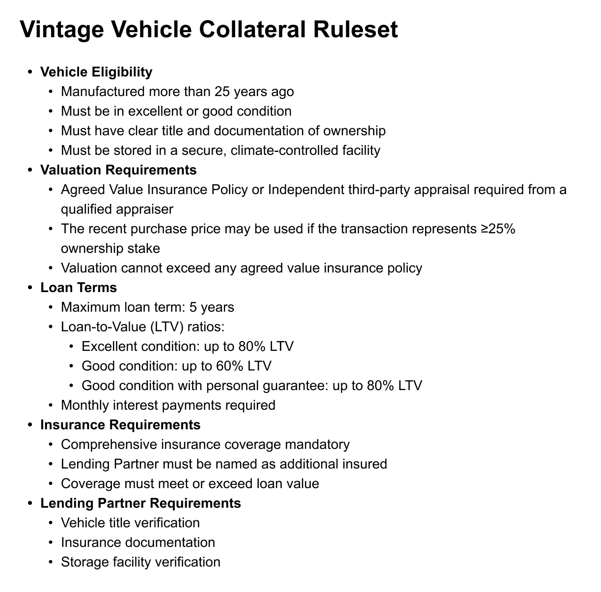
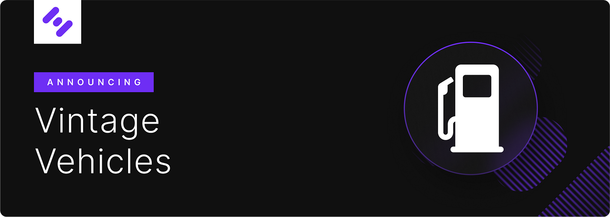

# HIP 12 — Collateral Ruleset: Vintage Vehicles

HIP 12 — Collateral Ruleset: Vintage Vehicles

We’re excited to introduce our latest collateral ruleset for a new category of Real-World Assets: Vintage Vehicles. We’ve already successfully added one vehicle to the protocol, now it’s time to adopt a generalized collateral ruleset to enable many more. This addition to our collateral framework represents another step forward in our mission to grow Hifi’s TVL to $25M!

For those unfamiliar with the vintage vehicle market, these assets represent a unique intersection of collectibles and investments. Vintage vehicles, defined as those manufactured more than 25 years ago, often appreciate in value when properly maintained and stored. The market for these vehicles has shown remarkable stability and growth, with well-preserved examples becoming increasingly sought after by collectors and enthusiasts.

### Parameters

The collateral will be represented on-chain through the Vintage Vehicle Collateral ($VVC1) token:

* Collateral Ceiling: 10M

* System-wide Credit Limit: $5M

* 125% collateralization ratio (80% loan-to-value)

* Fixed oracle value: $1 per token

### Special Considerations

Our vintage vehicle ruleset incorporates several key requirements to ensure the safety and value preservation of these unique assets:

* Vehicles must be stored in climate-controlled facilities to maintain their condition

* Comprehensive insurance coverage is mandatory

* Regular third-party appraisals are required to verify value

* Professional maintenance and condition reporting are essential

### Implementation

Under the supervision of the DAO-appointed designee, Lending Partners will be required to verify and monitor various aspects of each vintage vehicle loan, including:

* Vehicle title and ownership documentation

* Storage facility compliance

* Insurance coverage

* Regular condition reports

* Payment status monitoring

## Next Steps

In the coming days, the core team will publish a draft of the HIP 12 on the governance forum for community discussion. This and two other proposals are expected to go live on Friday, November 15, with voting beginning 48 hours after the proposal goes live.

For all things Hifi, keep an eye on our announcements, participate in our discussions, and be a part of the community on [Discord](https://discord.com/invite/uGxaCppKSH) and [Twitter](https://twitter.com/hififinance).

Source: https://blog.hifi.finance/hip-12-collateral-ruleset-vintage-vehicles-b09870fb8aaa
