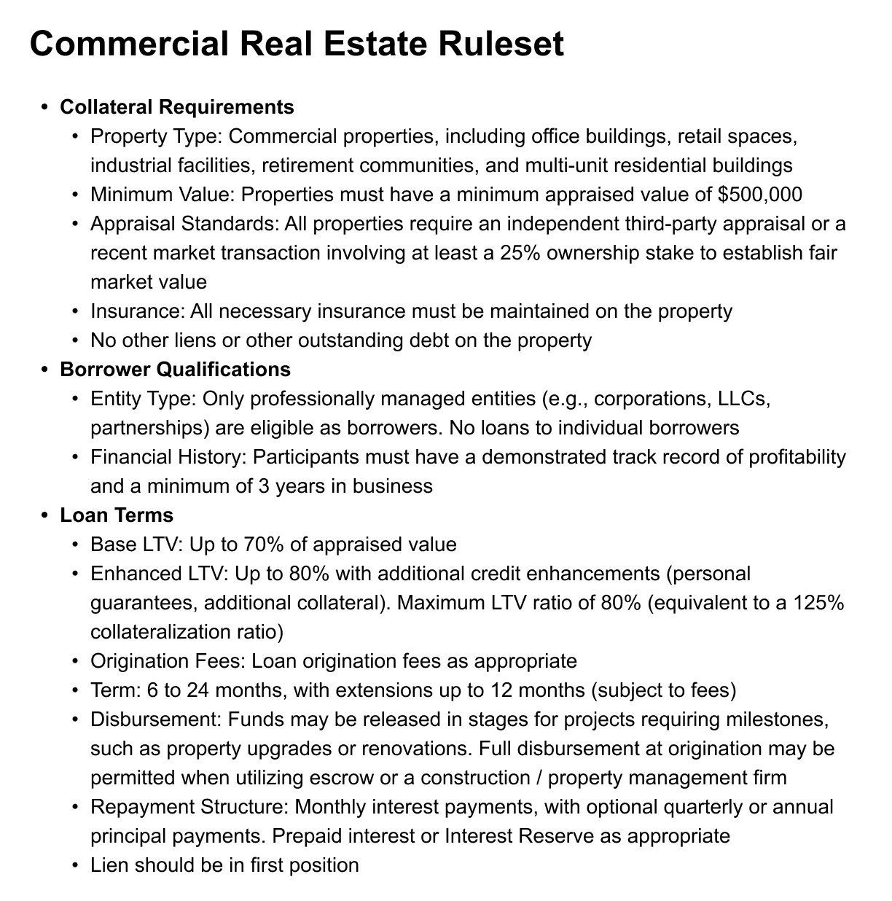

# HIP 13 — Commercial Real Estate Collateral Ruleset

HIP 13 — Commercial Real Estate Collateral Ruleset

We are excited to introduce our latest collateral ruleset for Commercial Real Estate. Similar to our Vintage Vehicle Collateral we’ve already successfully added commercial real estate to the protocol, now it’s time to adopt a generalized collateral ruleset to enable many more. This new addition to our Real-World Asset (RWA) framework represents a significant step forward in our mission to expand Hifi’s TVL to $25M and beyond!

### Overview of Commercial Real Estate Lending

Commercial real estate loans are a cornerstone of the traditional lending market, enabling businesses to finance properties ranging from office buildings to retail spaces and industrial facilities. These loans typically involve substantial collateral values and are secured by the underlying real estate assets. With professional management and established income streams, CRE presents an attractive opportunity for Hifi to expand its lending capabilities while maintaining strong risk management practices.

### Parameters

Our $CRE2 implementation includes the following key parameters:

* Collateral Ceiling: 15M

* System-wide Credit Limit: $10M

* 125% collateralization ratio (80% loan-to-value)

* Fixed oracle value: $1 per token

### Key Features of Our CRE Ruleset

The Commercial Real Estate ruleset has been carefully designed to balance growth opportunities with risk management:

* Diverse Property Types: Eligible properties include office buildings, retail spaces, industrial facilities, retirement communities, and multi-unit residential buildings

* Professional Management: Loans are restricted to professionally managed entities with proven track records

* Flexible Terms: Loan terms ranging from 6 to 24 months with extension options

* Strong Collateralization: Conservative base LTV of 70%, with potential for up to 80% LTV with additional credit enhancements

* Robust Requirements: Minimum property value of $500,000 and comprehensive insurance requirements

## Next Steps

In the coming days, the core team will publish a draft of the HIP 13 on the governance forum for community discussion. This and two other proposals are expected to go live on Friday, November 15, with voting beginning 48 hours after the proposal goes live.

Stay connected with Hifi by following our announcements and joining our community discussions on [Discord](https://discord.com/invite/uGxaCppKSH) and [Twitter](https://twitter.com/hififinance).

Source: https://blog.hifi.finance/hip-13-commercial-real-estate-collateral-ruleset-7c3402cf61c3
