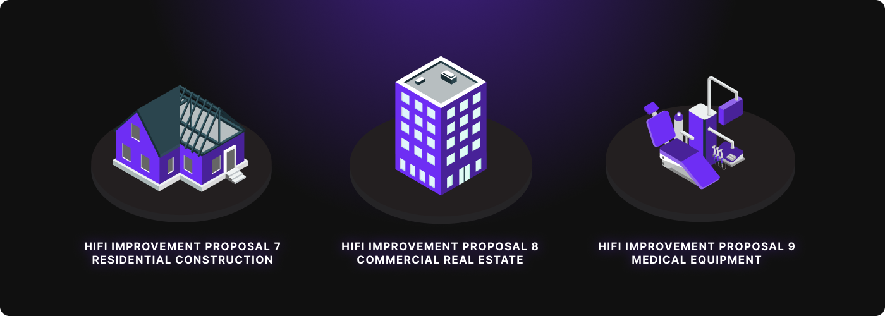

# Hifi Smashes $25M TVL Goal!

Hifi Smashes $25M TVL Goal!

We’re absolutely thrilled to announce that Hifi has not just reached but **CRUSHED** our ambitious **$25M Total Value Locked goal**! Last year, we laid out this target in our [2024 roadmap](https://blog.hifi.finance/hifi-2024-roadmap-e489383df572); some thought it was too ambitious. Today, the Hifi protocol has reached over $25M TVL. This rapid TVL growth is really pushing this version of our protocol to the limits; we have over $9M of hUSDC sitting on the sidelines, not counting toward the TVL metric. If we calculated TVL for each dollar of debt the protocol funds, our TVL would be at a whopping **$34.99M!**

*For more information on how TVL is tracked and counted, check out [Doug’s writeup](https://discord.com/channels/724701556087455815/1117890331032162505/1316556400121348187) in the [Hifi Discord](https://discord.com/invite/uGxaCppKSH).*

## A Community Achievement

This milestone belongs to every single person who believed in Hifi’s vision of bringing **real-world assets** (RWAs) on-chain: **Our DAO Members** who thoughtfully shaped and voted on Hifi Improvement Proposals (HIPs), O**ur Liquidity Providers** who backed us with unwavering support, **Our Borrowers** who trusted us with their assets, O**ur Developers** who built our robust infrastructure, **Our Guardians **who safeguarded our community, and **Every Community Member** who spread the word — this is your victory!

## Our Journey Together

What makes this achievement even more special is how we got here. Our community’s first major victory was [**HIP 6 — the Liquidity Bootstrapping Program](https://www.tally.xyz/gov/hifi-dao/proposal/5)**. This program marked a strategic shift in Hifi’s liquidity approach, targeting a more robust and long-lasting growth model and presenting several key benefits to the Hifi ecosystem and its stakeholders such as enhanced growth and scalability, a sustainable liquidity model, and a more strategic utilization of resources.

**Hifi Improvement Proposal 6** turned our biggest challenge — liquidity — into our greatest strength!

From there, we systematically expanded our RWA offerings through a series of groundbreaking HIPs:

* [**HIP 7](https://www.tally.xyz/gov/hifi-dao/proposal/6):** Established our residential construction framework with clear builder qualification criteria

* [**HIP 8](https://www.tally.xyz/gov/hifi-dao/proposal/7):** introduced our first commercial real estate framework, opening doors to multi-unit developments and office spaces

* [**HIP 9](https://www.tally.xyz/gov/hifi-dao/proposal/8):** revolutionized medical equipment financing with the $MEC1 token implementation

* [**HIPs 10–13](https://www.tally.xyz/gov/hifi-dao/proposals):** have further refined these frameworks while expanding market access

Our community didn’t just participate — you led the way, your voices in our [Discord](https://discord.com/invite/uGxaCppKSH), your votes on [Tally](https://www.tally.xyz/gov/hifi-dao), and your discussions in our [forums](https://forum.hifi.finance/) — these were the building blocks of our success.

## Celebrating Today, Building Tomorrow

While reaching **$25M+ TVL** is incredible, we’re just getting started with our RWA strategy. Our successful frameworks and growing expertise in bringing real-world assets on-chain have created a strong foundation for even greater growth. We’re already working on new innovative collateral types and enhanced protocol efficiency to support our expanding RWA ecosystem.

This is the perfect moment to become part of our story. Whether you’re a DeFi veteran or just getting started, there’s a place for you in the Hifi family. To everyone who’s been part of this journey — thank you.

To join the Hifi family, follow us on [Twitter](https://twitter.com/hififinance) and join our [Discord](https://discord.com/invite/uGxaCppKSH)!

Source: https://blog.hifi.finance/hifi-smashes-25m-tvl-goal-0a128827a9a6
