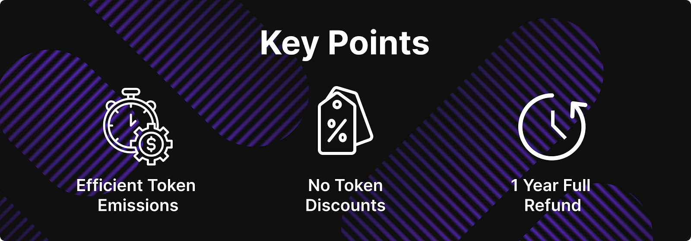

# HIP 14 — Administrative Update for Our Liquidity Bootstrapping Program

HIP 14 — Administrative Update for Our Liquidity Bootstrapping Program

Nearly a year ago, Hifi DAO launched an ambitious initiative through [HIP 6 ](https://blog.hifi.finance/hip-6-liquidity-bootstrapping-program-46cf5ee9244e)— our Liquidity Bootstrapping Program. Today, we’re thrilled to report that this program has been an overwhelming success, helping Hifi DAO secure over $13.5M in protocol liquidity. As we approach the program’s one-year anniversary, these transactions will begin to finalize and we’re proposing HIP 14 to decide how to utilize any HIFI tokens that may be returned to the DAO.

## HIP 6 Success and Looking Forward

As you may recall, the Liquidity Bootstrapping Program was designed with careful consideration of market dynamics and participant protection. Hifi DAO’s effectively been borrowing $13.5M interest-free, thanks to HIP 6’s innovative design. A key feature of the program was offering participants the option for a full refund after one year. Thus, depending on the price of HIFI over the coming year, and the decisions made by participants, some portion of the HIFI tokens may be returned to the DAO.

## What HIP 14 Proposes

HIP 14 is a straightforward administrative proposal with a simple but important objective: to allow Hifi DAO to redeploy any returned HIFI tokens with the same terms that we used for HIP 6. This ensures that the original mission of HIP 6 can continue seamlessly, even if participants choose to exercise their refund option. HIP 14 is identical to HIP 6, except that HIP 14 ***will not*** mint any new HIFI tokens, it only allows us to reuse existing tokens that are returned through HIP 6.

### Key points of HIP 14:

* Authorize the continued use of any returned HIFI tokens for liquidity bootstrapping

* Maintain the same careful and strategic approach to liquidity management

* Ensure protocol-owned liquidity remains a priority for Hifi’s growth.

## Why This Matters

The success of HIP 6 has demonstrated the effectiveness of our approach to building protocol-owned liquidity. By allowing returned HIFI tokens to be recycled back into the same program, we can:

1. Maintain flexibility in liquidity management

1. Sustain protocol-owned liquidity efficiently

1. Ensure the program can continue to be successful

If you’re a HIFI token holder, we encourage you to participate in the upcoming governance vote for HIP 14. The proposal will be live on [Tally](https://www.tally.xyz/gov/hifi-dao), and we welcome community discussion on our [governance forum](https://forum.hifi.finance/). Remember to ensure your HIFI tokens are in a wallet you control and that you’ve [delegated your voting power](https://medium.com/@HifiFinance/hifi-dao-tutorial-assigning-delegates-c70f9d3372a0) to participate in this important decision.

### **Additional HIP 6 References**

* [HIP 6 — Liquidity Bootstrapping Program](https://blog.hifi.finance/hip-6-liquidity-bootstrapping-program-46cf5ee9244e)

* [HIP 6 — Additional Details](https://blog.hifi.finance/hip-6-additional-details-8ea692f89b32)

* [HIP 6 — Governance Proposal](https://www.tally.xyz/gov/hifi-dao/proposal/5?chart=0)

Have questions about HIP 14? Join the discussion on [Discord](https://discord.com/invite/uGxaCppKSH) or reach out to us on [Twitter](https://twitter.com/hififinance). Let’s continue building on the success of our liquidity bootstrapping program together!

Source: https://blog.hifi.finance/hip-14-administrative-update-for-our-liquidity-bootstrapping-program-d24bd0983d40
