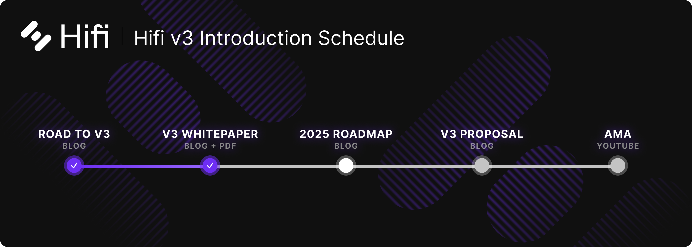
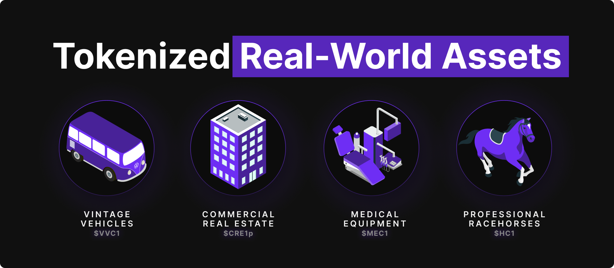
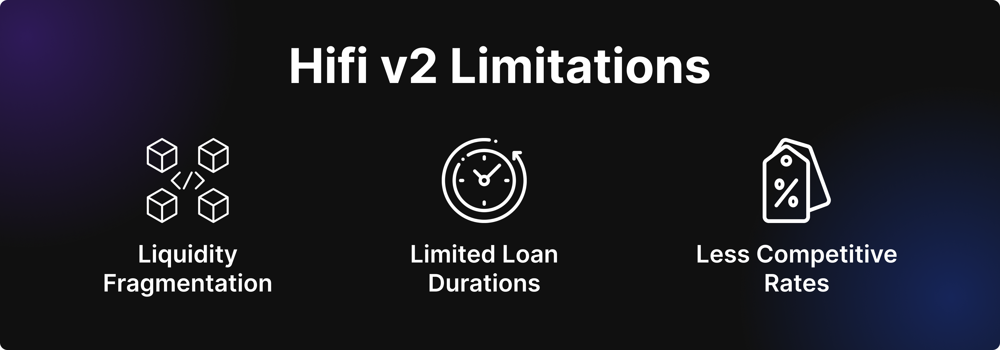
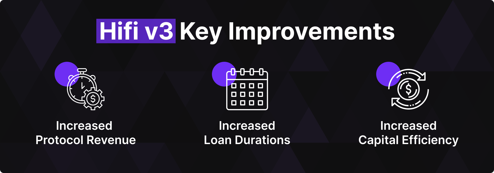

# Introducing Hifi v3

Introducing Hifi v3

The launch of Hifi v3 marks the most significant evolution of our protocol to date. Over the past two years, we’ve built a strong foundation — developing a lending protocol, growing a community, and demonstrating product-market fit with real-world asset owners. Now, as we introduce Hifi v3, we are doubling down on what works and addressing the limitations that have held us back. This upgrade isn’t just a refinement — it’s a complete architectural overhaul designed to maximize protocol revenue and enhance capital efficiency.

With a new stablecoin at its core and a revamped economic model, Hifi v3 unifies liquidity, extends loan durations, and isolates interest rate markets. These innovations make our lending framework more competitive and scalable than ever before. This is the next step in making decentralized fixed-rate lending the standard for real-world asset-backed borrowing.

### Looking Back

In the past two years, we have a lot to be proud of. We have built a team, a protocol, a community, a brand, and a DAO. In the face of uncertainty, we set out to grow protocol TVL by 25x and did it! We were in a position to take several risks, and while not all of our bets paid off, the most important ones did.

We began by establishing a thesis and laying out a growth strategy aligned with that thesis. Let’s take a look at what we got right and what we got wrong. Quoting our November 2022 blog post titled [Growth](https://blog.hifi.finance/growth-175a470d3d58), we said:
> NFTs are onboarding the most users to the blockchain, and Real World Assets (RWAs) are positioned to onboard the greatest amount of value on-chain. Our customer is NFT Communities. Looking ahead, we’re positioned to solve the single greatest challenge facing NFT communities. Helping NFT communities maximize **growth and retention** will drive value, usage, and new users to Hifi’s Lending protocol. Knowing that NFTs will play a foundational role in tokenizing ownership of real-world assets. Our ecosystem will onboard real-world assets on-chain and directly into Hifi’s Lending Protocol.

Looking back, we saw a massive correction in the NFT market, and the growth and traction we had hoped for never materialized. However, we were right about the potential of Real World Assets (RWAs) and continue to see growth in tokenizing these assets today. Since then, alongside our lending partners, we have tokenized Vintage Vehicles, Real Estate, Professionally Managed Horse Syndicates, and Medical Equipment. We found product-market fit with traditional borrowers who are native users of blockchain technology. These users demanded every dollar of liquidity we could provide, and as a consequence, we’ve been pushing our protocol to its limits.

### Current Architecture Limitations

Hifi’s current protocol architecture has the following limitations: Liquidity fragmentation across markets of differing maturity dates. The AMM limits loan duration to a maximum of ~4 years. Finally, our consolidated interest rate market across all collateral types makes Hifi’s offering less competitive against industry-specific lending products.

### Hifi v3

Introducing Hifi v3, a complete overhaul of Hifi’s protocol architecture with a new stablecoin at its core. Hifi v3 was designed with one purpose in mind, to increase protocol revenue. The new architecture introduces a new token economic model where all interest accrued by the protocol goes to Hifi DAO! Additionally, Hifi v3 increases our capital efficiency, meaning less capital is sitting idle in the protocol, and more capital is deployed to earn interest for Hifi DAO.

Our core team has been hard at work addressing all of the limitations of our existing protocol. This upgrade unifies our liquidity, increases our ability to extend longer-duration loans, and isolates our interest rate markets to be competitive against industry-specific lending products. This enables Hifi to be more competitive than ever, scale our TVL, and, more importantly, grow our protocol revenue.

### Next Steps

We can’t wait for you to dig into the details of Hifi v3. You can check out the whitepaper [here](https://blog.hifi.finance/hifi-v3-whitepaper-e78a141d4d1a). The core team is currently in the final stages of development, and we’re incredibly excited to unlock our next phase of growth together.

Stayed tuned for our next blog, the 2025 Roadmap! Follow us on [Twitter](https://twitter.com/hififinance) and join our [Discord](https://discord.com/invite/uGxaCppKSH) to stay updated.

Source: https://blog.hifi.finance/introducing-hifi-v3-3c7b5231a974
