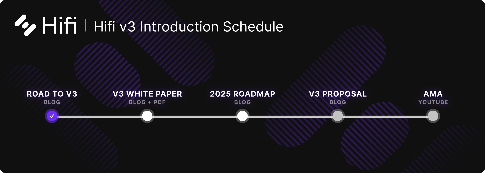

# The Road to Hifi v3

The Road to Hifi v3

Over the coming weeks, we will be releasing a series of blog posts that introduce Hifi v3. Today, we introduce that schedule and revisit the metric we primarily use to measure our success. We’re incredibly excited about what’s coming.

## Measuring Success

Last year, we set out to grow TVL by 25x. We put our entire focus on TVL, TVL, TVL! And despite challenges, we hit our goal and experienced incredible growth. We couldn’t be happier with the outcomes we’ve seen. Now, as we look forward, we took the time to revisit the metric that has been our north star and wanted to make sure it was the best representation of traction and growth. And we’ve found something better. The primary metric that matters when you break everything down is protocol revenue. TVL is still great, but protocol revenue is more pure in representing the value we create and deliver to our customers.

Appropriately, we’ve been working hard behind the scenes to align everything we do with this new focus. We can’t wait to introduce Hifi v3, give an update on our plans with Crown Ribbon, and share our 2025 roadmap.

Voting on the Hifi v3 Proposal is expected to occur during the first two weeks of March. Migrating existing positions from v2 to v3 is expected to take place in mid-March.

Join the conversation in [Discord](https://discord.com/invite/uGxaCppKSH) and [Twitter](https://twitter.com/hififinance) and help us redefine an industry.

Source: https://blog.hifi.finance/the-road-to-hifi-v3-084e11b20236
