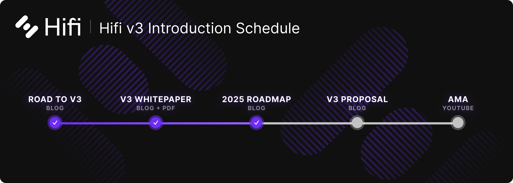
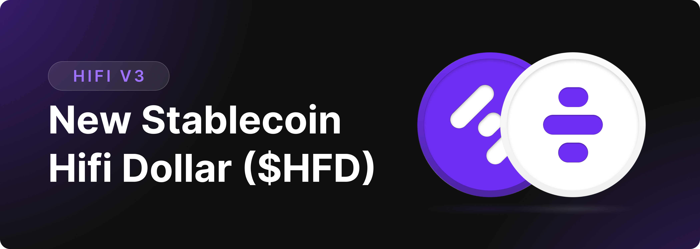
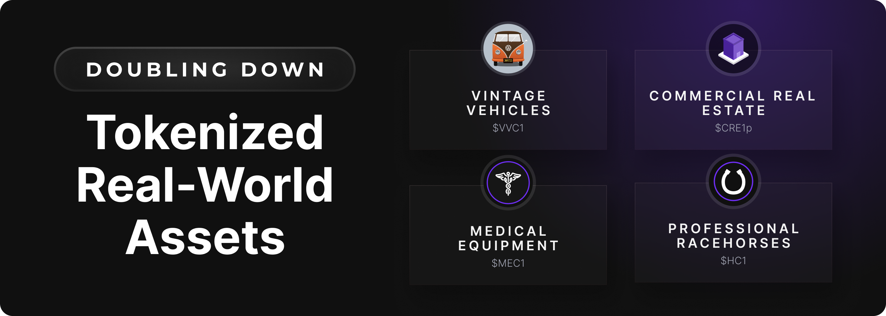
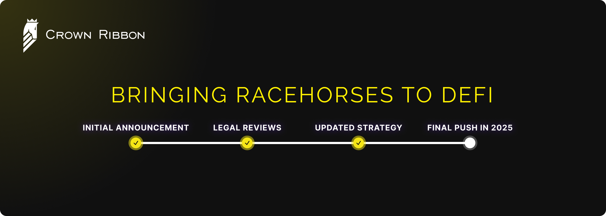

# 2025 Roadmap

2025 Roadmap

In 2023, we laid the groundwork for onboarding Real World Assets (RWAs) on-chain as collateral. By 2024, as detailed in our [Hifi 2024 Roadmap](https://blog.hifi.finance/hifi-2024-roadmap-e489383df572), we successfully grew TVL by 25x by prioritizing RWAs and refining our onboarding frameworks. Now, in 2025, we’re ready to push the envelope further.

Below is our comprehensive 2025 roadmap, drawing on all the lessons we’ve learned and the feedback we’ve gathered from our community. Let’s dive in!

## **1. Launch Hifi v3 and the Hifi Dollar ($HFD) Stablecoin**

We spent most of 2024 growing TVL and finalizing Hifi v3’s core architecture. The new protocol design focuses on:

* **A native stablecoin (HFD)** with interest accruing in real time to Hifi DAO.

* **Balance sheet smart contracts** that isolate collateral risk, unify liquidity, enable longer-term loans, and make us competitive against industry-specific lending products.

* **A Protocol Stability Mechanism (PSM)** that simplifies conversions between HFD and other stablecoins.

### **Deploying Hifi v3 in “Restricted Liquidity” Mode**

In early 2025, we are launching Hifi v3 under **Restricted Liquidity** mode, ensuring a structured and secure phased rollout. This phase will provide controlled access, allowing a seamless migration process for RWA collaterals from v2 while we finalize additional audits and security checks. During this period, core functionalities will be available only for RWA collaterals.

### **Enabling “Full Liquidity” Mode**

Security and sustainability remain our highest priorities. We have multiple audits and bug bounties scheduled in Q1 2025. Once these are completed, we’ll lift liquidity restrictions — enabling “Full Liquidity” mode — and expand the available collateral types, durations, and rates against which users can mint $HFD.

## **2. Doubling Down on Real World Assets (RWAs)**

In our [2023–2024 blog posts](https://blog.hifi.finance/hifi-2024-roadmap-e489383df572), we emphasized how RWAs helped Hifi find product–market fit. Over the past year, traditional borrowers have shown a remarkable appetite for fixed-rate, overcollateralized loans backed by tangible assets.

### **Continuing RWA Onboarding**

Hifi’s success in onboarding assets like professionally managed racehorses, vintage vehicles, and real estate has demonstrated the demand for blockchain-based lending solutions tailored to non-crypto-native assets. In 2025, we will continue with our RWA onboarding efforts, creating new avenues for borrowers to unlock liquidity. This may include integrating new collateral types, refining our legal and risk frameworks, and ensuring a seamless user experience for both institutional and retail participants.

## **3. Launching Crown Ribbon**

Perhaps our most anticipated initiative is our partnership with Crown Ribbon, a platform that tokenizes racehorse ownership interests under a fully regulated framework. The longer-than-expected regulatory process has delayed the launch of Crown Ribbon, but we plan to give one final push in 2025 in an attempt to get this partnership over the finish line.

### **Improved Regulatory Environment**

Navigating securities compliance for tokenized, real-world assets has been challenging. We are optimistic about the evolving regulatory landscape and hopeful that Crown Ribbon will finally launch in 2025.

### **Upgrading Our Legal Team**

Recognizing the need for a change in our legal team, we will part ways with our existing legal team and bring on a new group to finish the job. Their mandate is clear: help us and our partners navigate an increasingly complex regulatory environment, ensuring Crown Ribbon’s regulatory success and opening the door to greater institutional participation across the entire Hifi ecosystem.

## **4. Increasing Protocol Revenue**

Our ultimate goal is to maximize protocol revenue for Hifi DAO. With Hifi v3, we’ve gone from relying on small origination fees to capturing all interest accrued across every loan in real-time. As explained in the Hifi v3 Whitepaper, if you haven’t read it yet, you can find it [here](https://blog.hifi.finance/hifi-v3-whitepaper-e78a141d4d1a). Go give it a read!

## **Looking Ahead**

2025 marks Hifi’s biggest leap yet: the full launch of Hifi v3, the official debut of the $HFD stablecoin, and the final push to launch Crown Ribbon in a more supportive regulatory landscape. We’re doubling down on real-world assets and are fully committed to our mission to bring real-world assets (RWAs) on-chain and transform traditional finance through decentralized lending.

Stay connected on [Twitter](https://twitter.com/hififinance) and [Discord](https://discord.com/invite/uGxaCppKSH) for updates, governance proposals, and opportunities to contribute to Hifi’s mission. Together, we will unlock the full potential of on-chain finance.

Source: https://blog.hifi.finance/2025-roadmap-77a513bdcdd9
