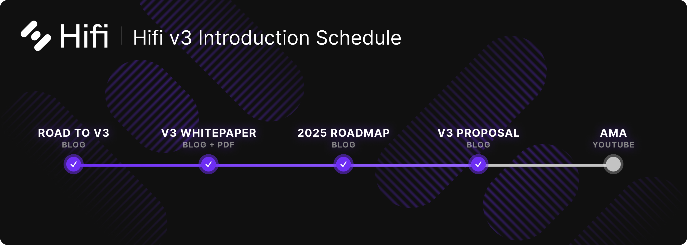
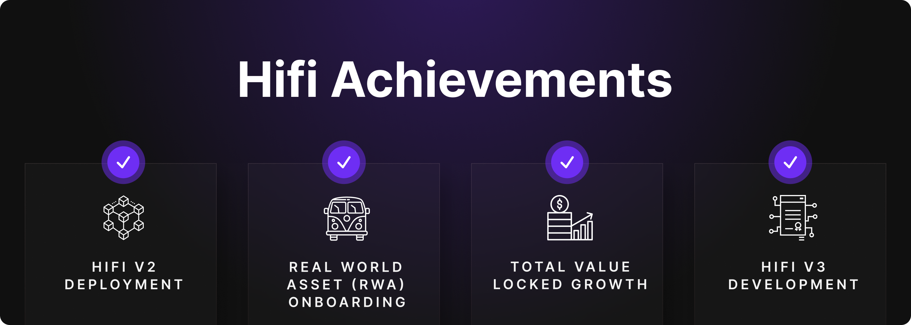
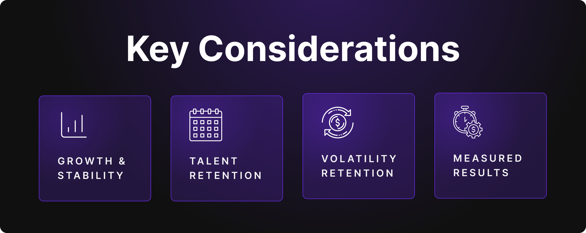
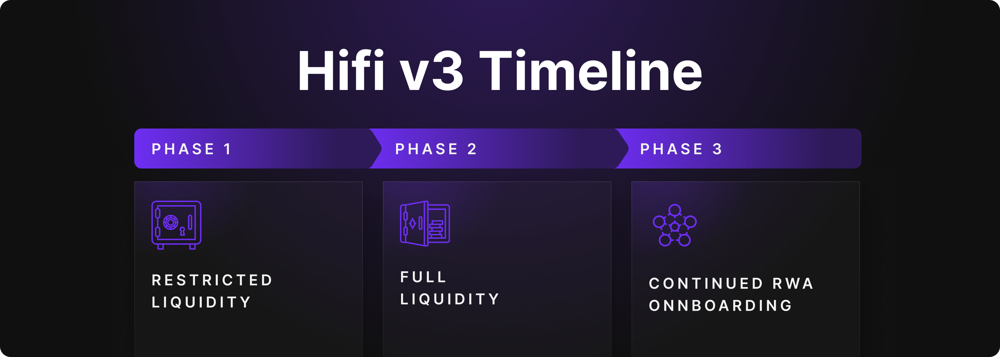

# v3 Proposal

v3 Proposal

After [two productive years](https://medium.com/@HifiFinance/two-years-of-hifi-dao-b1aa8242af05), it’s time to propose renewing the core team’s contract, extending it for another two-year term, and outlining the v3 deployment and transition plan.

The past two years have validated our approach to building the Hifi Protocol: we achieved major technology milestones, grew our community, and laid the groundwork for Hifi v3. This renewal is crucial for maintaining stability, leveraging the team’s expertise, and ensuring continuous development of the Hifi protocol. In this post, we outline the rationale behind the renewal — covering the purpose of extending the contract, key funding considerations, and alignment with the upcoming **Hifi v3** launch.

Last week, we unveiled the Hifi v3 roadmap; if you haven’t read it yet, be sure to give it a read [here](https://blog.hifi.finance/2025-roadmap-77a513bdcdd9). In it, we highlight the following:
> 2025 marks Hifi’s biggest leap yet: **the full launch of Hifi v3**, the official debut of the **$HFD stablecoin**, and the final push to launch **Crown Ribbon** in a more supportive regulatory landscape. We’re doubling down on real-world assets (RWAs) and are fully committed to our mission to bring real-world assets on-chain and transform traditional finance through decentralized lending.

## **Service Contract Renewal**

Matching the [original proposal](https://snapshot.box/#/s:hifi-finance.eth/proposal/0x94b8dd5dc839ea0528c993f3be0eba9a26f2d9a91fa885ea19596a90ad3425f0), our renewed contract with the core team keeps the same structure and terms as the previous contract and simply extends the contract for another two years. Here’s an overview:

* **Service Provider:** Mainframe Group, Inc.

* **Contract Duration:** Two years

* **Effective Date:** December 1, 2024

* **Token Allocation:** 25 million HIFI tokens, vesting linearly over the contract period

* **Scope of Services:** Continued development, protocol enhancements, community engagement, marketing, administration, accounting, business development, and legal services.

**Note:** Token vesting will be prorated in line with the contract’s effective date. This reimburses the team for the operations expenses incurred since the original contract expired and pays for the large upfront costs associated with audits for the v3 codebase.

This renewal reflects our confidence in the team’s ability to navigate both the challenges and opportunities that lie ahead.

### **Demonstrated Results**

Over the last two years, we:

* Developed and launched Hifi v2 on Ethereum (and previously on Polygon).

* Successfully onboarded our first Real-World Asset (RWA) lending partner, demonstrating tangible product–market fit.

* Grew protocol TVL significantly, proving that demand exists for predictable lending.

* Pioneered new technologies, culminating in Hifi v3, a stablecoin-based architecture that promises higher revenue for the DAO, better capital efficiency, and longer-duration loans.

Throughout this period, our guiding star was fueling TVL growth. We have been diligent stewards of both funding and community trust. While we’re extremely proud of the strides made, we have only scratched the surface of what Hifi can become.

## **Key Considerations**

As with our original proposal, this proposal has the same core considerations that inform each aspect of the proposed contract terms.

### Ensuring Growth and Stability

With Hifi v3 introducing a new stablecoin-driven architecture, our focus shifts toward maximizing protocol revenue and scaling TVL. A structured and well-resourced core team is essential to achieving these goals. The success of the past two years — establishing Hifi’s market presence, refining the protocol, and securing key partnerships — was made possible through a dedicated team with a long-term strategic vision.

### Talent Retention and Market Dynamics

The DeFi space is highly competitive, and the best engineers, economists, and business development professionals seek stability. Providing a structured two-year contract not only ensures job security but also aligns incentives, fostering long-term commitment and reducing talent churn. The high upfront cost of onboarding new team members in the blockchain space makes continuity even more critical.

### Managing Market Volatility

Cryptocurrency markets are inherently volatile, and unpredictable downturns can impact operational planning. By securing funding for two years, we provide the necessary buffer to maintain consistent development efforts regardless of broader market conditions. This structure allows Hifi to continue executing its roadmap without being forced into reactive decision-making due to market swings.

### Adequate Time to Measure Results

The impact of protocol upgrades and strategic shifts takes time to materialize. A two-year contract renewal allows for a realistic assessment of the effectiveness of Hifi v3, including adoption metrics, revenue growth, and community expansion. It ensures that the core team has the necessary runway to refine and optimize the protocol based on real-world data.

## v3 Deployment and Transition Plan

We will begin by finalizing one additional v2 market, ensuring users can continue to borrow and lend without interruption as we complete the remaining Hifi v3 development. Once development is finalized and we initiate a code freeze, we will engage multiple security auditors to thoroughly review the new architecture. This staged approach ensures we identify any potential vulnerabilities, fix them promptly, and refine the protocol before the official launch. As the audits progress and our confidence in the code increases, we will deploy Hifi v3 in “Restricted Liquidity Mode,” allowing our initial borrowers and lenders to migrate positions from v2 into v3 under controlled parameters.

During Restricted Liquidity Mode, the focus will be on safely transitioning existing v2 users and monitoring the protocol’s real-world performance. As more audits return finalized reports, and we feel fully satisfied with both the architecture and user feedback, we transition the protocol into “Full Liquidity Mode,” unlocking the full feature set of Hifi v3.

Once the majority of positions have migrated to v3 and v2’s final market has settled, we will have completed the transition to Hifi v3. By phasing the deployment in this way, we ensure that users maintain uninterrupted access to liquidity while benefiting from Hifi v3’s superior design. This transition is more than just a protocol upgrade — it represents a fundamental shift in how DeFi can access predictable liquidity for real-world assets!

## Conclusion

Two years ago, Hifi took a bold step toward decentralization by clarifying the relationship between the protocol and its core development team. Today, we stand at another inflection point, having delivered on many of the promises we made while simultaneously uncovering fresh opportunities to expand Hifi’s reach and maximize protocol revenue.

Our proposal to renew the core team contract for another two years is not a small ask. But we believe it is the most effective path to accelerating our momentum, hiring and retaining top-tier talent, and insulating ourselves against market volatility. Renewing the contract now positions Hifi to capitalize on the energy and innovation surrounding Hifi v3.

We encourage all community members to join the discussion, evaluate the proposal on its merits, and vote according to what you believe is best for Hifi DAO. Your engagement, feedback, and, ultimately, your votes determine how we collectively move forward.

## Upcoming AMA

Have any questions on Hifi v3? Join our [YouTube AMA](https://www.youtube.com/watch?v=_2fNe-vCVPw) on **Thursday, February 27th, 2025th, at 10:00 AM MST. **Leave your questions in the “#ama-questions” channel within our [Discord](https://discord.com/invite/uGxaCppKSH) or you can ask your questions directly in the live stream chat.

Source: https://blog.hifi.finance/v3-proposal-adc59ff52713
