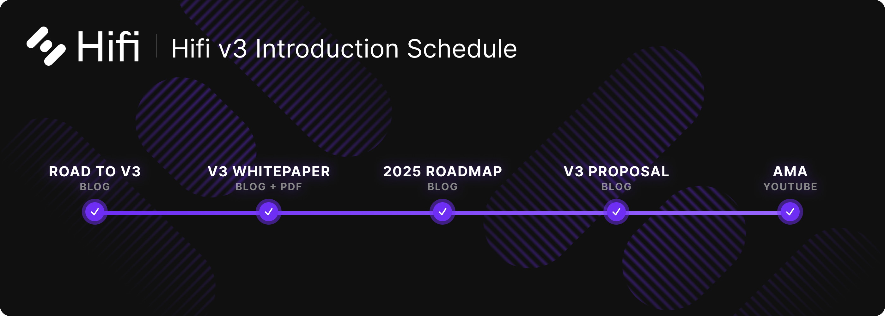

# Hifi v3 AMA Recap

Hifi v3 AMA Recap

During this Ask Me Anything session (February 27th, 2025), Doug took questions directly from the community regarding the upcoming Hifi v3 release, the new overcollateralized stablecoin (Hifi Dollar), plans for protocol growth, and more. Below is a recap of some of the most important questions and answers:

<iframe width="560" height="315" src="https://www.youtube.com/embed/_2fNe-vCVPw" frameborder="0" allowfullscreen></iframe>

[**Will the new Hifi Dollar (HFD) smart contracts be deployed all at once or phased in?](https://www.youtube.com/live/_2fNe-vCVPw?si=8N9GP2LtxYa36GBL&t=342)**

All of the V3 smart contracts (including Hifi Dollar) will be deployed at the same time. However, we plan a phased rollout of liquidity to ensure security and stability and transition everyone to v3. We will wait for multiple security audits before fully opening liquidity.

[**Any updates on the possibility of Hifi Finance being listed on Coinbase, or any timeframe for that?](https://www.youtube.com/live/_2fNe-vCVPw?si=62YjInUwtK-ruEoK&t=400)**

We can’t comment on specific exchange listings. We’d love to be on every reputable exchange globally, and we work with exchanges interested in listing us. However, we do not control final listing decisions nor disclose private discussions.

[**With upcoming token dilution, do you plan to conduct airdrops for Hifi token holders who participated in voting?](https://www.youtube.com/live/_2fNe-vCVPw?si=_3ccPySWEZDofDa0&t=475)**

At present, there are no airdrops planned. Historically, Hifi has only used airdrops or incentives to reward specific behaviors needed to bootstrap new initiatives. With full protocol utilization and no immediate need to drive new or different user behavior, an airdrop does not align with Hifi’s objectives at this stage.

[**Will US users have access to the new Hifi Dollar token?](https://www.youtube.com/live/_2fNe-vCVPw?si=U4Tqld7CCWwk_CLy&t=506)**

We expect U.S. users will be able to use Hifi Dollar. It functions like DAI or USDC — an over-collateralized stablecoin. We remain committed to following applicable rules, but the stablecoin model should be accessible to U.S. users.

[**Does Hifi Dollar provide any direct benefit to Hifi token holders?](https://www.youtube.com/live/_2fNe-vCVPw?si=aveWgfGp85WnCLny&t=600)**

Yes. Although Hifi Dollar is a stablecoin, it complements the Hifi governance token. Hifi Dollar simplifies borrowing and can be over-collateralized with approved assets, potentially increasing overall protocol revenue. This revenue growth **benefits the Hifi DAO treasury**, which is governed and owned by Hifi token holders.

[**Will the website be updated to showcase recent real-world asset (RWA) loans and metrics?](https://www.youtube.com/live/_2fNe-vCVPw?si=H3qpe5XPGapYbG4U&t=789)**

We usually publish North Star metrics, such as total value locked (TVL) or protocol revenue. We’re considering updates to highlight RWA utilization but will first finalize our shift toward focusing on protocol revenue rather than just TVL.

[**Will any of the newly minted Hifi tokens go to shareholders? Can you clarify how these funds will be used?](https://www.youtube.com/live/_2fNe-vCVPw?si=6w23035JpDPbGQG0&t=893)**

The primary uses of newly minted tokens are **payroll, audits, and ongoing development** — not direct shareholder distributions. If the protocol grows to a point of surplus, we might allocate resources to the ecosystem or consider further initiatives. Right now, the focus is funding the development and security of V3.

[**What are the current hurdles or biggest challenges facing Hifi?](https://www.youtube.com/live/_2fNe-vCVPw?si=Y3xHg7Uwz4HOHWOf&t=1020)**

Our biggest challenge is actually a **good** one: nearly every dollar in the protocol is lent out. That means demand for loans outstrips available liquidity. Going forward, we aim to **attract more capital** to scale lending and continue improving our capital efficiency in V3.

[**How will you determine when to transition from a “restricted liquidity mode” to “full liquidity mode” in V3?](https://www.youtube.com/live/_2fNe-vCVPw?si=VfiIumDT-CKsFeTv&t=1163)**

It’s primarily based on **security audits**. We’ll deploy V3, restrict initial liquidity, then move to full liquidity only after finalizing and reviewing all audit reports.

[**How will the team ensure top security during the V3 audit process?](https://www.youtube.com/live/_2fNe-vCVPw?si=HMjzkyrj6l3Y6NzW&t=1191)**

Security is our **highest priority**. We invest in multiple independent audits, emphasize **clear and accessible code** for thorough review, and avoid overly complex optimizations that could compromise safety.

[**What will the migration from V2 to V3 look like for users?](https://www.youtube.com/live/_2fNe-vCVPw?si=BFEouuYhQM1mJWfl&t=1227)**

We aim for a **smooth migration**. Users will be able to move collateral from V2 into V3, mint Hifi Dollar, and use that to pay off any V2 debt. The main gating factor is when significant liquidity starts flowing into V3.

[**What happens if the proposal to mint 25 million new tokens is rejected? Is there a backup plan?](https://www.youtube.com/live/_2fNe-vCVPw?si=Cex6zkfvJjniKyOV&t=1261)**

Without those tokens, **we won’t have enough resources** for key expenses like audits, development, and payroll. Our model relies on the community’s support to fund ongoing growth; there is no large VC backing to cover those costs. Essentially, **progress would stall** if the proposal fails.

[**How will the V3 liquidation mechanism ensure real-world assets (RWAs) remain effective collateral?](https://www.youtube.com/live/_2fNe-vCVPw?si=ZT_2RSSQrxGWRZXu&t=1421)**

We partner with third-party lenders who manage RWA liquidations under **legally binding agreements**. If they fail to liquidate properly, the legal framework provides recourse. This model applies to both V2 and V3.

[**If Crown Ribbon is approved, how prepared is Hifi to integrate with it quickly?](https://www.youtube.com/live/_2fNe-vCVPw?si=O4N1UcsK3q9lLtuI&t=1463)**

We’re **as ready as possible**. We’d likely need some lead time to finalize legal frameworks, but from a technical standpoint, we can integrate relatively quickly. Crown Ribbon’s focus is enabling **retail investors** to participate without deep crypto knowledge.

[**Now that you’ve reached the $25 million TVL target, what’s next?](https://www.youtube.com/live/_2fNe-vCVPw?si=XRfiwjNiAwqD8V-f&t=1634)**

We’re transitioning from a TVL focus to a **protocol revenue** focus. Our 2025 roadmap centers on **deploying V3**, auditing thoroughly, and migrating liquidity safely. We aim to maximize revenue and ensure sustainable growth.

[**Why partner with Crown Ribbon if you already have horses as collateral?](https://www.youtube.com/live/_2fNe-vCVPw?si=3_n9W92gLaeC9aji&t=1685)**

Crown Ribbon is designed for **retail access** to racehorse ownership, bridging traditional syndicates to DeFi. It opens the door to a much larger audience and further **scales Hifi’s** ability to offer lending against these assets.

[**Is it time to start aggressive marketing to draw more users?](https://www.youtube.com/live/_2fNe-vCVPw?si=Z91Ij5QavPHziBzG&t=1761)**

Right now, the protocol is fully utilized — every dollar is already lent out. Marketing to flood in more borrowers wouldn’t help if we cannot supply them with liquidity. Instead, the focus is on building out v3, increasing capital efficiency, and scaling resources so future marketing can be more effective. We do anticipate that we will continue to market, originate loans, and try to keep a high utilization for all token holders to maximize the amount the treasury grows by.

[**Will Hifi expand to other networks or integrate with more DeFi protocols?](https://www.youtube.com/live/_2fNe-vCVPw?si=CKbvPnv1tNE2WhuP&t=2094)**

We’re open to exploring **other chains and partnerships**, but our main bottleneck is lack of additional liquidity — **not** lack of integrations. Once V3 is stable and if we see excess liquidity, we’ll consider cross-chain expansion or deeper DeFi integrations.

[**Are partnerships possible with banks, funds, or major TradFi players?](https://www.youtube.com/live/_2fNe-vCVPw?si=_Ni2rQJ8dkY_iTLB&t=2153)**

Yes. we are really well-positioned for that. We partner with traditional lenders as it is. If you go and look at our RWAs work, we already have a hybrid model where we are bridging and bringing on the tokenized real-world assets. There are certainly opportunities here that can take many different forms.

[**Any upcoming website or branding updates?](https://www.youtube.com/live/_2fNe-vCVPw?si=R899IlVyMASAtC3S&t=2191)**

We’ll make **minor updates** to clarify messaging around the Hifi Dollar and V3 along with some amounts of a website refresh. A complete brand overhaul isn’t the priority right now; security, audits, and a smooth V3 rollout take precedence.

[**Will v3 maintain decentralized governance safeguards for contract changes?](https://www.youtube.com/live/_2fNe-vCVPw?si=QygaAh2yc4abXF8R&t=2259)**

Yes. V3 will be under **governance control from day one**, just like V2. Upgrades or parameter changes will require community governance proposals and votes.

[**Do you plan to support RWAs from outside the U.S.?](https://www.youtube.com/live/_2fNe-vCVPw?si=qMvfDBRpHIH9YgUI&t=2297)**

We’re open to **global expansion**. However, for now, we’re fully deployed on U.S.-based assets with no lack of demand. As we scale, we’re definitely interested in diversifying internationally.

[**Will v3 collateral still be NFTs? Or only ERC-20?](https://www.youtube.com/live/_2fNe-vCVPw?si=jkD3_kLIUrY7LBHL&t=2459)**

While it’s technically possible (and used in v2 via ERC-20 “wrappers”), the focus is shifting away from NFTs because that thesis has not played out as strongly in the market. The bigger push is toward ERC-20-based RWAs and more conventional crypto assets, where stable revenue can grow the DAO treasury.

[**How much of the minted tokens would go to direct lending vs. operations?](https://www.youtube.com/live/_2fNe-vCVPw?si=glPRwdJapYuprU28&t=2949)**

Most of the minted tokens fund operating costs (payroll, audits, development). Any *excess* is historically deployed back into the protocol or ecosystem. Hifi’s main overhead is talent retention and thorough security audits. Without these minted tokens, Hifi cannot sustain development and growth.

[**Final Thoughts on 2025 and beyond?](https://www.youtube.com/live/_2fNe-vCVPw?si=dtV2PA47WMrzCQMy&t=2875)**

We’re in a strong position heading into 2025. Every dollar in our protocol is deployed and earning money on behalf of token holders, our legal and regulatory environment is improving, and we’re about to launch V3. Our **focus** is on safe deployment, successful audits, and increasing protocol revenue. Thank you for your continued support as we expand HiFi’s impact.

Keep an eye out on [Twitter](https://twitter.com/hififinance) and [Discord](https://discord.com/invite/uGxaCppKSH) for Hifi Improvement Proposal 15, this upcoming proposal will determine the future of Hifi.

Source: https://blog.hifi.finance/hifi-v3-ama-recap-fc5d2154b0e5
