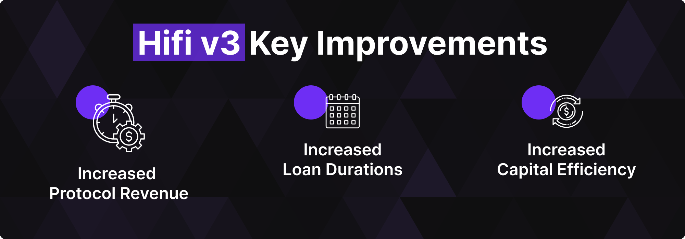

# Hifi DAO Update: HIP 15 Proposal Passed!

Hifi DAO Update: HIP 15 Proposal Passed!

Congratulations to the Hifi DAO! We’re thrilled to announce the successful passing of [Hifi Improvement Proposal 15](https://www.tally.xyz/gov/hifi-dao/proposal/14) (HIP 15), marking another significant milestone in Hifi’s evolution. With over 9 million votes unanimously in favor, the Hifi DAO approved HIP 15 to ensure stability, continuity, and momentum as we move forward into the exciting opportunities ahead. Here’s what you can look forward to:

## **Service Contract Renewal**

We’ve renewed our two-year service contract with Mainframe Group, Inc., spanning from December 1, 2024, to December 1, 2026. This renewal allocates essential resources for ongoing protocol development, security audits, marketing, community engagement, and operational excellence, providing necessary support for sustained innovation.

## **Final Market on Hifi v2**

To ensure seamless operations during our transition, we’re launching one final market on Hifi v2, set to mature on June 27, 2025. This guarantees uninterrupted lending and borrowing activities as we finalize, audit, and introduce Hifi v3. Upon launch, users will be able to migrate their positions from v2 to v3 effortlessly.

## The Launch of Hifi v3 and the $HFD Stablecoin

The highly anticipated Hifi v3 launch marks a groundbreaking shift in decentralized finance, introducing our innovative stablecoin — the Hifi Dollar ($HFD). Stablecoins have recently seen remarkable growth, exceeding $125 billion in market capitalization globally, and HFD aims to capture its share by combining unparalleled stability, flexibility, and innovation.

This upgrade unifies our liquidity, increases our ability to extend longer-duration loans, and isolates our interest rate markets to be competitive against industry-specific lending products.

## Conclusion

With Hifi v3, we’ll transition to capturing accrued interest in real-time, boosting protocol revenue and sustainability while positioning Hifi DAO for long-term success. As we continue to expand our offering of Real World Assets — including professionally managed racehorses, vintage vehicles, and real estate — we remain dedicated to enhancing risk management and user experiences. Additionally, despite regulatory complexities surrounding the Crown Ribbon Initiative, we’re actively strengthening our legal expertise to navigate compliance hurdles and unlock substantial institutional-scale opportunities throughout 2025.

Every token holder contributes significantly to shaping our future. Stay connected through Discord and Twitter.

Source: https://blog.hifi.finance/hifi-dao-update-hip-15-proposal-passed-78fde83dad2f
