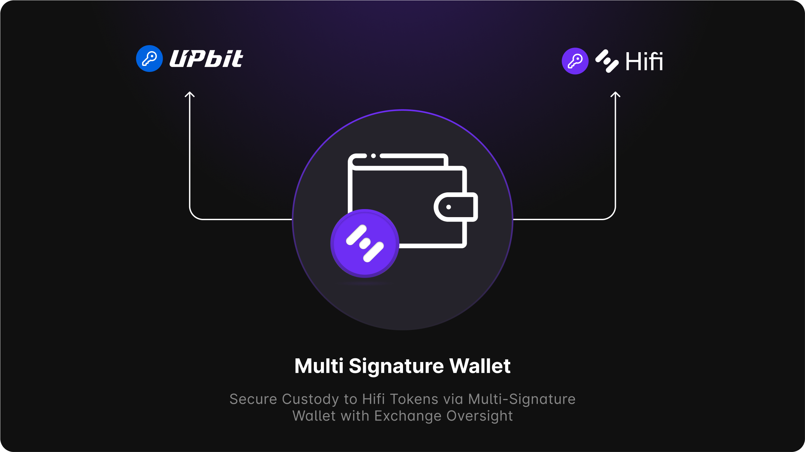

# Official Response: Upbit & Bithumb Delisting HIFI

Official Response: Upbit & Bithumb Delisting HIFI

As many of you are aware, on March 28, 2025, DAXA and each of its member exchanges paused HIFI deposits and published an Investment Warning for HIFI. In the spirit of transparency, I’d like to share context about the interactions between our team and these exchanges.

Our team was made aware of the Investment Warning at the same time as everyone else. DAXA also notified our team via email, included questions they had, and requested that we respond within 11 days. We had no issue with this and were happy to respond to their questions; we didn’t need 11 days to respond, so we sent back answers within 12 hours of receiving the email.

The questions were nothing out of the ordinary, with most of them easily answered by anyone who spent a little time reading our published blog posts and docs. The topics ranged from operational and governance questions to process questions about RWA valuations and liquidations. Some of them required additional follow-up, and we were happy to prepare more detailed reports that would walk them through the logic behind a figure on our metrics page or a detailed breakdown of the collateral values within the protocol. They wanted to understand how we utilized resources over the past two years, and which resources were from our liquidity bootstrapping effort HIP-6. They requested additional documentation proving that the delegated rights for liquidating collateral was actually in place for HIFI DAO, and they requested to see the loan agreements with the end borrowers.

We run a very clean operation, so none of this was terribly concerning for us, and so back and forth we would go, day after day, our team always making it a priority to respond within 12 hours of receiving their emails. But as the deadline they had set for us approached, we began to wonder if DAXA and their member exchanges were engaging with us in good faith or not.

So in an effort to put an end to all of this, and knowing that we’ve always operated with the highest degree of integrity and professionalism, we decided to make them an offer we believed would put an immediate end to the Investment Warning, and that should have solved any legitimate concerns they might still have. What follows are excerpts from an email sent to DAXA on April 3, 2025.
> Hello, DAXA team,
> Please note that I’ve cc’d our legal council on this email.
> Up to this point in time, we believe you have been acting out of caution and prudence on behalf of your customers and have a genuine desire to want to protect them. We share in this same desire.
> We are concerned that you are no longer acting in good faith. Your correspondence continues to emphasize the possibility of end-of-market support; you continue to ask follow-up questions, meanwhile, the deadline for resolution remains fixed for April 7th, 2025. You have made no adjustment to this deadline and thus provide no accommodation for our ability to continue to respond promptly in our ongoing dialogue. All of this is in addition to your preemptive and unfounded decision to pause deposits of HIFI tokens on your exchanges.
> Our concern is that you intend to proceed with end-of-market support, regardless of our efforts to answer every question you have asked of us. We worry that even after providing satisfactory answers and sensitive supporting documents, you will continue to come up with new demands of us until eventually, the deadline passes.
> We sincerely hope that we are wrong.
> To this end, we propose the following. We are willing to open up all our books and records for you or an auditor of your choosing to review. During this period, you must re-enable deposits of HIFI tokens on your exchanges. We will also agree to continue to abstain from selling any HIFI tokens whatsoever until you are satisfied and any concerns you have are resolved. We have not sold any HIFI tokens since this correspondence began. We are even willing to move all our HIFI into a 2-of-2 escrow multi-sig, with each of us controlling one address to give you ultimate assurance.
> As a token of our good faith, and shared in confidence, attached to this email are documents that support the valuation of the two largest collateral positions within the protocol. Currently, this represents 86.7% of deposited collateral value within the protocol.
> We are happy to answer any and all of your outstanding queries and provide you with any and all supporting documentation, but we refuse to do so under the duress and threat of possible end-of-market support and delisting from your exchanges.
> Please be advised that while our previous communication has been made under a reasonable pretense of confidentiality, it is our intention to publish this email if you choose to deny us reasonable accommodation.
> We attest that there is zero fraud, zero bad debt, and that every loan satisfies the requirements set forth and approved by HIFI token holders. And we can prove it.
> While it is ultimately your decision to make, if you choose to move forward with end-of-market support for HIFI, it will have an immediate and devastating impact on your customers and our ecosystem. […]
> We respectfully request that you engage with us on reasonable terms, allow us the opportunity to prove our attestations, and put an end to the unnecessary material harm you are causing to your customers and the broader Hifi ecosystem.
> Respectfully,
Hifi Finance Team

DAXA chose not to accept our offer and instead asked more questions and for any other additional clarifications we’d like to provide before a final review was to be made. Appropriately, we did respond to every question, every inquiry for clarification, and every request for supporting legal documentation, as we wanted to ensure that our community had the best opportunity to return to normal trading operations on these exchanges. On April 11, 2025, DAXA would respond. [Upbit](https://upbit.com/service_center/notice?id=5031) and [Bithumb](https://feed.bithumb.com/notice/1648129) decided to move forward with the end-of-market support and ultimately delist HIFI, and [Coinone](https://coinone.co.kr/info/notice/3925) chose to extend their evaluation period until April 18, 2025, and request additional information.

Our team has a direct line of contact with the larger exchanges we are listed on; Upbit is one of those exchanges we can communicate directly with. So whenever an upcoming governance proposal might make a change to token issuance, we notify them weeks ahead of time. In this most recent governance proposal that allocated resources for the coming two years, we received no response from Upbit except an acknowledgment that they had received our message and that they would take a look at it.

We are at a complete loss at what to make of these decisions. We provided advanced notice of upcoming governance votes that could impact token supply; the vote passed unanimously by token holders. Without warning, we are issued an Investment Warning. We answer all their questions for weeks. We finally offer to open up all our books and records to them and lock up all of our tokens until any and all of their concerns are resolved, and yet they choose to delist HIFI regardless. We never imagined how any rational person with the facts and offer they had in front of them would arrive at this outcome.

While the decision is obviously theirs to make, We are uncertain of any benefit or protection this has provided to their customers. The impact of their decision has been both immediate and devastating to their customers and our community. The aftermath will continue to play out over the coming weeks and months, and unironically, DAXA and their member exchanges continue to leave us with more questions than answers.

Where does this leave us and our community? Our answer is that we honestly don’t know. We need to let the dust settle, and then we will be in a position to evaluate our new reality and potential paths forward.

Source: https://blog.hifi.finance/official-response-upbit-bithumb-delisting-hifi-375a8f512f39
