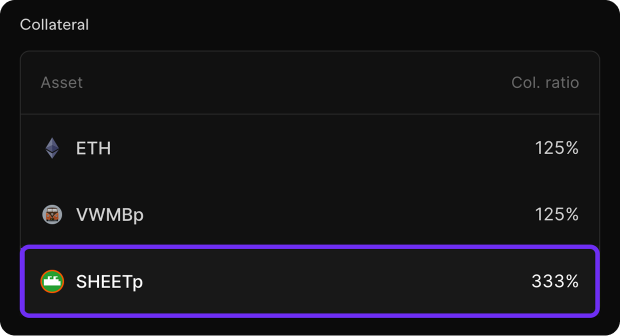
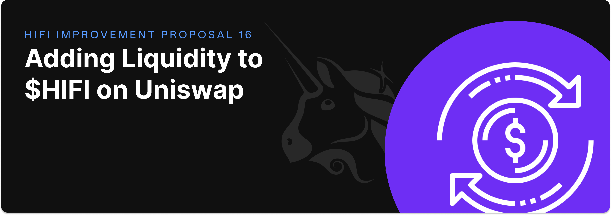

# Establishing a Baseline Plan

Establishing a Baseline Plan

Previously, we acknowledged that the content of our [last blog post](https://blog.hifi.finance/resetting-expectations-957be6b7ef13) would create more questions than it answered. Even though we still do not have all the answers, our objective today is to position the DAO to have everything in order if no other progress is made in sorting out the future of Hifi DAO. This is not intended to be an effort that advocates for this plan. Instead, it is helpful to have in place an approved plan that clarifies what happens if nothing else happens and gives the community some breathing room to iterate towards some alternative.

Our baseline proposal seeks to accomplish the following:

* Reduce expenses and distractions.

* Allocate resources to ensure all outstanding obligations are honored.

* Add durable liquidity for Hifi on a decentralized exchange.
Document important wind-down details.

To this end, the core team will put up for consideration a proposal that includes the following:

* Deploy a new market that will expire March 27, 2026.

* Remove [$SHEETp](https://etherscan.io/token/0xc2bc2320D22D47D1e197E99D4a5dD3261ccf4A68) as a supported collateral.

* Approval for a community-led breakoff of both the Sheet Heads and Pawn Bots IP and digital assets.

* Sunset support for [PooledNFT](https://poolednft.com/).

* Allocate 800K of USDC for essential services through March 27, 2026.

* Acknowledge the nullification of the agreements entered into with [HIP-15](https://www.tally.xyz/gov/hifi-dao/proposal/14).

* Allocate 200K of USDC and $200K worth of HIFI to support a [HIFI/USDC market on Uniswap](https://app.uniswap.org/explore/tokens/ethereum/0x4b9278b94a1112cad404048903b8d343a810b07e).

* Continue to support ETH and the existing RWAs as collateral.

* Continue to compound earned interest within the protocol.

### Lending Market & Collateral Updates

Adding this new market covers the duration of most of the active outstanding loans within the protocol. It also provides ample time for the team to work with borrowers of longer-dated positions to refinance their debt elsewhere if necessary. As we narrow our focus, now is a prudent time to remove the least utilized collateral on the protocol, $SHEETp. This will mark the conclusion of our NFT as collateral experimentation. Appropriately, in the coming weeks, we will update the Pooled NFT website to support withdrawals only. Please take time to withdraw your NFTs from PooledNFT.com.

### Sheet Heads & Pawn Bots Break-off

A couple long-time active members of our community have expressed the desire to take the existing IP of these NFT projects and work to preserve the project and involve existing holders in new iterations of these collections. We think this is a great idea as it helps support our efforts to reduce distractions and be focused elsewhere. There are several ideas floating around regarding what this eventually takes shape into, including moving the project to the Base blockchain. This proposal will assign the necessary rights for these collections to [@Hollywood41](https://x.com/Hollywood41x) and [@Mainbrain_](https://x.com/MainBrain_) to lead this effort forward.

### Essential Services Resource Allocation

This proposal allocates 800K USDC for ongoing support and maintenance of our outstanding obligations through the end of the March 27, 2026, Market. The essential services that will be provided are limited to DAO administration and accounting, hosting and maintenance for the blog, website, web app, forum, and liquidation bots. Explicitly absent in this arrangement are new marketing and product development efforts. This agreement will replace and nullify the existing agreement made in HIP-15 and will necessitate a reduction in the size of our core team. These resources will come from existing protocol-owned liquidity, will not require any new HIFI to be minted, and will not utilize any of the 25M HIFI tokens that were recently returned to the DAO.

### Decentralized Exchange Liquidity

Given recent events, it is more obvious than ever, the importance of liquidity on decentralized exchanges. This proposal allocates 200K of USDC and $200K worth of HIFI sourced from our existing protocol owned liquidity reserves to support a HIFI/USDC market on Uniswap.

### Documenting Wind-Down Details

In the event of a final wind down, any HIFI will be burned, and then all remaining protocol-owned assets will be liquidated for ETH and made available for HIFI token holders to redeem their allocation of these assets pro-rata. So, if you owned 1% of HIFI, you would have a claim to 1% of the ETH proceeds from the sale of all protocol-owned assets. We believe ETH is the best option as it is the most durable asset with the least amount of counterparty risk. This approach is consistent with what we have observed in other DeFi protocols, like single collateral DAI. If this does end up happening, there will be announcements from all of our official channels, with instructions to guide HIFI holders through the process of claiming their proceeds.

While this proposal touches on several changes, it’s worth noting a few of the things that continue to remain in place. We still plan to support ETH and the existing RWAs as collateral, and we plan to continue to compound earned interest within the protocol. Again, we will remind everyone that our purpose here is not to advocate for this plan, but believe it is valuable to have a baseline plan in place so there is at least clarity on what will happen if no viable alternative is found.

If you’re a HIFI token holder, we encourage you to participate in the upcoming governance vote for HIP 16. [The forum discussion](https://forum.hifi.finance/t/hip-16-baseline-plan-for-hifi-dao/489) is now live, and it is anticipated that the proposal will go live on Tally later this week. Remember to ensure your HIFI tokens are in a wallet you control and that you’ve delegated your voting power to participate in this improvement proposal.

Source: https://blog.hifi.finance/establishing-a-baseline-plan-6843e1b32b27
