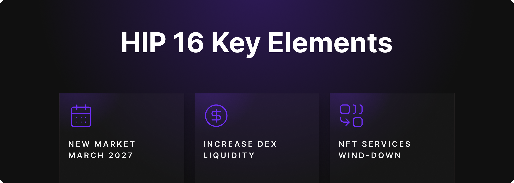
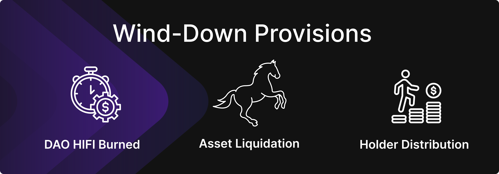

# HIP 16 Update: Proposal Passed

HIP 16 Update: Proposal Passed

[Hifi Improvement Proposal 16](https://www.tally.xyz/gov/hifi-dao/proposal/15) (HIP 16) has officially been passed and executed — a critical measure designed to provide the Hifi DAO with a clear fallback strategy while the long-term direction remains uncertain. HIP 16 establishes a baseline plan for financial resource allocation, collateral updates, decentralized exchange liquidity, and procedures for a potential future wind-down.

This proposal isn’t about ending the protocol — it’s about ensuring continuity and clarity as we collectively explore the best path forward.

## A Strategy for Uncertain Times

HIP 16 was crafted to reduce distractions, preserve resources, and clarify the steps the DAO will take if no further changes are made. Rather than advocating for a shutdown, this proposal gives the community breathing room to evaluate new initiatives while having a clear contingency plan.

With HIP 16 approved, the following key actions will now move forward:

### Deployment of a New Lending Market

A new lending market will be launched with a maturity date of **March 27, 2026**. This ensures continued borrowing and lending functionality while providing runway for borrowers of longer-term positions to refinance if necessary.

### Strengthening Decentralized Exchange Liquidity

Liquidity is vital. HIP 16 allocates an additional 200,000 in USDC and $200,000 of HIFI tokens to establish robust liquidity for the HIFI/USDC trading pair on Uniswap. This ensures that users can continue to access HIFI via decentralized markets with minimal slippage.

### Collateral Updates & NFT Wind-Down

As part of narrowing the DAO’s focus, [$SHEETp](https://app.uniswap.org/explore/tokens/Ethereum/0xc2bc2320D22D47D1e197E99D4a5dD3261ccf4A68) will be removed as supported collateral, and the **PooledNFT service will transition to withdrawal-only mode**. This effectively concludes our NFT-collateral experiment; we recommend users take the time now to reclaim their assets directly from [PooledNFT.com](https://poolednft.com).

### Community-Led IP Breakoff

The community is stepping up. HIP 16 officially transfers the rights to the [SheetHeads](https://opensea.io/collection/sheet-heads) and [Pawn Bots](https://opensea.io/collection/pawnbots) collections to long-time contributor [@Mainbrain_](https://x.com/MainBrain_). This shift allows the projects to grow in new directions, including potential relaunches on chains like Base or expansion into new ecosystems. The team will provide all related images, metadata, and assets to support a smooth transition.

### Essential Services

HIP 16 allocates 800,000 USDC from protocol-owned liquidity for essential services through March 27, 2026. These services include DAO administration, accounting, and maintenance of key infrastructure (web app, blog, liquidation bots, etc.).

This agreement replaces [HIP 15](https://www.tally.xyz/gov/hifi-dao/proposal/14), nullifies all prior service contracts, and reduces the size of the core team. Notably, no new marketing or product development efforts are funded under this proposal.

### Wind-Down Provisions (If Needed)

In the event the DAO ever proceeds with a formal wind-down, HIP 16 lays out clear steps:

* All DAO-owned HIFI tokens will be burned.

* Remaining protocol assets will be liquidated into ETH.

* Proceeds will be distributed pro rata to HIFI holders based on their token holdings.

This ETH-based liquidation model minimizes counterparty risk and aligns with practices observed in other mature DeFi protocols.

### Continuing Core Operations

Despite scaling back, several components of the protocol remain active:

* ETH and existing Real World Assets (RWAs) will continue to be supported as collateral.

* Accrued interest will continue compounding within the protocol, maintaining ongoing yield generation for participants.

## Looking Ahead

HIP 16 provides the community with time to carefully consider what’s next. While we reflect, the team is doing everything possible to ensure Hifi’s continued success. We’ve been pulling all the levers we can, from engaging with exchanges, responding swiftly to inquiries, and more. We believe our efforts played a key role in keeping Hifi listed on exchanges like Coinone and Binance, and we’re committed to continuing that work.

Now is the time for us all to come together as a community and determine the best path forward. The future is still open, and it’s up to all of us to decide what direction we take.

Join the discussion on [Discord](https://discord.com/invite/uGxaCppKSH) and [Twitter](https://x.com/HifiFinance), and stay updated on our next steps.

Source: https://blog.hifi.finance/hip-16-update-proposal-passed-9c7dea346d64
